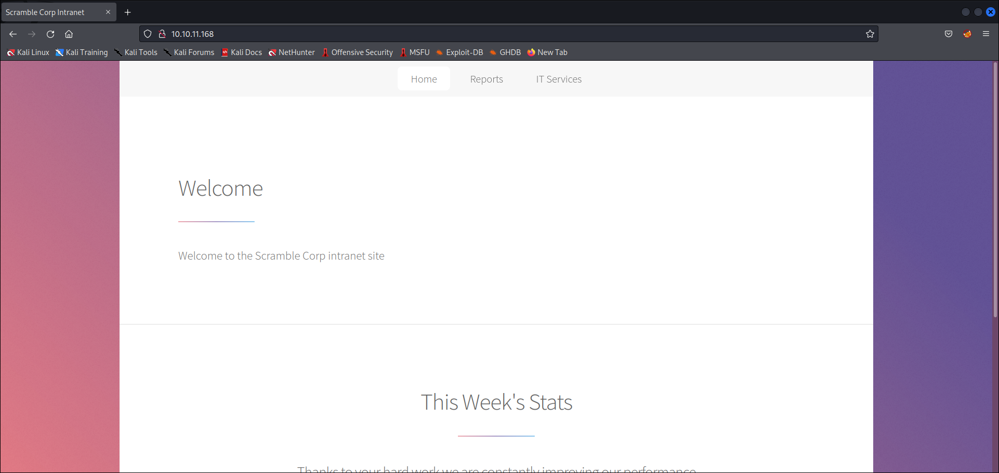
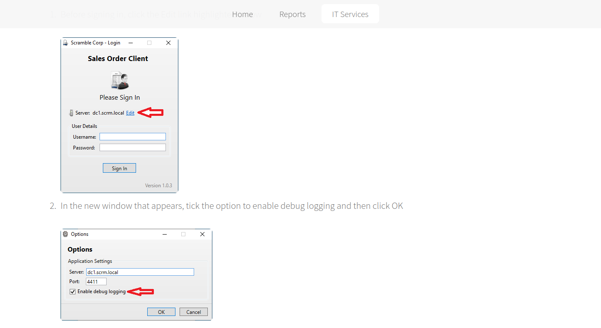

# Scrambled
* **POINTS**: 30
* **USER RATING**: Medium
* **OPERATING SYSTEM**: Windows
* **RATING**: 4.5

## 1. Recon
```shell
└─$ nmap -sC -sV -oA nmap/initial 10.10.11.168
Starting Nmap 7.92 ( https://nmap.org ) at 2022-06-25 09:44 EDT
Nmap scan report for 10.10.11.168
Host is up (0.13s latency).
Not shown: 987 filtered tcp ports (no-response)
PORT     STATE SERVICE       VERSION
53/tcp   open  domain        Simple DNS Plus
80/tcp   open  http          Microsoft IIS httpd 10.0
|_http-server-header: Microsoft-IIS/10.0
| http-methods: 
|_  Potentially risky methods: TRACE
|_http-title: Scramble Corp Intranet
88/tcp   open  kerberos-sec  Microsoft Windows Kerberos (server time: 2022-06-25 13:44:44Z)
135/tcp  open  msrpc         Microsoft Windows RPC
139/tcp  open  netbios-ssn   Microsoft Windows netbios-ssn
389/tcp  open  ldap          Microsoft Windows Active Directory LDAP (Domain: scrm.local0., Site: Default-First-Site-Name)
|_ssl-date: 2022-06-25T13:46:05+00:00; +3s from scanner time.
| ssl-cert: Subject: commonName=DC1.scrm.local
| Subject Alternative Name: othername:<unsupported>, DNS:DC1.scrm.local
| Not valid before: 2022-06-09T15:30:57
|_Not valid after:  2023-06-09T15:30:57
445/tcp  open  microsoft-ds?
464/tcp  open  kpasswd5?
593/tcp  open  ncacn_http    Microsoft Windows RPC over HTTP 1.0
636/tcp  open  ssl/ldap      Microsoft Windows Active Directory LDAP (Domain: scrm.local0., Site: Default-First-Site-Name)
| ssl-cert: Subject: commonName=DC1.scrm.local
| Subject Alternative Name: othername:<unsupported>, DNS:DC1.scrm.local
| Not valid before: 2022-06-09T15:30:57
|_Not valid after:  2023-06-09T15:30:57
|_ssl-date: 2022-06-25T13:46:05+00:00; +4s from scanner time.
1433/tcp open  ms-sql-s      Microsoft SQL Server 2019 15.00.2000.00; RTM
| ssl-cert: Subject: commonName=SSL_Self_Signed_Fallback
| Not valid before: 2022-06-25T13:44:02
|_Not valid after:  2052-06-25T13:44:02
|_ssl-date: 2022-06-25T13:46:05+00:00; +3s from scanner time.
3268/tcp open  ldap          Microsoft Windows Active Directory LDAP (Domain: scrm.local0., Site: Default-First-Site-Name)
|_ssl-date: 2022-06-25T13:46:05+00:00; +3s from scanner time.
| ssl-cert: Subject: commonName=DC1.scrm.local
| Subject Alternative Name: othername:<unsupported>, DNS:DC1.scrm.local
| Not valid before: 2022-06-09T15:30:57
|_Not valid after:  2023-06-09T15:30:57
3269/tcp open  ssl/ldap      Microsoft Windows Active Directory LDAP (Domain: scrm.local0., Site: Default-First-Site-Name)
| ssl-cert: Subject: commonName=DC1.scrm.local
| Subject Alternative Name: othername:<unsupported>, DNS:DC1.scrm.local
| Not valid before: 2022-06-09T15:30:57
|_Not valid after:  2023-06-09T15:30:57
|_ssl-date: 2022-06-25T13:46:05+00:00; +4s from scanner time.
Service Info: Host: DC1; OS: Windows; CPE: cpe:/o:microsoft:windows

Host script results:
|_clock-skew: mean: 3s, deviation: 0s, median: 2s
| ms-sql-info: 
|   10.10.11.168:1433: 
|     Version: 
|       name: Microsoft SQL Server 2019 RTM
|       number: 15.00.2000.00
|       Product: Microsoft SQL Server 2019
|       Service pack level: RTM
|       Post-SP patches applied: false
|_    TCP port: 1433
| smb2-time: 
|   date: 2022-06-25T13:45:30
|_  start_date: N/A
| smb2-security-mode: 
|   3.1.1: 
|_    Message signing enabled and required

Service detection performed. Please report any incorrect results at https://nmap.org/submit/ .
Nmap done: 1 IP address (1 host up) scanned in 97.51 seconds
```

### 1.1 SMB - TCP 445
#
Non riusciamo ad accederci

```shell
┌──(asd㉿asd)-[~/Scrivania/Scrambled]
└─$ smbmap -H 10.10.11.168
[!] Authentication error on 10.10.11.168

┌──(asd㉿asd)-[~/Scrivania/Scrambled]
└─$ smbmap -H 10.10.11.168 -u anonymous -p anonymous
[!] Authentication error on 10.10.11.168

┌──(asd㉿asd)-[~/Scrivania/Scrambled]
└─$ smbclient -N -L \\10.10.11.168
session setup failed: NT_STATUS_NOT_SUPPORTED
```

tanto meno `crackmapexec` ci da info

```shell
└─$ crackmapexec smb 10.10.11.168 --shares
SMB         10.10.11.168    445    NONE             [*]  x64 (name:) (domain:) (signing:True) (SMBv1:False)
SMB         10.10.11.168    445    NONE             [-] Error enumerating shares: SMB SessionError: STATUS_USER_SESSION_DELETED(The remote user session has been deleted.)
```

### 1.2 Website - TCP 80
#
Sulla porta **80** abbiamo il sito *Scramble Corp Intranet*



Nella pagina */support.html* ci sono due risorse che danno informazioni interessanti:
1. **Report a problem with the sales orders app**: dove troviamo info riguardo il dominio

<p align="center">
  
</p>

2. **Contacting IT support**: dove troviamo un possibile username valido

<p align="center">
  
</p>

Ma non solo... ci sono due "hint" che mi hanno fatto capire come proseguire:
1. **News And Alerts**

    *04/09/2021: Due to the security breach last month we have now disabled all NTLM authentication on our network. This may cause problems for some of the programs you use so please be patient while we work to resolve any issues*

2. **Password Resets**

    *Our self service password reset system will be up and running soon but in the meantime please call the IT support line and we will reset your password. If no one is available please leave a message stating your username and we will reset your password to be the same as the username.* 

## 2. Kerbrute
Faccio una enumerazione degli users con `kerbrute` 

```shell
└─$ kerbrute userenum --dc 10.10.11.168 -d scrm.local ~/Scaricati/SecLists/Usernames/xato-net-10-million-usernames.txt 

    __             __               __     
   / /_____  _____/ /_  _______  __/ /____ 
  / //_/ _ \/ ___/ __ \/ ___/ / / / __/ _ \
 / ,< /  __/ /  / /_/ / /  / /_/ / /_/  __/
/_/|_|\___/_/  /_.___/_/   \__,_/\__/\___/                                        

Version: v1.0.3 (9dad6e1) - 06/25/22 - Ronnie Flathers @ropnop

2022/06/25 11:46:59 >  Using KDC(s):
2022/06/25 11:46:59 >   10.10.11.168:88

2022/06/25 11:47:23 >  [+] VALID USERNAME:       administrator@scrm.local
2022/06/25 11:48:26 >  [+] VALID USERNAME:       asmith@scrm.local
2022/06/25 11:49:55 >  [+] VALID USERNAME:       Administrator@scrm.local
2022/06/25 11:51:05 >  [+] VALID USERNAME:       jhall@scrm.local
2022/06/25 11:59:35 >  [+] VALID USERNAME:       sjenkins@scrm.local
2022/06/25 12:00:45 >  [+] VALID USERNAME:       khicks@scrm.local
2022/06/25 12:11:19 >  [+] VALID USERNAME:       Asmith@scrm.local
2022/06/25 12:40:09 >  [+] VALID USERNAME:       ASMITH@scrm.local
2022/06/25 12:45:00 >  [+] VALID USERNAME:       tstar@scrm.local
```
